# Rules as Code Design Process Demonstration

## Introduction

## Background

This section will provide a brief background as to what Rules as Code is, what our
design process was trying to discover, and the Blawx tool that we have developed
as a part of that design process.

### Rules as Code

A fullsome review of the concept of Rules as Code is beyond the scope of this document.
For our purposes, it is enough to say the Rules as Code is an approach to public
sector administration that calls for digitizing legislation, regulation, policy and
other written rules in machine executable formats as early as possible in their life-
cycle, in an interdisciplinary way. The proponents of Rules as Code predict that this
will have benefits across a wide array of use cases inside the public sector.

#### History

The topic of expressing laws in a machine executable form was probably first broached
in 1986 by Sergot et. al. in the paper "The British Nationality Act as a Logic 
Program", which expressed the mentioned legislation in the then very new programming
language Prolog. There was a boom in interest in logic programming and expert systems
that lasted until around the 1990s, and then lost steam in what is now called the
"AI Winter". Several academics continued to actively work on logical systems
specifically for expressing legal norms, and there were several software tools
developed using these approaches which continued to evolve oer time, but were never
widely adopted.

During the 2010s, interest in the idea of digitizing laws grew again, in
multiple different places, and in different contexts. The advent of data science as
applied to public benefit and tax policies motivated the development of tools for
microsimulation - creating a digital model of a community in order to simulate
the effects that changes in policy would have on that community. This prompted the
development of OpenFisca, an open source
Python library for microsimulation of tax and benefit
policies, and currently the most popular of Rules as Code technologies,
which saw its v1.0 release in 2016.

Later in the 2010s there was an increased discussion of the benefits for public
administration in digitizing rules, and investigations as to the best tools and
techniques for obtaining those advantages. This work began most prominently in
New Zealand, as part of the "Better Rules Better Outcomes" project of the New Zealand
government. That conversation has since spread from New Zealand around the world.

The benefits of Rules as Code are all anticipated to derive from the creation and use
of a machine executable digital model of the meaning of legislative and regulatory
texts. But the manner in which these benefits arise are varied, and do not all depend
on using these encodings to build user-facing software. The benefits can be thought
of as falling primarily into one of three categories: design, drafting, and automation & compliance. 

#### Benefits for Legislative and Regulatory Design

The benefits to the design of rules from having digitized versions is in a number of
places. First, formalization of proposed rules enhances their internal coherence,
resulting in better-thought-out policies. Second, digitization gives the policy
design experts the opportunity to run experiments with complex rules against complex
data, to test whether the behaviour of the rules is in line with the policy objectives.

This is the use case for which microsimulation tools were developed. When proposing,
for example, a change to a tax or benefit policy, it would be possible to encode the
current rules and the proposed changes, then simulate the effects of both versions on
a statistically-representative model of the jurisdiction's population. The results
of these simulations can be compared and visualized in ways that allow policy experts
to see how, for example, a benefit program might inadvertently have a negative effect
on certain categories of people by virtue of the knock-on effects on their income,
their tax rate, and their eligibility for other benefits.

#### Benefits for Legislation and Regulatory Drafting

The benefits to legislative drafting also arize from both the formalization of the text
of the law, and from the availability of a digitized version to allow analysis of the
law's behaviour. Formalization, because it requires a greater attention to semantic
relationships between different concepts expressed in the law, draws to light
unintentional vagueness that might not have otherwise been noticed in natural language
drafting processes. Depending on the technologies used, it may also be possible to do
certain forms of static analysis on the encoding to detect internal contradictions, or
sections of law that are of no effect. It would also be possible to define certain
undesireable outomces, and ensure that the encoding does not allow for those outcomes.

This latter approach is important in the French context, where there are rules about
the effects that financial legislation can have on marginal tax rates. Having a
digitized version of the rule capable of being statically analysed gives you the
opportunity to prove by testing or by analysis that laws do not have those effects.

The task of legislative drafting involves ensuring that the drafters and their clients
have a shared understanding of the desired effect of the law, and that the text drafted
has that desired effect. When a law under development is encoded, it is possible to let
client subject matter experts create their own hypothetical scenarios and to see what
legal conclusions would be derived from the encoded version of the text, making it easier
for clients to find unanticipated outcomes that would otherwise by difficult to detect.
This in turn allows for greater clarity of communication between drafters and their
clients, and greater confidence in the resulting legislative text.

It is worth re-iterating that in both the policy design and legislative drafting
stages, there are benefits from the Rules as Code approach that do not depend on the
software being "used" for anything. It is merely the task of attempting to express the
concepts in the formal language of the Rules as Code tool that draws the attention of
the public servant to factors that would have been difficult to see, otherwise. This
is in much the same way that an architectural drawing makes it easy to see where the
swing paths of two doors might interfere with one another, when that would be difficult
to detect without formalizing the building's design in that way.

#### Benefits for Service Automation and Compliance

Having a digitized expression of the meaning of a statutory text allows for that
code to be used inside the public sector, for service automation tasks, and outside
the public sector for compliance tasks. In both cases, if the legal knowledge is
encoded in a way that is isolated from a specific use-case and re-usable in multiple
use-cases, the encoding can have the effect of greatly reducing the complexity of
building software to administer or adhere to legal rules. The reason for this is
that the person building the application no longer needs to know what the rules mean.
Instead, they need to know only what facts are relevant to those rules, and how to
express them in a way that they can be consumed by a rule engine. Similarly, when
the rules change, the encoding of that change can be made centrally, simplifying the
task of discovering places where existing software is not compliant with existing
rules, and updating it to the new regime.

The approaches for using software developed in Rules as Code approaches can be by
embedding the Rules as Code encodings in other software as a library, providing
a rules reasoner as a service that can be called by other software to answer questions
about the rules, using the encodings as a reference implementation against which other
software can be tested for consistency, or using the encodings to generate test suites
that can help ensure the conformance of other tools, among other possible approaches.

#### Adoption and Experimentation in the Public Sector

France, Australia, Canada, and Singapore have all invested in the development of 
programming languages for use in Rules as Code and microsimulation tasks during the 
2010s. The OECD's Observatory for Public Sector Innovation noted Rules as Code as a 
growing area of public sector innovation in their "Cracking the Code" report, which was 
released in October of 2020. Since then the OECD has continued to identify Rules as Code
as a major innovation trend in the public sector.

Canada's involvement with Rules as Code experiments other than microsimulation
began with organizations like
the Canada School of Public Service, and the Community of Federal Regulators roughly
five years ago, and has included Transport, ESDC, Treasury Board, Natural Resources,
Justice, and others, and continues to the date of writing.

### Design Questions

This document is intended to record a part of the design process used in
an exploration of Rules as Code as an approach to public administration. In
a design process, there is a status quo, there is an ideal future state, and
there is an area of uncertainty as to how to achieve that future state. The
designer's role is determine what is unknown that can be explored, to conceive
experiments that could be run to learn more about those unknowns, and to 
build prototypes, experiment with them with the people whose problem is being
solved, and use the results to reduce that uncertainty.

The experiment described here is a part of a design process for answering the
question of how might we see Rules as Code successfully adopted inside the
Canadian Public Service for the benefit of the people it serves.

One area of uncertainty is illustrated by this question: "Why, if it is such
a good idea, is it not already happening." One hypothesis is that Rules as
Code requires formalization of rules, and formalization of rules requires
knowledge of both rules, and of formalization. In the case of automation,
the formalization tools are programming languages. Most
programmers are not rule experts, and most rule experts are not programmers.
So in practice, Rules as Code requires a multi-disciplinary
approach, with both rule experts and programming experts communicating and
collaborating effectively. The literature with regard to legal expert
systems suggests that this multi-disciplinary approach has been plagued by
ineffective communication, which has led to something called the "knowledge
acquisition bottleneck." Placing, for example, a lawyer and a programmer in
a room together and asking them to encode a law tends to be expensive, slow,
and of questionable quality. Research as of a few years ago confirms that
having law students assist computer science students in encoding legal rules
improves the legal quality of the encodings, but the encodings still do not
actually reflect the understanding of the rules that was shared by the law
student.

This gives us a more useful design question: "How might we reduce the
knowledge acquisition bottleneck?" Our hypothesis is that it is the difficulty
of communication between individuals with different disciplines that causes
the bottleneck, so one possible solution might be to remove the need for
that communication, or to enhance the communication between rule experts and
programmers.

That leads to the design question: "How might we improve the communication
between rule experts and programmers about encodings of rules, or reduce the 
need for it?" Our hypothesis
is that part of the reason for the difficulty of communication is that when
a programmer misunderstands what they are told by a rule expert, the rule
expert cannot detect that fact, because they cannot read the code. If there 
was a shared language, which both rule experts and programmers would be able
to use with equal proficiency, they would be able to express their understanding
of the rules in that language, and each would be able to see where that
expression does not match with their perspective. Possibly the language
would be sufficiently accessible to rule experts that the task of encoding
the rules could belong exclusively to them, eliminating the need for
communication except with regard to how that code can be used by programmers.

There is precedent for this sort of change in the profession of accounting, where
access to computational financial models was dramatically expanded by the
development of the electronic spreadsheets. That is why this
hypothetical tool is sometimes referred to as "spreadsheets for law."

That leads to the next design question: "Is it possible to create tools that are
both sufficiently powerful and sufficiently easy to use that the task of
encoding rules could be given to non-programmers, and the resulting encoding
would be valuable?" Our hypothesis is that it might be possible by using
formalisms that are consistent with the nature of legal rules, so that they
start out as familiar to rule experts as possible, and then generating
friendly user interfaces to those formalisms.

That leads to the two design question of "what formalisms are best suited to
representing rules?", and "how might we make those formalisms accessible to
non-programmers"? Our hypothesis is that declarative logic formalisms, because
they have a structure and semantics similar to that of rules (an unordered 
list of possible implications),
is well-suited to the task of making Rules as Code accessible to rule
experts. Our hypothesis with regard to how they might be made accessible is
by borrowing techniques that are currently used to teach imperative programming
to children.

### Blawx

Blawx, a combination of the declarative programming language s(CASP) and
the user interfaces made available by the Blockly library, is a prototype
designed to test the above hypotheses. It began to see use in August of 2022
by individuals inside the Canada School of Public Service's Public Sector
Experimentation Programme in
collaboration with other departments of the Government of Canada engaged
in Rules as Code experimentation. Those projects have included experiments
both in the regulatory drafting and service automation realms.

This section of the document sets out the basic structure of Blawx, and
the changes that were made to Blawx
from January of 2022 forward, and what motivated them.

#### Blockly

The main feature of Blawx that did not change starting in January of 2022 is that
the coding and testing interfaces are built using Google's Blockly library for
generating visual, puzzle-piece themed user interfaces for generating code. Blockly
was originally designed for projects that were designed to teach imperative
programming languages to children.

Some of the advantages of the drag and drop visual interface include the ability
to dynamically generate new blocks based on the user's declarations, the ability
to do some small amount of type checking in the user interface, providing the
user with an interface in which it is effectively impossible to generate a large
variety of syntax errors, and an interface in which the terms used can be verbose
enough that they constitute a controlled natural language, without slowing the
task of "writing" the code (dragging a long block takes as much time as dragging
a short one), and making the resulting encoding legible to people who do not
participate in drafting it.

Given other changes that were made to Blawx, almost the entire block language
needed to be re-implemented, but Blockly was kept as the platform on which these
block interfaces were generated.

#### Django

Django is a Python library for generating web applications quickly and easily. It
was selected as the platform on which the Blawx application would be built, with
the code editing interfaces integrated into that application. In previous
iterations of Blawx, the coding environment was the entire application. But CSPS's
use-cases required features like user accounts, server-side storage of encodings,
and others that required a platform for the application.

#### s(CASP) and SWI-Prolog

SWI-Prolog is a popular and actively maintained implementation of the Prolog 
programming language. s(CASP) is a constraint answer set programming language with
a number of features that make it well suited to legal knowledge representation.
Among those features are natural language explanations for answers (and the absence
of answers), open world
reasoning, hypothetical and abductive reasoning, constraints - including numerical
constraints - over infinite domains, duals, and more. s(CASP) is implemented as a
library for SWI-Prolog, and both are open source.

The Blawx block language generates s(CASP) knowledge representations, which are
then run on the application server using the s(CASP) library and SWI-Prolog.

Prior to January of 2022 the previous version of Blawx had been based on the Flora-2
programming language, so migrating from Flora-2 to s(CASP) as the representation
language required rewriting the Blawx block language almost from scratch.

#### The Blawx Block Language

The Blawx Block language consists of a relatively small number of basic language
elements that can be combined in various ways to create knowledge representations
of statutes and regulations, and then generate corresponding s(CASP) encodings.

An in-depth explanation of all of the elements of the Blawx block language is
beyond the scope of this document, but information on the current language can
be obtained by going to the live demonstration server at https://dev.blawx.com,
clicking "Help" in the left menu, and selecting "Blawx Coding Features" from
the available categories. You can also run the Blawx software locally on any
machine with the ability to run docker containers by running 
`docker run lexpedite/blawx` or the equivalent for your operating system.

Briefly, the basic language consists of approximately 50 blocks, nearly half of
which have to do with manipulating the specific data types of numbers, dates, and
lists. The primary structure of the language is similar to that of a logic
programming language, consisting of facts (things which are unconditionally true),
rules (things which are conditionally true), assumptions (things which are always 
either true or not in any given model, but not neither), and questions (the
information you want the reasoner to derive).

Within those four main structures the user can place a variety of statements, which
appear as a "line" in the coding environment, and values, which appear as smaller
puzzle pieces that fit inside the statements.

The user is given three ways to extend this language with their own blocks.
First, the user is allowed to create "Categories." A category can be thought of
as a group to which a specific "object" may or may not belong. For instance,
and object "jason" might belong to the category "Person". Categories are implemented
as a unary predicate in the s(CASP) language.

Second, the user can create
"Attributes." An attribute is a relationship between an object and a data value or
another object. Attributes are quasi-typed, in that the user can specify the
specific data type or defined Category that should be used in the second parameter.
In the editing and testing interface, data types will be enforced, and values of
the wrong type will "not fit" into the generated blocks. However, the user interface
cannot distinguish between categories, so there is no type checking in the interface
against declared categories. The declared categories in attributes are used to
simplify the user interface generation, such as in the Scenario Editor, which will
provide only options from the correct category when allowing the user to fill the
values in an attribute statement. Attributes are implemented as binary predicates
in the s(CASP) code.

Third, the user can create "Relationships." A relationship is between from three to
ten objects or values in various data types or categories. A relationship is
implemented similarly to an attribute, except that there is no requirement that
any parameter of the relationship be an object. Relationships are implemented
as n-ary predicates in s(CASP).

All three of the blocks used for generating these user-defined terms allow the
user to specify the name that will be used for the predicate in the s(CASP) code,
but also allow them to specify the natural language form for that statement that
will be used in the design of the block in the coding interface, and in the natural
language explanations generated by the reasoner.

Originally, the Blawx block language allowed for only Categories and Attributes.
Over the course of using Blawx it became obvious that the restriction to only
Categories and Attributes made modelling concepts that refer to more than
two objects or values unnecessarily complicated. This became particularly
apparent when expanding the language to deal with event reasoning, because it
became necessary to be able to say not only that an event occurred, but the date
on which it occurred. Needing to create a category with three attributes was
needlessly complicated and unintuitive for the users, so Relationships were
added.

There is some question as to whether Attributes are entirely necessary, or
whether relationships could be changed to include binary relationships also. The
question is whether the advantage in reducing the size of the block language is
worth losing the ability to describe implicitly algebraic data structures, where
there is not merely a relationship between an object and something else, but that
relationship is viewed as an ontological property of that category of object.

It is also possible that in future we may find that it is valuable to be able
to implement nullary predicates (propositions), which is not currently possible.

There are three major extensions to the s(CASP) language that were implemented
inside the Blawx block language: exceptions, events, and dates.

#### Exceptions

This section is intended to give a brief explanation of the defaults and exceptions
features of the Blawx block language, and how they are implemented in s(CASP).

The defaults and exceptions system in Blawx is based on knowing the source of
defeasible conclusions, and specifying the overriding relationships between
combinations of conclusions and sources. To achieve this, the hirearchical structure
of the law is converted into a set of section selector blocks, referring to one
section of the law. The user then generates rules using the "attributed rule block"
which is pre-populated with the name of the current section, and appears as follows:

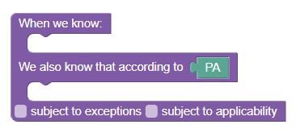

When the user uses this block, three rules are generated in the s(CASP) language.
The first asserts that if the conditions hold, the conclusion defeasibly holds
according to that section, using the "according to" predicate. The second asserts that if the conclusion defeasibly
holds then it holds indefeasibly according to the same section, using the "holds"
predicate. The third asserts
that if the conclusion holds indefeasibly according to the section, then the
statement by itself is true.

For example, the following block...
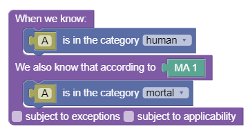
... would generate the following s(CASP) code:
```
according_to(sec_1_section,mortal,A) :- human(A).

% BLAWX CHECK DUPLICATES
holds(sec_1_section,mortal,A) :- according_to(sec_1_section,mortal,A).

% BLAWX CHECK DUPLICATES
mortal(A) :- holds(sec_1_section,mortal,A).
```

If the user selects "subject to exceptions" on the attributed rule block, the
generated code for the second rule (which until now has been largely meaningless)
will be modified to add a test to see whether the conclusion is defeated, like this:

```
according_to(sec_1_section,mortal,A) :- human(A).

% BLAWX CHECK DUPLICATES
holds(sec_1_section,mortal,A) :- according_to(sec_1_section,mortal,A), not blawx_defeated(sec_1_section,mortal,A).

% BLAWX CHECK DUPLICATES
mortal(A) :- holds(sec_1_section,mortal,A).
```

In a prior version of defaults and exceptions in Blawx, defeasibility was
implemented as a library that applied to other conclusions in a higher-order way.
Rather than specifying the defeasibility logic for a specific rule, it was
specified generically, essentially encoding the idea that if a conclusion is
defeasibly held by a section, and is not defeated, then it indefeasibly holds.
This was found to be computationally expensive, and was abandoned in favour
of generating an explicit defeasibility theory for each attributed rule. The main benefit of the approach is that there is no longer a search
for `defeated(A,B,C,D)`, which in turn requires a search of everything that
defeasibly held, which grew exponentially in complexity with the complexity of the code.

You will notice that the more obvious structure `holds(sec_1_section,mortal(A))`
has been avoided in favour of `holds(sec_1_section,mortal,A)`. This choice was
made to generate code that would be more efficient inside s(CASP), in the hope
that indexing on the predicate name of the conclusion in the second parameter
would be more efficient than searching for all conclusions for a given section.
It's not entirely clear if this approach is entirely necessary. 

Because the Blawx block language does not include disjunction, it is very common
to have multiple attributed rules with the same conclusion in a given section of
law. That, in turn, generates second and third rules that are entirely redundant,
and which significantly slow processing time. As such all second and third rules
are annotated with `% BLAWX CHECK DUPLICATES` and the reasoner ensures that 
they are included in the generated
code only once.

Now that the rule is subject to exceptions, the user can use an "overrules" block
to indicate how conflicts between defeasible conclusions should be resolved. An
example might be as follows:

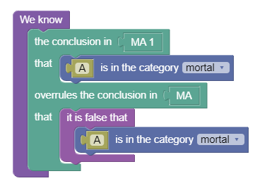

That block generates the following s(CASP) code:
```
blawx_defeated(root_section,-mortal,A) :- holds(sec_1_section,mortal,A).
```
That code will trigger the defeater check in the second rule generated above.

It is possible to directly query whether a given conclusion is defeasibly
held by any section, whether it is indefeasibly held by any section, and whether it
is defeated by any other section. But these elements of the block langauge
are seldom valuable except in debugging encodings.

There are two ways in which this exception system is likely going to be in need
of modification. One is the requirement of indicating that a rule is subject to
exceptions before defeaters will be checked. Requiring the user to indicate
that a rule is subject to defeasibility *in the place the rule is stated* is a
violation of our objective of maintaining structural isomorphism. In legislation
it is implicit that conclusions are defeasible, and it ideally would not be
necessary to explicitly state that defeaters should be checked for. The reason
for that approach is to minimize the computational efficiency costs of checking
for defeaters, which even with the improvements described above can still be
computationally expensive. In future, there may be a pre-processing step applied
to a rulebase to find all instances of overrules statements, find corresponding
defeated rules, and automatically check for defeaters in those rules. That would
allow the user to indicate that a rule may be defeated by writing a rule that
concludes as much, wherever in the law it makes the most sense to make that 
encoding.

##### On Structural Isomorphism

The defaults and exceptions system is built to maximize structural isomorphism -
the degree to which small sections of code correspond in a one-to-one way with
small sections of the legal text. There are a number of reasons to pursue
structural isomorphism that are not obvious, but we hypothesize are important.

First, structural isomorphism is a litmus test for semantic gap. If it is possible
to encode the law in a structurally isomorphic way, that suggests that the encoding
has a semantics similar to the semantics of the law, which is going to have all
the corresponding benefits for ease of use. Most encoding languages do not allow you
to implement an exception to a rule without modifying the default rule itself.

Second, structural isomorphism makes it far easier to update existing codebases
when legislation or regulation changes. In the absence of structural isomorphism,
when a section of a law changes, it is not possible to know which portions of
the encoding of that law do (and more importantly, do not) need to be modified in
order for the encoding to match the new version of the law. That is a major
impediment to maintainability of legal knowledge representations, which adds
significantly to the long-term cost of Rules as Code approaches.

Third, structural isomorphism makes the task of code validation much smaller. If
a subject matter expert is asked to review the code relevant to a given section of
the law, that is actually possible. In languages that do not support structural
isomorphism, you cannot have someone review the code for section 3, because the
code for section 3 may be spread around the codebase. So it makes it realistic
to break the encoding, testing, and validating tasks into small self-contained 
units that are easier to manage individually.

Fourth, structural isomorphism places a coding language in the best possible position
to take advantage of generative AI approaches that might be capable of assisting
in code generation in the future. Generative AI is very good at translation, but
requires rosetta stones in the form of matched pairs. A structurally isomorphic
encoding of a law is an example of such a set of matched pairs.

##### Presumptions

When discussing defaults and exceptions it is important to note that there is
another faculty in Blawx, which is derived directly from s(CASP), which can be
used to achieve non-monotonic reasoning, and that is the use of defaults.

In s(CASP) (and in Blawx) it is possible to say that something is true unless
there is evidence that it isn't. That has the logical structure of a legal
presumption, and can be used to implement logical presumptions in code. This
will be seen in the applicability section below.

#### Applicability

In addition to the attributed rule block allowing the use to specify that a rule
is subject to exceptions, it is also possible to specify that the rule is subject
to applicability. If the user does so, this adds a set of statements to the first
of the three generated rules, immediately after each category check, testing for
whether or not the rule applies to the object that was sought. For example,
the rule above would generate code like this:

```
according_to(sec_1_section,mortal,A) :- human(A),
blawx_applies(sec_1_section,A).

% BLAWX CHECK DUPLICATES
holds(sec_1_section,mortal,A) :- according_to(sec_1_section,mortal,A), not blawx_defeated(sec_1_section,mortal,A).

% BLAWX CHECK DUPLICATES
mortal(A) :- holds(sec_1_section,mortal,A).
```

You can see here that in the first of the three rules, there is now a check for
`blawx_applies(sec_1_section,A)`. This is intended to allow the user to specify
that certain rules do or do not apply to certain entities. This is a formulation
that regularly occurs in legislation, such as requirements that do not apply to
"Ministers of the Crown".

If the user choose to make a rule subject to applicability, they are obliged to
make applicability explicit in the code. This is usually done by setting a
presumption either in favour or against applicability, and then deriving the
opposite conclusion in the appropriate circumstances.  Here is an example of
a presumption of applicability for section 1.

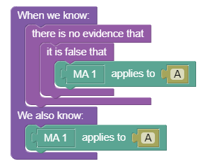

You will note that the presumption uses two different kinds of negation. This
is a feature of the open world reasoning of answer set programming that
translates relatively easily into legal application. In open world reasoning
the absence of evidence of something is not evidence for its opposite. The
presumption effectively reduces the open world to a closed world in which the
presumption holds unless its opposite is explicitly found.

The difference between "there is no evidence that" and "it is false that"
is illustrated by the difference in law between the concept of "not guilty" and
"innocent." Criminal trials are an attempt to prove guilt, not an attempt to
prove innocence. If the attempt to prove guilt fails, "there is no evidence that"
the person is guilty. But we cannot also say "it is false that" the person is
guilty. They may have gotten away with the crime.

These differences are reflected in the difference between negation as failure, and
logical negations, both of which are allowed in Blawx encodings.

#### Events

Blawx currently has a minimal implementation of event reasoning. It was anticipated 
that this would be necessary for a 
project that needed to calculate periods of time during which
an entity was or was not in compliance with a particular ruleset. That project
was not ultimately implemented, and so the event reasoning features of Blawx have not
been thoroughly tested.

Event calculus is a method of describing in logical language
the causal effects of events over time. Essentially, events of certain types have
specific impacts on values that change over time, called "fluents."

Blawx's implementation of event reasoning is similar to event calculus, but varies 
from other
implmentations. Originally, like with defaults and exceptions, event reasoning
was implemented as a higher order theory that operated on conclusions generally.
However, this was again found to be computationally efficient. A revised version
of event reasoning was created that creates an event calculus for each user-defined
predicate, allowing the searches for relevant facts to be constrained to a greater
degree.

For example, if we define a category "Person", the following lines of code are among
the code that is generated:
```
blawx_not_interrupted(datetime(Start),person(X),datetime(End)) :- Start \= bot, End \= eot, findall(Time,blawx_becomes(-person(X),datetime(Time)),Times),blawx_list_not_between(Times,Start,End).
blawx_not_interrupted(datetime(Start),-person(X),datetime(End)) :- Start \= bot, End \= eot, findall(Time,blawx_becomes(person(X),datetime(Time)),Times),blawx_list_not_between(Times,Start,End).
blawx_not_interrupted(datetime(bot),person(X),datetime(End)) :- End \= eot, findall(Time,blawx_becomes(-person(X),datetime(Time)),Times),blawx_list_not_before(Times,End).
blawx_not_interrupted(datetime(bot),-person(X),datetime(End)) :- End \= eot, findall(Time,blawx_becomes(person(X),datetime(Time)),Times),blawx_list_not_before(Times,End).
blawx_not_interrupted(datetime(Start),person(X),datetime(eot)) :- Start \= bot, findall(Time,blawx_becomes(-person(X),datetime(Time)),Times),blawx_list_not_after(Times,Start).
blawx_not_interrupted(datetime(Start),-person(X),datetime(eot)) :- Start \= bot, findall(Time,blawx_becomes(person(X),datetime(Time)),Times),blawx_list_not_after(Times,Start).
blawx_not_interrupted(datetime(bot),person(X),datetime(eot)) :- blawx_initially(person(X)), blawx_ultimately(person(X)), findall(Time,blawx_becomes(-person(X),datetime(Time)),[]).
blawx_not_interrupted(datetime(bot),-person(X),datetime(eot)) :- blawx_initially(-person(X)), blawx_ultimately(-person(X)), findall(Time,blawx_becomes(person(X),datetime(Time)),[]).
blawx_as_of(person(X),datetime(Time)) :- blawx_initially(person(X)), BeforeT #< Time,blawx_not_interrupted(datetime(bot),person(X),datetime(BeforeT)).
blawx_as_of(person(X),datetime(Time)) :- blawx_becomes(person(X),datetime(BeforeT)),BeforeT #< Time,blawx_not_interrupted(datetime(BeforeT),person(X),datetime(Time)).
blawx_as_of(-person(X),datetime(Time)) :- blawx_initially(-person(X)), BeforeT #< Time,blawx_not_interrupted(datetime(bot),-person(X),datetime(BeforeT)).
blawx_as_of(-person(X),datetime(Time)) :- blawx_becomes(-person(X),datetime(BeforeT)),BeforeT #< Time,blawx_not_interrupted(datetime(BeforeT),-person(X),datetime(Time)).
blawx_during(datetime(Start),person(X),datetime(End)) :- blawx_becomes(person(X),datetime(Start)), blawx_becomes(-person(X),datetime(End)), Start #< End, blawx_not_interrupted(datetime(Start),person(X),datetime(End)).
blawx_during(datetime(bot),person(X),datetime(End)) :- blawx_initially(person(X)), blawx_becomes(-person(X),datetime(End)), blawx_not_interrupted(datetime(bot),person(X),datetime(End)).
blawx_during(datetime(Start),person(X),datetime(eot)) :- blawx_ultimately(person(X)), blawx_becomes(-person(X),datetime(Start)), blawx_not_interrupted(datetime(Start),person(X),datetime(eot)).
blawx_during(datetime(bot),person(X),datetime(eot)) :- blawx_initially(person(X)), blawx_ultimately(person(X)), blawx_becomes(-person(X),datetime(Start)), blawx_not_interrupted(datetime(bot),person(X),datetime(eot)).
blawx_during(datetime(Start),-person(X),datetime(End)) :- blawx_becomes(-person(X),datetime(Start)), blawx_becomes(person(X),datetime(End)), Start #< End, blawx_not_interrupted(datetime(Start),-person(X),datetime(End)).
blawx_during(datetime(bot),-person(X),datetime(End)) :- blawx_initially(-person(X)), blawx_becomes(person(X),datetime(End)), blawx_not_interrupted(datetime(bot),-person(X),datetime(End)).
blawx_during(datetime(Start),-person(X),datetime(eot)) :- blawx_ultimately(-person(X)), blawx_becomes(person(X),datetime(Start)), blawx_not_interrupted(datetime(Start),-person(X),datetime(eot)).
blawx_during(datetime(bot),-person(X),datetime(eot)) :- blawx_initially(-person(X)), blawx_ultimately(-person(X)), blawx_becomes(-person(X),datetime(Start)), blawx_not_interrupted(datetime(bot),-person(X),datetime(eot)).
```

This is an event reasoning theory with regard to the predicate `person/1`.
It first defines a utility predicate `blawx_not_interrupted` that determines 
whether it
is true that the truth value of `person(X)` did not change between two dates.
Because s(CASP) deals with numerical constraints over infinite domains, it is
necessary to deal with literal "edge" cases, which are represented with
`datetime(bot)` and `datetime(eot)` which represent the "beginning of time"
and "end of time" respectively.

Then, it defines a predicate `blawx_as_of` which can be used to determine whether
`person(X)` held as of a specific time. Third, it defines a predicate `blawx_during`
which can be used to find the longest stretches of time during which `person(X)`
held without change. Each of these is duplicated for the logical negation,
`-person(X)`.

The "as of" and "during" predicate are then available for testing in the Blawx
block language.

The inputs to these predicates are of three forms: what was initially true,
what was ultimately true, and what became true when. These three "inputs" to
the event reasoning system are also in the block langauge, for a total of five
blocks. One way in which the Blawx implementation varies from others is that
typical event calculus implementations record the causal event when indicating
how a fluent's value was set. In Blawx, this information would be available
in the explanation provided by s(CASP), so it wasn't necessary to keep in the
conclusion. So where in other event calculus implementations, you would create
a predicate `becomes(Event,Time,Fluent)`, in Blawx the equivalent construction
is to write a rule that tests for whether an event occurred, which is represented by a 
relationship or
attributed with a date or datetime value, and if so concludes that as of that
date the value of the fluent was changed accordingly.

If we look at one line of the theory, it reads as follows:
```
blawx_as_of(person(X),datetime(Time)) :- blawx_becomes(person(X),datetime(BeforeT)),BeforeT #< Time,blawx_not_interrupted(datetime(BeforeT),person(X),datetime(Time)).
```

This code means that X was a person as of a time represented by the number "Time"
if X became a person at a time 
represented by the number "BeforeT", if BeforeT is constrained to be less than 
Time, and
there was no interruption in whether X was a person between those two times.

Because Blawx is using numerical constraints in the event reasoning, it is
capable of an array of calculations that would not be possible, or would be
more computationally expensive, in other systems. It is also not necessary to
give Blawx a minimum and maximum time to consider when evaluating the effects
of events. This was not possible before modifying the Blawx date system to use
numerical representations, discussed below.

#### Dates, Times, and Durations

Blawx originally implemented dates, times, and durations using a custom library that
used a structured representation of dates, times, and durations. This had
advantages and disadvantages. One advantage was that it was possible to do date
calculations such as "add one month to January 29, 2003", and expect leap days
to be dealt with in a consistent way. A disadvantage was that it was not
possible to "reverse" the logic that was used to calculate timestamp representations
of structured datetimes, and vice versa, because these algorithms used mathematical
operations that could not be reversed, such as modulo.
That made it difficult to do things like ask
"why not" about conclusions that involved dates. It also made it impossible to use
numerical constraints on dates, which would allow Blawx to answer questions using
constraints on the possible dates for which the query holds. That latter capability
was required for implementing event reasoning, so the choice was made to switch
to a raw numerical representation of datetimes and durations in the code, and
to translate those numerical representations to structured dates, times, and
durations only in the front end of the code editor and Scenario Editor.

This actually significantly simplified the complexity of the date library code,
but eliminated the ability to deal with calendar durations of varying
size, such as months and years. As such the date, time, and duration library now
allows the user to specify amounts only for days, and smaller periods.

The Blawx block language contains blocks that allows the user to:
* Set a variable to today's date
* Set a variable to the current datetime
* Generate a date, datetime, time, or duration
* Compare dates or datetimes
* Compare durations
* Add a duration to a datetime
* Combine a date and time to create a datetime
* Generate a date, time, datetime, or duration from a number

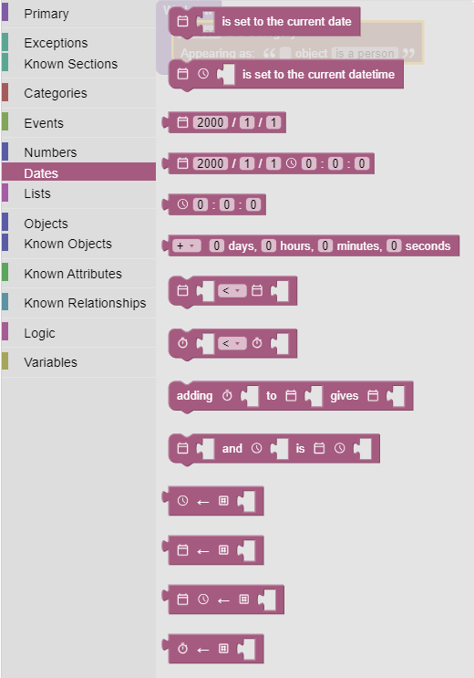

#### CLEAN

Blawx's structural isomorphism depends on knowing the structure of the source legal
text. Initially, it was designed to derive that structure from an AkomaNtoso XML document.
AkomNtoso (also known as LegalDocML) is an XML standard for describing, among other
things, legislative and regulatory documents. It was adopted primarily because it
is the only widely recognized standard for these documents, even though it is not
to my knowledge deployed by any federal or provincial government in Canada. That
was because the actual standards used by governments in Canada for publishing
legislation and regulation were not documented anywhere that I could find.

AkomaNtoso is a difficult format to generate by
hand. There are also no user-friendly open source libraries for generating it from
text. So it became necessary to create a simple way for users to generate their own
AkomaNtoso encodings of the legal text they want to encode. 
The closest similar tool that we found was a tool designed for use in generating
documents that adhered to a legislative format used in Africa, on the basis of a
plain-text encoding. We used some basic open source libraries offered in that
software (specifically the cobalt library) and created CLEAN (Canadian Legislative
Enactments in AkomaNtoso). Clean is a markdown-like language in that it a) looks like
how you might set out legislation if you were limited to doing it in plain text, and
b) can be used to generate a corresponding AkomaNtoso XML version of the same legal
text.

CLEAN is open source, and is available at https://github.com/lexpedite/CLEAN. It is used
in Blawx's Rule Editor interface, where the user provides the CLEAN version of the legal
text that will be used for the structure of the code in the code editor.

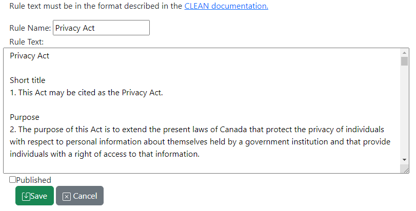

#### The Blawx Encoding Process

The pattern of use of Blawx can be described generally as follows:

1. Give Blawx the text of the law.
2. Section by section:
    1. Encode the new vocabulary required in that section as categories, attributes, and
  relationships
    2. Encode the implications in that section as rules using the available vocabulary
3. Test to see whether your encoding behaves as expected
4. Validate your encoding with other experts who understand the rules
5. Deploy your encoding as and if required.

In reality this process is not linear, and you tend to move back and forth between
different sections of the law as later sections provide information about how better
to model the terms of earlier sections. It is also typical to go back and forth between
creating vocabulary, using that vocabulary in rules, 
and then realizing that the vocabulary needs
to be changed, and then that the rules need to be changed correspondingly, etc.

It is also perhaps advisable to test each section of an encoding as you proceed, but
even if you add this step, the later task of making sure the code for all of the
sections behaves as expected in combination is still necessary.

That said, the above outline is a relatively strong abstraction to describe what a
person actually does using Blawx for Rules as Code.

Testing is distinguished from validation in that testing confirms that the intent of
the person who wrote the code is captured in the code. Validation is designed to
determine whether that intent matches the interpretation of someone else of the same
rules. If the person doing the encoding is the subject matter expert, and it is only 
their
own interpretation that they are seeking to encode, the validation step is redundant.
But typically it will be valuable for someone else to confirm that the encoding is 
accurate,
and Blawx is designed to make that validation step feasible for non-programmer subject 
matter experts, operating directly on the encoding of the legal knowledge (as opposed
to having people test an application).

Deploying is not always required, because there are advantages to the drafting process
that arise from formalization in Rules as Code. If those are the only advantages you
are seeking, then you will have obtained them by virtue of the previous steps, and
there is nothing else to be done with the resulting code. If you are trying to integrate
Blawx with other software, deploying will involve having that software format facts
for submission to the Blawx reasoner's API, and processing the responses. There are
various other ways in which Blawx code might be used, all of which are captured by
the idea of deploying.

One could also conceive of a last stage which involves monitoring for changes in the
rules or their interpretation that should be integrated into the encoding, or bugs that
were not previously detected, and
restarting the process when those motivations are detected.

## Privacy Act Demonstration

This section of the document is intended to 
illustrate the practical process of generating and using a Rules as Code encoding in 
Blawx. For this demonstration, we have chosen to encode portions of Canada's
Privacy Act, and then to use those encodings to prototype a training tool. This tool
would enhance other training mechanisms by providing trainees - whether 
access to information and privacy practitioners, or  data stewards, or others -
with an automated system that can answer questions about the legal consequences of
specific hypothetical fact scenarios, in much the way that an experienced ATIP
professional might be able to, but in an entirely automated way.

While we will illustrate how the Blawx tool could be used in a validation step,
do to time limitations a validation step was not actually undertaken in this project.
As such, we can make no assertions as to the consistency of the interpretation
reflected in the code with the interpretation assigned to those sections of the
Privacy Act with any official or legal expert. **The code generated here is
illustrative of a tool and a process, and should not be relied upon for any real-world
use case.**

The demonstration is broken into four parts:
* Encoding the Privacy Act in Blawx
* Testing the Encoding
* Validating the Encoding
* Integrating Blawx with a Conversational Chatbot

### Encoding the Privacy Act in Blawx

In this section, I describe in detail the process of generating a Blawx encoding
of the selected parts of the Privacy Act.

#### Scope of Privacy Act Covered

Due to time limitations it was not possible to encode the entirety of the
Act, and so a small demonstrative scope was selected. This included the
definition of "personal information", paragraphs (a) through (i), plus the
exclusion to the definition for the purposes of section 7 in paragraph (m), plus the restriction on use
of personal information in section 7, and the exception to that exclusion in
paragraph 7(a).

#### CLEAN Representation of Portions of the Privacy Act

CLEAN does not currently support identifying definition clauses in a legal
document by the phrase defined, so to represent the Privacy Act it was
necessary to give artificial section and paragraph numbers to the
definitions and their sub-parts. The relevant portions of the text representation of the Privacy Act
that was used is shown here. The full representation of the Act is included
in the [privacy_act.blawx file in this repository](privacy_act.blawx), and can be accessed by loading that example in the version of Blawx that was used for
this project, which was 1.6.21-alpha.

```
Privacy Act

...

Definitions
3. In this Act,
  ...
  (7) personal information means information about an identifiable individual that is recorded in any form including, without restricting the generality of the foregoing,
    (a) information relating to the race, national or ethnic origin, colour, religion, age or marital status of the individual,
    (b) information relating to the education or the medical, criminal or employment history of the individual or information relating to financial transactions in which the individual has been involved,
    (c) any identifying number, symbol or other particular assigned to the individual,
    (d) the address, fingerprints or blood type of the individual,
    (e) the personal opinions or views of the individual [exception]{except where they are about another individual or about a proposal for a grant, an award or a prize to be made to another individual by a government institution or a part of a government institution specified in the regulations},
    (f) correspondence sent to a government institution by the individual that is implicitly or explicitly of a private or confidential nature, and replies to such correspondence that would reveal the contents of the original correspondence,
    (g) the views or opinions of another individual about the individual,
    (h) the views or opinions of another individual about a proposal for a grant, an award or a prize to be made to the individual by an institution or a part of an institution referred to in paragraph (e), but excluding the name of the other individual where it appears with the views or opinions of the other individual, and
    (i) the name of the individual where it appears with other personal information relating to the individual or where the disclosure of the name itself would reveal information about the individual,
  (7.1) but, for the purposes of sections 7, 8 and 26 and section 19 of the Access to Information Act, does not include
  ...
    (m) information about an individual who has been dead for more than twenty years;

Use of personal information
7. Personal information under the control of a government institution shall not, without the consent of the individual to whom it relates, be used by the institution except
  (a) for the purpose for which the information was obtained or compiled by the institution or for a use consistent with that purpose; or
  ...

```

CLEAN supports "sandwich text", where a section consists of text,
followed by a list of sub-elements, followed by more text. However, it
does not support multiple lists of sub-elements in the same section with text
between them. Because 
the definition of "personal information" uses this unusual structure, it was
necessary to divide the definition into two sub-sections. Paragraphs (a)-(i)
and the text preceding them were placed in section 3(7). The text following
paragraph (i) and the remaining paragraphs were placed in section 3(7.1).

For ease of navigation within the Blawx interface, this document uses the
citations present in the CLEAN document. For example, what would be referred to as
"section 3, definition of personal information, paragraph (m)" in the Act
will in this document be referred to as section 3(7.1)(m).

#### Train-of-Thought

The intent of this document is to investigate and share the experience of
formalizing a law using Blawx, in addition to the capabilities of the finished
formalization. That is because part of our hypothesis is that the process
of encoding, as opposed to merely the product of it, has significant benefits
for how people think about interpreting legislation, even if the encoding is
never deployed for a legal automation purpose.

In order to illuminate whether those benefits exist, and what they might be,
this section of the document is presented as a train-of-thought from the
first-person perspective of the author, and was drafted in real time as
the encoding was being created. I have tried to indicate when, where, and why
I was uncertain, and to indicate how I resolved those uncertainties.

I make no claim that the result that I fell upon is necessarily correct. It
is only my best guess, and I intentionally did not use sources outside of
the statute itself in order to resolve interpretation problems, because
such sources would not be available if Rules as Code were used at the
legislative drafting phase. As such, issues that I have interpreting the
legislation using only its text can be viewed as analogous to issues that
might have arisen in the process of a Rules as Code drafting process.

#### Encoding section 3(7)

```
(7) personal information means information about an identifiable individual that is recorded in any form including, without restricting the generality of the foregoing,
```

Noting that the examples following do not restrict the foregoing, this section needs to be encoded on its own.
My initial attempt included the categories individual, personal_information, and information.
Information had the attribute "about" that referred to an individual. Information also had the attribute
"recorded", indicating whether it was recorded in any form. Lastly, information had the attribute
"about_identifiable_individual", which was a boolean to indicate whether that requirement was met.

Note that at this time, reading only this portion of the law, it was not evident that the
person the information was about must be the identifiable individual for the definition of personal information to apply.
My reasoning for that was recognizing that a single piece of information might be "about" multiple people at the same
time, such as a piece of information about a family, or a team. Whether it was about an identifiable individual
would be the question of whether any of the people the information was "about", at least one was identifiable.
And there was no indication that we needed to know which, because "personal" is being applied to "information",
which I took to refer to the data.

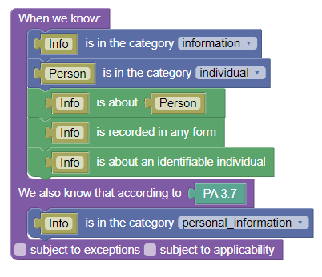

#### Encoding Section 3(7)(a)

```
a) information relating to the race, national or ethnic origin, colour, religion, age or marital status of the individual,
```

To encode this section I created attributes on the category "information" for
relating to each of the particular types of information, referring to an individual. Because it says "the individual", I took that to be a reference to the person the information is "about".

Note that a) does not duplicate the requirements of 7, nor is there any implication of how they would be satisfied merely by satisfiying a). The section is not saying that "information relating to race" is necessarily recorded or about an identifiable individual. The reference to "the individual" was interpreted to mean the identifiable individual the information was about, so that those requirements both still needed to be met to trigger a).

As such, I copied the rule from 7, and added the requirement that the information
relates in that way to the person the information is about. One such rule was
created for each of the several possible things to which the information could relate. A similar approach was taken for all of the paragraphs below.

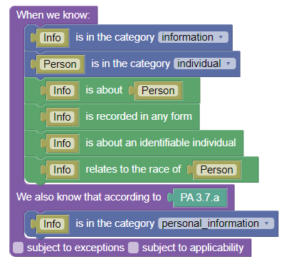

#### Encoding Section 3(7)(b)

```
b) information relating to the education or the medical, criminal or employment history of the individual or information relating to financial transactions in which the individual has been involved,
```

Paragraph (7)(b) was encoded in much the same way, setting out an additional 5 "related to" properties for information, and duplicating the rules similarly.

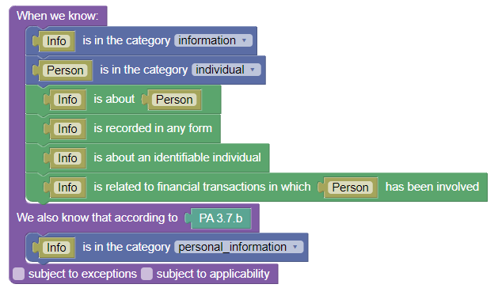

#### Encoding Section 3(7)(c)

```
c) any identifying number, symbol or other particular assigned to the individual,
```

The pattern of starting the paragraphs with "information relating to" has been abandoned, but it was presumed that the things listed would be examples of the information mentioned in 7, but because they are specific things as opposed to
categories of things, the "relating to" was not necessary.

To encode this section information was given three attributes referring to individuals, indicating that the information is an id number, id symbol, or id particular for that individual. Note that I chose to model this not as the
information "includes" these identifiers, because that's not what the rule says.

Again, because the reference is to "the individual", the requirement is not that the information identifies anyone, but that it identifies at least one person that
the information is "about". So the rule was drafted as follows, with three copies for the three attributes.

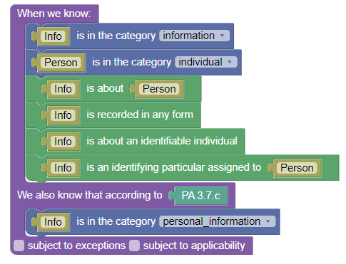

#### Encoding Section 3(7)(d)

```
d) the address, fingerprints or blood type of the individual,
```

This section was encoded in much the way section c) was encoded. Three attributes saying that the information "is" the address, fingerprints, or blood type of a given individual, and then adding the requirement in the rule that one
of those hold true for an individual the information is about.

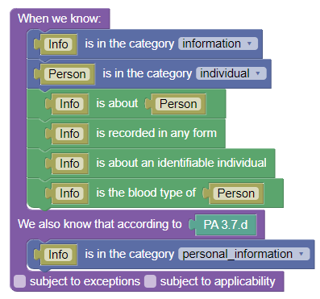

#### Encoding Section 3(7)(e)

```
e) the personal opinions or views of the individual except where they are about another individual or about a proposal for a grant, an award or a prize to be made to another individual by a government institution or a part of a government institution specified in the regulations 
```

Recognizing that this section sets out a default, and then an exception to that default, the section was divided into two, and encoded separately.

This immediately causes an interpretation problem. Section 7 says 
"without restricting the generality of the foregoing". Paragraph (e) has been
precluded from limiting what can constitute personal information. So it's not
clear that an exclusion would necessarily have legal effect. But we will come back to that.

##### Encoding Section 3(7)(e), first portion

```
e) the personal opinions or views of the individual
```

The first part was encoded by adding an attribute to information called "is_opinion_of" which refers to an individual. This attribute would say whose opinion it was, and by implication that it is an opinion.

The rule was encoded with the requirement that the information be the personal opinion of the person the information is about, but because of the exception this rule was set to be subject to exceptions.

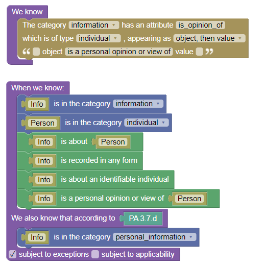

##### Encoding Section 3(7)(e), exception

```
except where they are about another individual or about a proposal for a grant, an award or a prize to be made to another individual by a government institution or a part of a government institution specified in the regulations ,
```

In this section I understood the disjunction at the first "or" to be primary, so the
first thing to encode was the exception that applies "where they are about another individual".


###### Encoding Section 3(7)(e), exception, first part

So it is no longer enough for us to know that the information is an opinion of a person, we need to know whose opinion it is and about whom it is an opinion. That is a ternary relationship between the information, the opiner, and opinee.
As such I created a 3-ary relationship called "personal_opinion_on_person", between an information and two individuals. In order to be sure to relate the
relationship to the previous predicate, I created an unattributed rule to assert that if an information was an opinion of A about anyone, it was an opinion of A's.

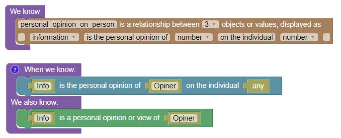

Then it was necessary to contradict the conclusion in the default, and to have the current section's conclusion override the default.
So I created a rule that when an information is the opinion of A on B, and when
A and B are not the same object (to represent the word "another" in "another individual")
then it is false that the information is personal information.

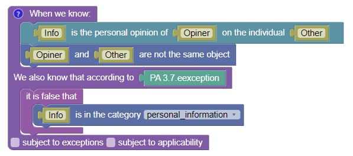

This was problematic, because a piece of information could be personal
information about more than one person, and it would not cease to be personal
information about one such person because any such person expressed an opinion
about someone else in that information. In the given ontology, the "information"
is either "personal" or it is not. If this conclusion served to declare that
something is not personal information, that would be excessive.

As such it seemed like this is more properly understood as an exclusion of applicability. The exception means that section (e) is not used to determine whether something is personal information when it is about another individual.

Blawx has features for applicability, so the root of (e) was changed to make it
subject to applicability, not to exceptions.

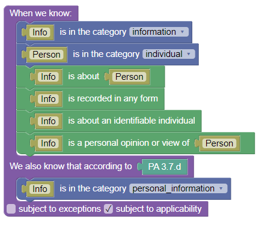

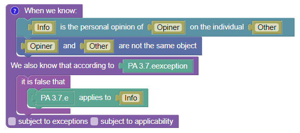

The Blawx applicability method requires that a value be set for applicability
explicitly for all elements, so it was necessary to encode a default rule that would make section e apply unless the exception made that false. That presumption
was implemented in an unattributed rule.

The question of where this implicit information, that section (e) applies unless
something says explicitly that it doesn't, should be found in the encoding, is
stylistic. My preference is where there is only one example of non-applicability,
to place the presumption with the non-applicability rules, because that is the
point at which the need for them becomes obvious. If there is more than one
exception it can be more coherent to place the presumption with the rule.

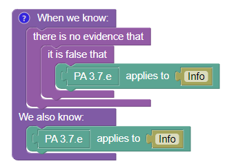

###### Encoding Section 3(7)(e), exception, second part

```
or about a proposal for a grant, an award or a prize to be made to another individual by a government institution or a part of a government institution specified in the regulations
```

This was complicated, so I skipped it in favour of encoding the other sections first.

#### Encoding Section 3(7)(f)

```
(f) correspondence sent to a government institution by the individual that is implicitly or explicitly of a private or confidential nature, and replies to such correspondence that would reveal the contents of the original correspondence,
```

Because this section is referring to messages to and from governments and individuals, we need a generic way to refer to them as either the sender or recipient for correspondence. As such, at this point in the encoding I created
the category "entity", and the category "correspondence", and the category "government_institution". I also created two ontological rules, shown below,
indicating that both individuals and government institutions are entities.

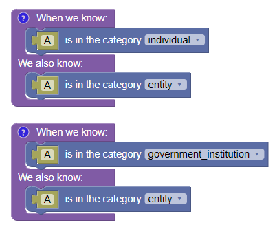

I then created four attributes for correspondence: sender, and recipient refer to entities. The attribute
"is_private" is a boolean that refers to "implicitly or explicitly of a private or
confidential nature". The attribute "reply_that_would_reveal_contents_of" is an
attribute from a correspondence, to a second correspondence, where the second
correspondence is a reply to the first that would reveal the contents of the first.

The first part of the rule, referring to correspondence sent to government institutions, was encoded by adding the requirements that the information is
correspondence, was sent by the person that the information is about, was
sent to a government institution, and is private.

Noting that the rule requires only "sent to" and not "received by", the blocks for
the sender and receiver attributes read "X was sent by Y" and "X was sent to Y",
respectively.

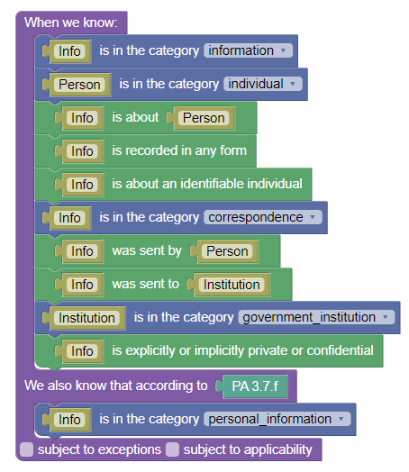

The rule about replies was encoded in much the same way, but adding the requirement
that the original is also a correspondence, the information is a revealing reply
to the original, and the other requirements are true of the original.

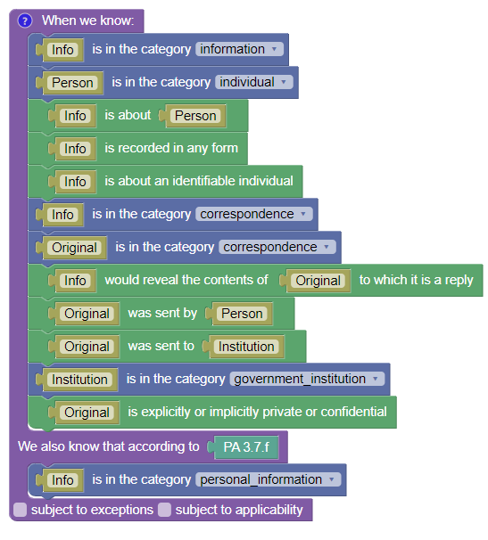

#### Encoding Section 3(7)(g)

```
g) the views or opinions of another individual about the individual,
```

At this point, it becomes clear that sections (e), (g), and (h) are designed to work together. Section (e) makes something personal information when it is opinion other than about another individual. Section (g) makes that same information personal information.

So the obvious question is why? Why would the subsections of 7, which are not supposed to set out exceptions to 7 at all, have three different clauses for opinions, when every opinion would fall under at least one of them?

That question led me to examine the rest of the act for how the definition of personal information is actually used, to see if that would offer any clues.

Such a clue was found in section 8(1) which reads:

>Disclosure of personal information
>
>8. (1)  Personal information under the control of a government institution shall not, without the consent of the individual to whom it relates, be disclosed by the institution except in accordance with this section.

This makes it clear that the legislation anticipates that personal information has an "individual to whom it relates" (or more than one) who has legal rights that other individuals do not have with regard to that information.

That phrase is used 6 times in the Act, and is not defined.

So the distinction being made in the definition (7)(e) and (g) is that if an information is an opinion of person A about person B, person B has those rights; and likewise, if it is not an opinion about another person, the author has those rights. So the definition of personal information is also trying to define the "individual to whom (the personal information) relates" at the same time.

So the question then is whether and how this differs from the phrasing in the definition of personal information, which refers the person the information is "about". 

As it happens, the word "about" is only used once outside of the definitions section, in section 5(2), which reads as follows:

>Individual to be informed of purpose  
>(2) A government institution shall inform any individual from whom the institution collects personal information about the individual of the purpose for which the information is being collected.

So here, the legislation anticipates that information is being collected from someone, and that information is "about" the person from whom it is being collected. Why might we use this phrasing instead of saying "individual to whom the personal information relates"?

Perhaps because a personal opinion is "about" both the opiner and the opinee, but the "individual to whom it relates" depends on the context. For instance, if the government collects from me my opinion of Bob, the information is "about" me, in the sense that it is about my opinion. But I am not the "individual to whom it relates," because it is an opinion about another individual.

My suspicion, therefore, is that who information is "about" and the person whose personal information it is, are two different things. An information can be "about" many people, but it is not necessarily true that all of those people are entitled to the legal rights associated with it being "their" personal information.

If I wanted to know whether or not that is actually the case, I would need to look to how authoritative sources have interpreted the rules in the past, like courts and privacy commissioners. But part of the point of this exercise is to explore the benefits for legislative drafting of formalizing legal texts in this way. It is therefore enough to be able to say the following:

**Formalizing the Privacy Act in this way revealed weaknesses in setting out the definition of personal information, in particular with regard to defining who qualifies as an "individual to whom it relates".**

My new interpretation of the definition is that for each section, we need to define not only whether it is personal information, but also the individual to whom it relates.

So then the question arises, what is the difference between saying that a piece of information is personal information, and saying that a piece of information relates to a particular individual as personal information?

It seems intuitive that if a piece of information is personal information related to Bob, then it is also personal information. Is it possible for something to be personal information, but for it not to be the case that it relates to anyone?

It would seem not, because personal information is information about an "identifiable individual" according to the definition, and that individual is referred to in all the examples provided.

As such, it is not necessary for us to identify "personal information" as a separate category, or for use to model "personal" as an attribute of information. It is enough for us to model the existence of an individual for whom the information is personal, and to whom it relates.

So that is how we will try again, eliminating the category of personal information, and merely define the relationship of "identifiable individual to whom the information relates".

#### Re-Encoding Section 3(7)

So we are going to change our ontology by getting rid of "personal information" as a category, getting rid of "about_identifiable_individual" as a property of information, and adding "relating_to" as an attribute of information that refers to an individual. We are also going to change the name of the "about" attribute to "identifiably_about". 

To be explicit, we are making another guess, here, that "identifiability" is intended to refer to a relationship between the information and the person the information is about, as opposed to the information alone, or the individual alone.

That is to say, we are interpreting the requirement "information about an identifiable individual" to include the requirement that it would be possible, given that information alone or in combination with other information, to identify which individual the information is about.

We are combining that requirement into the requirement that the information be "about" someone, by changing the name of the attribute to "identifiably_about".

If we return to the main section of the definition, we have the following ontology and rule.

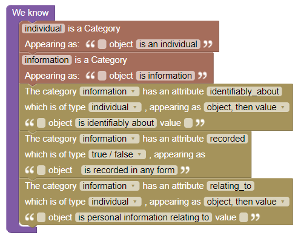

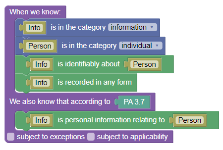

#### Re-Encoding Sections 3(7)(a-f)

Now we can re-write the rules in the sub-definitions accordingly.  It is still the case that the sub-definition are including the requirements of recording and identifiability and "about" by using the phrase "the information." So the requirements of the definition will be repeated there, with the additional requirements added, and with the modified conclusion that the information is personal information relating to a person.

Here is an example of the re-written rule for paragraph (a):

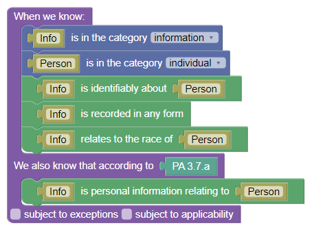

The rest of the code above was modified in a corresponding way.

However, because the conclusion is now a relationship between a person and the information, sections e, g, and h become easier to encode.

#### Re-Encoding Section 3(7)(g)

```
g) the views or opinions of another individual about the individual
```

This is easily specified by requiring that there be two individuals, that they are different, and that the "Person" is the subject of the opinion.

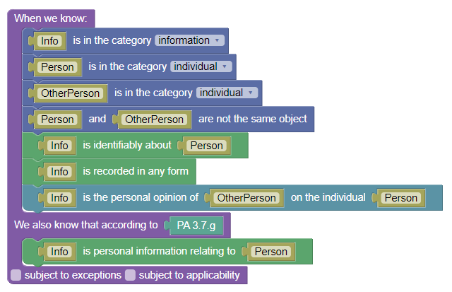

#### Re-Encoding Section 3(7)(e), exception, second part

Now we come to section h), which makes explicit mention of the same terms used in the exception portion of section e), so we'll bite the bullet and go back and encode the second half of the exception in section e using our new understanding of the rules.

```
or about a proposal for a grant, an award or a prize to be made to another individual by a government institution or a part of a government institution specified in the regulations
```

We could independently encode the concepts of grants, awards, and prizes, but for our purposes it is unlikely that we would be obtaining input data from a system that makes those distinctions, or from a person who would not be able to decide whether the larger category applies. It is sufficient, therefore, for us
to create a category called "proposal" which encompasses "a proposal for a
grant, an award, or a prize". Now we need it to be possible for information to be about a proposal in addition to being about a person. We could go back and modify the "about" attribute of information so that the target is some category to which both proposals and persons belong. Or, we could create another attribute called "about_proposal", which has proposals as the target specifically.

Or, we could leave the definition as-is, and simply allow the user to state in code that information is "about" a proposal. This is possible, at least inside the coding environment, because the coding environment does not do any type-checking
between different user-defined categories. But it is problematic on the user-
interface side, because interfaces like Scenario Editor (shown later) will use
the target category to decide what options to display. Creating a super-category
has similar problems, in that scenario editor doesn't immediately know what
super-categories apply to an object declared in a sub-category.

Ideally, these considerations wouldn't need to come into play, but Blawx remains
experimental alpha software. To accommodate those sorts of issues, we will
create a second "about_proposal" attribute, with proposals as the target. That will make it easier for the scenario editor and other applications to know what
kind of options to offer when they ask a user what the information is "about".

We need to give proposals a grantor and a grantee attribute.

We have the phrase "government institution or part of a government institution." There are various rules in the Privacy Act about what constitutes part of a government institution, but those are outside the scope of our encoding, so
we will choose to model this only with regard to government institutions, for
which there is already a category.

Another part of this text that requires attention is the phrase "to be made".
This adds a temporal aspect to the definition, in that it seems to refer to
a proposal with regard to a grant that has not yet been decided upon. That raises
the question of whether something ceases to be personal information once the granting decision has been made, which seems on its face to be unlikely. Another possibility is that an opinion issued about a grant that has already been issued at the time the opinion is issued might not qualify under this section. It is also possible that an opinion received by the government after the grant has been issued, regardless of when it was issued, is also not caught by this section.

For our purposes, we will assume that there is no important temporal aspect. A
piece of information is always personal information, or never, for any given reason, and that conclusion doesn't change over time. Because we don't have a
good way of answering the question "to be made as of when" based on the text, we will intentionally model it in that vague way, and create a way of recording the idea that the grant that the proposal is about is "to be made" without defining that further. We can do this by adding the idea "to be made" to the
attributed we have already defined as "about_proposal".

Another part of this text is "specified in the regulations". Currently, the Blawx language does not have mechanisms to refer in the abstract to possible subsidiary or superior legislation. If we added an actual regulation to the encoding, we could ask whether according to any number of sections of that regulation something is a government institution. But we also don't have the features in Blawx right now to refer to scopes of legislation such as "any subsection of this regulation", or "any regulation under this statute".

Because of those weaknesses, and because regulations are outside the scope of our encoding, we are also choosing not to encode that concept here.

In the same way that we need information to be about both individuals or proposals, we now need personal opinions to be about both. So we will create
another relationship for opinions of people, and another ontological rule
stating that information that is an opinion on a proposal is also an opinion.

Those decisions made, the ontology looks like this:

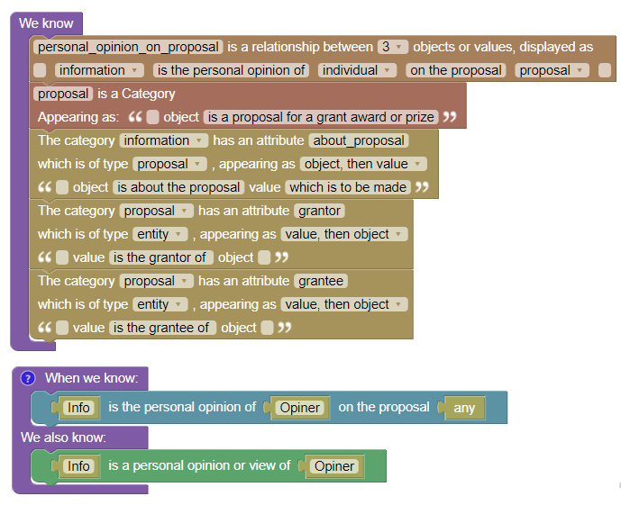

Now we need to encode the idea that section e of the definition does not apply
to information of this type. The requirements are that there is info, the info
is about a proposal to be made, the proposal is from a government institution to an individual,
the info is an opinion of an individual other than the grantee. If all of
those requirements are met then the rule in the main part of e does not apply.

Note that it is not necessary to restate the presumption that we already have
in this section.

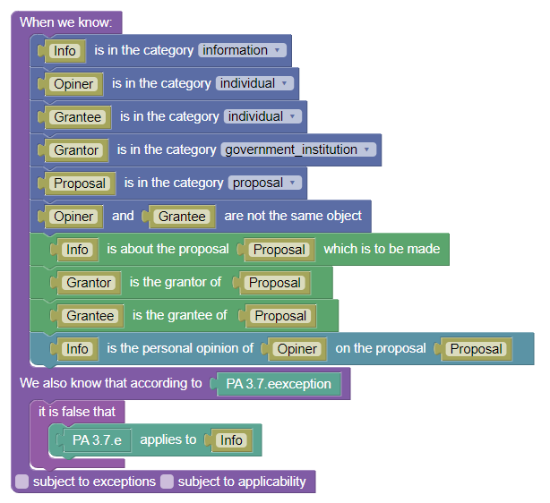

#### Encoding Section 3(7)(h)

Now we can return to section h of the definition

```
h) the views or opinions of another individual about a proposal for a grant, an award or a prize to be made to the individual by an institution or a part of an institution referred to in paragraph (e), but excluding the name of the other individual where it appears with the views or opinions of the other individual, and
```

The first thing to note about this section is the cross-reference to paragraph (e) of the current definition. My interpretation of it is that the reference
serves to import into this section the phrase "set out in the regulations" which
occurs in paragraph (e). But it leaves open the possible interpretation that
a government institution or part thereof is not "referred to" by paragraph (e)
unless paragraph (e) applies to a specific proposal from that department. Because (e) and (h) mirror each other, and will both always apply to the same
proposals, that is perhaps harmless. But it confuses the meaning of (h) for no
discernible benefit except avoiding repeating the phrase "set out in the regulations". If that's the objective, the phrase "government institution" should probably just be defined to include parts of government institutions as
set out in the regulations, allowing you to simplify both e and h in the definition of personal information. In fact, government institution is defined earlier in the act, and that reference does not refer to parts as defined in the regulations. That suggests the "parts" distinction is only relevant inside the definition of personal information, in which case it might still have been
clearer to simply repeat the words "as set out in the regulations" in both e and h.

Second, we have to note that there is an exception, here, too. It's worth repeating that because the root of the definition says "without limiting the generality of the foregoing", so an exception is confusing in that context. But we were able to interpret the exception in e, so perhaps the same approach will work, here.

The basic rule I interpret to be "information that is a person B's opinion about a grant to be awarded to a different person A is personal information relating to A."

So in that context, what does the exception mean? It starts saying "excluding the name of the other individual". Immediately we can see that there is a mis-match between the type of entity that the default rule applies to (an information that is an opinion on a proposal), and the thing excluded (a name). So this is not, as in
the exception in e, a rule that excludes the application of the rule to an information altogether. It seems like it might be applying an exclusion to a
specific sub-part of an information, specifically the opiner's name.

It's worth noting that the definition of personal information already considers
the possibility that "information" can be as little as a single piece of 
information, like a personal identifier, and that it can also be something that
includes those pieces of information, like an opinion. So the word "information" is already being used to define things that would include other "informations". But until now, we haven't needed to reflect that possibility in the code.

Here, we are being asked to determine that a super-information is personal information, but a sub-information of it is not.

This is an example of an implied ontology, that needs to be made explicit in code for the software to be able to work with it. The implication, as I read it, is as follows:

* informations may contain other informations
* by default, an information is personal information if the information that
  contains it is personal information.

Then, this section can be understood as an exception to that default. To encode this, we need to create the ontological terms and rules to describe that implication. That includes describing the idea of "contains" and "is_a_name". Here, we do not want to ascribe the implication that something inside something else is also personal information to a particular section of the law, because no section of the law says so explicitly. We also don't want
to override it with regard to the conclusion of any given section of the law,
so the exceptions system is not what we need. Instead, we will encode a
presumption which is true unless it is false, using an unattributed rule.

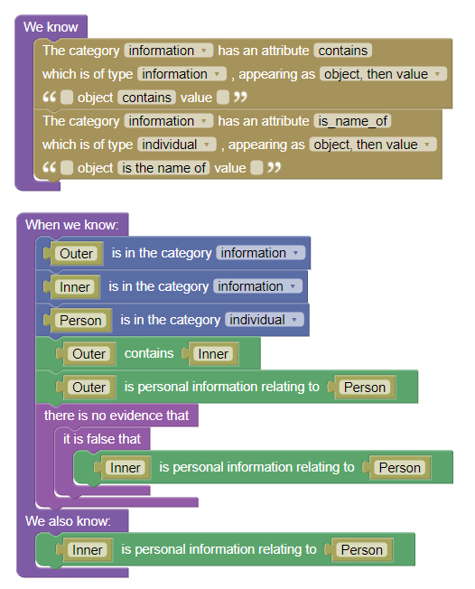

Now we can model "excluding the name of the other individual where it appears with the views or opinions of the other individual" by saying that the presumption does not apply to the name of the opiner when it is contained in an opinion. We are basically guessing as to the meaning of "appears with" being
equivalent to "contained in".

We therefore need two rules, one making the opinion personal information about the potential grantee, and another defeating the presumption that contained information is personal information if it is the name of the opiner.

The first part is almost identical to the exception in e, but with a different conclusion and section. 

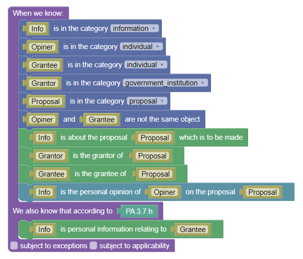

Now the rule is mostly duplicated, with the addition of a second piece of information, which is contained by the first, is the opiner's name, and the
conclusion is changed to logically falsify that the second information is
personal information regarding the grantee.

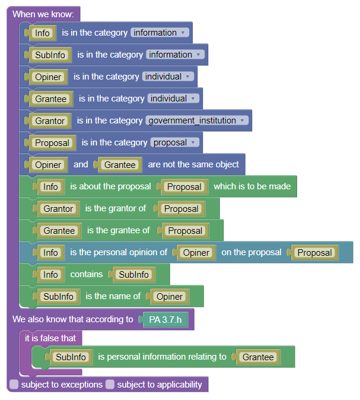

##### Disjunctive "and"

Let's take a second to note the word "and" at the end of (h). This is an example of why it is dangerous to use the raw text of a piece of legislation
to determine its semantic meaning. By default, the word "and" would be considered to be conjunctive, requiring both (or all) of the listed elements.

But frequently, as in this case, the word "and" is used to indicate that all the elements of the list are included in the list, and somewhere else it
is indicated that any element of the list is a disjunctive option. Here, the root of the definition says "including." The list of paragraphs is therefore logically disjunctive. Any on its own is sufficient to find that something is personal information.

So "and", here, means "or".

#### Encoding Section 3(7)(f)

```
 (i) the name of the individual where it appears with other personal information relating to the individual or where the disclosure of the name itself would reveal information about the individual,
```

Here, we need to add the concept of a name that in and of itself reveals information. We could model this as an attribute of an individual, that their name reveals information. But we have also stated that an information can be a
name, and the section applies to informations, not people. Plus people can have
more than one name, with some names having that risk and others not. So it is
perhaps better to encode this as a property of informations that are names.

We could create "name" as a category, but for the sake of simplicity we will create another attribute that a piece of information can be revealing alone. The text says that something is personal information where disclosure of the name itself would reveal information about the individual, as opposed to about
other people. So this should be an attribute between a piece of information and a person for whom that piece of information is revealing in and of itself.

It is impossible, in our ontology, for a piece of information to be revealing
with regard to an individual, and for it not to also be "about" that person.
We can therefore include an ontological rule making that implication.

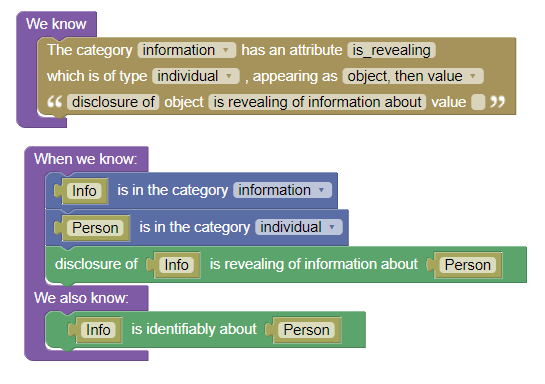

Now we can create the two disjunctive rules that make names personal information. The first is that a name is personal information if it appears
with other personal information. We can model "appears with" in the same
way that we did for (h), asking whether it is contained in information
which is also personal with regard to the same person. Following the pattern
used elsewhere, we get this rule:

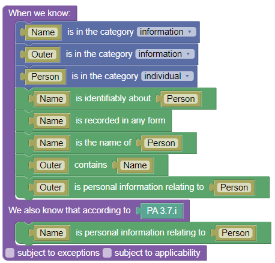

Some of these statements seem redundant, but may not be. For instance it seems
redundant to say that a name is personally identifying about "a person". But
that is not what that line of the rule means, in this context. Because the
variable name "person" is also used elsewhere, what it actually means is
something more like "the information called Name is the name of the person for
whom the containing information is about", which is less obvious.

Note that this rule is recursive. It reaches a conclusion about what is personal
information for who, and in order to reach that conclusion it considers whether
something is personal information for someone. So it is referring to its own
conclusion in its conditions, which creates opportunities for logical loops.
That can be a problem for computational efficiency, and can in some circumstances
create encodings that are unable to terminate because they loop indefinitely.

That's something that we will need to be aware of when testing this code.

#### Encoding Section 3(7.1)

```
(7)(1) but, for the purposes of sections 7, 8 and 26 and section 19 of the Access to Information Act, does not include
```

Because it is illustrative of some of the features Blawx has, and some
features it does not, we are also going to encode the exception under
paragraph (m) of the definition.

The first thing to note about this is that structurally, there is no way to
pinpoint the text that initiates paragraph (m), as it appears as a second
section of root text of the definition, and shares the same numbering scheme
as the prior list in the definition, despite the fact it has a different
function. That is why we had to create non-existent 7.1 in order to be able
to create code for this text inside Blawx. (noting that 7 itself is also representative of the 7th definition in the definitions section.)

Apart from that strangeness, we have, again, the strangeness that despite
the fact the definition says "without limiting the generality of the foregoing",
we again have a set of exceptions that are clearly intended to do exactly that.

Next, we are faced with the text "for the purposes of section 7..." This is a
formulation that occurs more than I would like in statutes, and for which there
is not currently a good representation inside Blawx. One way that this could be
represented is by the computer-science concept of "overloading", where a term
is given one meaning in a larger context, and given another meaning in a smaller,
contained context. It is potentially possible to implement a feature such
as that in Blawx in the future, but it does not currently exist. As such,
we are required to create a second attribute that indicates that information
is personal information for the purposes of those sections, create a
presumption that something that is personal elsewhere is also personal for
the more specific version, declare rules that override that presumption,
and then make sure we are using the newly defined attribute in the relevant
sections.

It is the last part, the requirement to know that a special version of the
attribute has been defined elsewhere before you can know which attribute to
use in the target sections, that is most objectionable, because it is a
violation of structural isomorphism. It makes it impossible to know how to
encode section 7 unless you are also aware of the existence of this special
version of the attribute. That violation of the one-to-one relationship
between encodings and rules make the encodings harder to write properly, and
also make the encodings harder to maintain when the rules change, because you
need to know more to make the required changes to a given section.

So this is an example of a limitation in Blawx's design, and how you can
workaround it, for now.

The exception in (m) for people who have been dead for 20 years is an
example of defeasibility. If it were not for the rule in (m), it would be the
case that the conclusion that something is personal information generally
would lead to the conclusion that it is personal information for section 7 also.
We may want to be able to ask questions like "which section overruled that
conclusion" in the course of testing our rules. So we will use Blawx's exceptions system to represent this.

The difficulty is that Blawx's exception system does not have an easy way of
overriding unattributed rules. So we will need to take the implied conclusion
that personal information generally is also personal information for section 7,
and turn that into an attributed rule. We will attribute that rule to the (7.1)
section, and indicate that the rule is subject to exceptions.

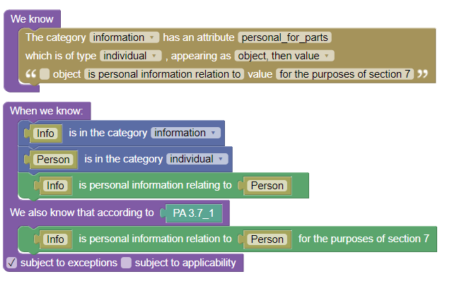

Now we need to describe the exception in (m).

#### Encoding Section 3(7.1)(m)

```
m) information about an individual who has been dead for more than twenty years;
```

The one element we need to add to the ontology to describe this rule is that individuals have dates of death.

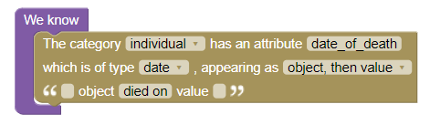

Now we need to make a rule that contradicts the rule in 7.1 for people who have
been dead for more than 20 years.

Dealing with date math in Blawx is unusual compared to a lot of programming
languages, because the statements are not nested, and instead of related to one
another by sharing variable names.  So our calculation for whether a person has
been dead for more than 20 years can be interpreted like this:

> * Today is a date.
> * The person has a date of death.
> * If you add 7305 days to the date of death, you get the date on which they were dead for 20 years.
> * If the date on which they were dead for 20 years is before today, they have
>been dead for more than 20 years.

The reason for using 7305 days as opposed to 20 years is that Blawx's date math
currently does not support date units larger than days. The reason for that is
that Blawx uses constraint math to calculate date math, but constraint math
doesn't cooperate very well with units that are of inconsistent size, such as years and months.
The ability to deal effectively with years and months may be added again in
the future.

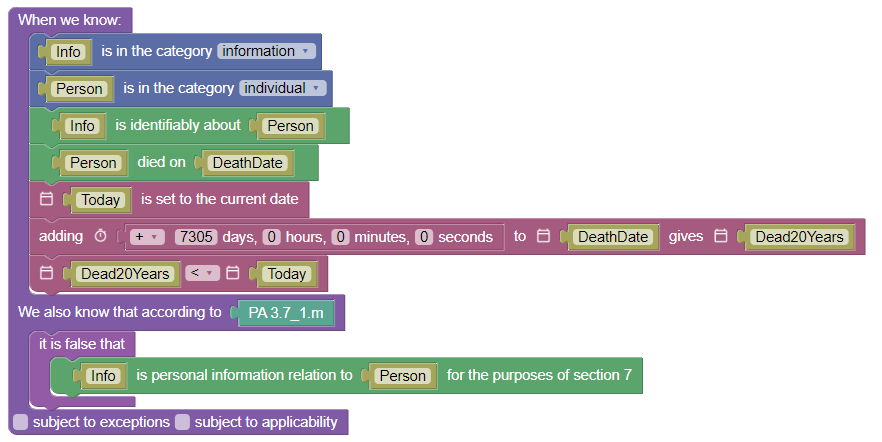

Now we have created a rule that comes to a contradictory conclusion to the rule in 7.1, which we indicated was subject to exceptions. In order for Blawx to know
which of these conclusions should "win", we need to be explicit about the overriding relationship between them.  That is done using the overrules block,
as follows.

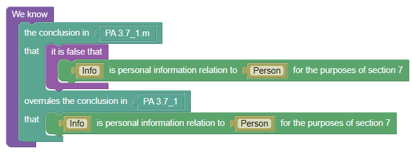

Now Blawx knows everything that it needs to know in order to resolve a conflict between the two conclusions if they would otherwise both hold.

The use of contradicting rules and an override block allows you to state the relationship between the contradicting rules wherever it appears in the law. If
the rule says "subject to", you can put the overrules block with the default rule. If the rule says "despite", you can put the overrules block with the exception. This aids in structural isomorphism, which makes the rules easier to write and maintain.

Note that requiring the user to specify that a rule is subject to exceptions is
also a violation of the principle of structural isomorphism. YOu have to know there is an exception somewhere else before you know to check off that box, so you are expressing knowledge that comes from elsewhere in the rule. In future versions of Blawx it won't be necessary to do that, as exceptions can be enabled for any rules that are targeted by an overrules block.

#### Encoding Section 7

```
7. Personal information under the control of a government institution shall not, without the consent of the individual to whom it relates, be used by the institution except ...
```

For this section we need to add the concept of a "purpose", "control", "consent", and "permitted to use".

Note that in Blawx there is no built-in deontic concepts like permission,
prohibition, etc. So if you want to model that something is permitted, you
need to create a predicate for that idea. That may change in future versions.

To model purposes, we will create a new category. To model control, we will
add the attribute "under_control_of" to the category information, and have it
point to an entity. To model "consent" we will create a relationship that
indicates an individual has consented to the use of an information by an entity
for a purpose. And for permission, we will create another relationship
indicating that an entity is permitted to use an information for a purpose.

The ontology looks like this:

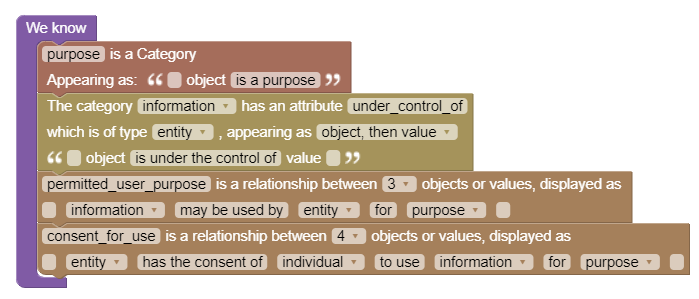

We can see from the word "except" that this section is describing a default
that will be overruled in the following sections, so we will use Blawx's
exceptions features to encode it. The default rule here is that if a 
government institution controls an information about a person who has not
consented to the use of that information by that institution for a purpose,
the institution may not use it for that purpose.

Arguably, implicit in this section is the opposite idea, that if consent has
been granted, then it is permitted. It might seem strange to need to say so,
but remember that in Blawx statements can be true, false, or neither. So if
we ever want to be able to say that something is permitted due to consent,
we need to create a rule that makes that implication possible.

We need to remember to use the "for the purposes of section 7" version of
the personal information attribute.

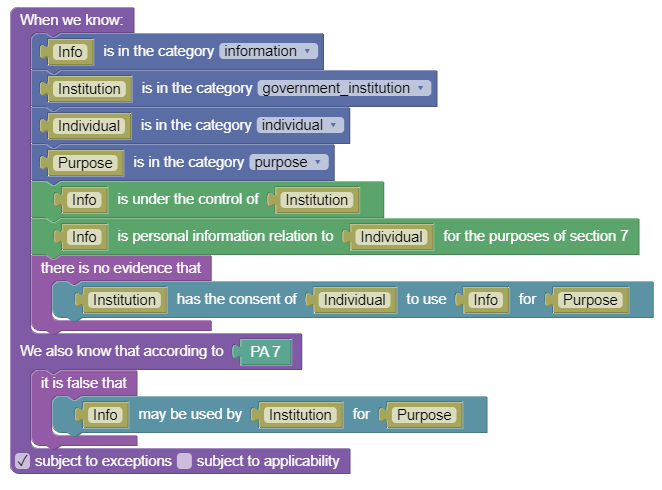

Note that only this rule is set to be subject to exceptions, because the exceptions
seem to be designed to set out cases only where use is permitted, never to find
cases where it is not despite consent.

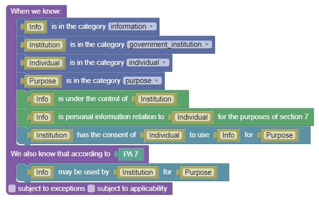

Now we will encode the exception in 7(a).

#### Encoding Section 7(a)

```
7(a) for the purpose for which the information was obtained or compiled by the institution or for a use consistent with that purpose; or
```

Here there are two ontological concepts that have been added: the purpose for
which information was obtained, and uses consistent with that purpose. In
deciding how to model this, we need to decide whether to create separate
representations of the concept of a "use" and a "purpose", or to join them
into a single concept in our model. If we separate them, we would need to model
relationships where a use is "for" a purpose, or is "consistent" with a purpose
separately. For the sake of simplicity, we will unify the two ideas as one,
call it purpose, not model uses directly, and instead ask whether purposes
are consistent with one another.

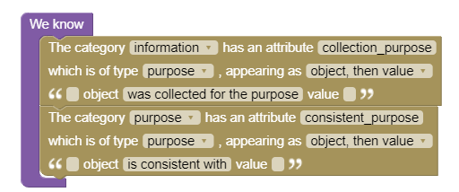

Note that just because we are not modelling the concept of a "use" separately
inside the ontology doesn't mean that it is excluded in our model. But it
exists at the semantic layer, instead of the syntactic layer, and thus cannot
be directly referred to, as distinguished from other uses, inside our rules.

There are two implications in this section. The first is that a government
institution can use information if the use is for the purpose for which the
information was collected. The second is that it can also use that information
for consistent purposes. We will create both of those rules separately.

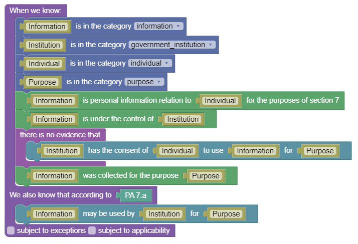

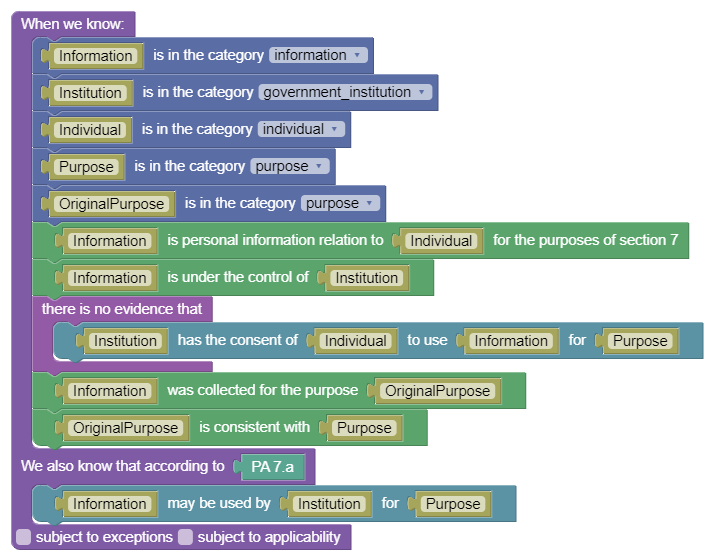

Because these are exceptions to the rule in 7, we need to specify how the
constradictory conclusions are resolved. We do that using the overrules block.

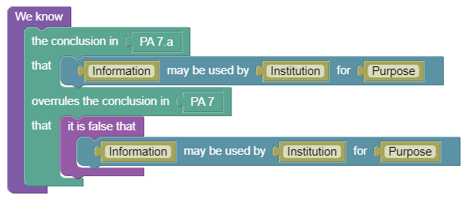

And that completes the second draft of the encoding. We can now proceed to testing and validating the encoding.

### Testing the Encoding

For the purpose of illustrating how Blawx can be used to test the behaviour
of rules, we will go through a number of small tests, and show how these
tests give the answers we expect (or not).

This section of the document is intended only to give readers an intuition for
how tests work in Blawx, and how they can be used to learn about the
behaviour of your encoding. **It is not intended to give best practices as
to testing code to be used in production, particularly where the use of that code has risks
of harm.** Best practices for testing of code to be used in production are still being
explored, but would be more extensive and cover a wider
array of possible inputs than shown here.

#### Test 1

We will start with a very simple fact scenario in which there is a person, bob,
and there is a document which indicates that bob is caucasian. Let's see if
Blawx can correctly conclude that this document is personal information, and why.

We model this in our block language as 4 facts. Bob is an individual, the
document is information, the document is identifiably about bob, and it is
recorded in any form.

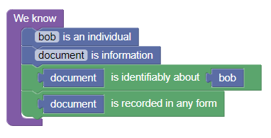

Now we will create a question that asks whether the document is personal
information relating to bob, as follows:

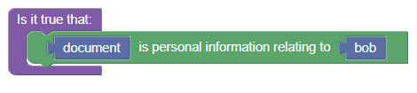

We can "Run" this test in Blawx, and we get only one answer, with only
one explanation, which appears as follows:

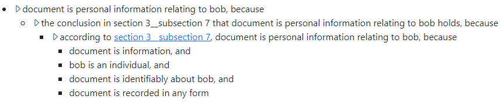

Note that in the Blawx interface a great deal more information appears, to
facilitate debugging. But that information is left out of the images for
the purpose of illustration.

You can see that Blawx has concluded that the document is personal information
by virtue of section 3 subsection 7, which is how we have renumbered the
definition of "personal information".  If the user hovers over the linked
portion of that explanation, the text of the definition appears as a tool tip.

#### Test 2

But of course, the document is not merely about bob, it is about bob's race.
We can add that as a fact to the test and run it again, and see what happens.

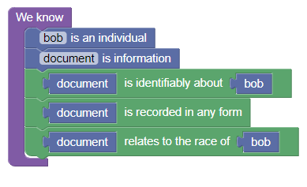

Now when we run the test, we still get only one answer, but we get two explanations. The first is identical to the answer in the first test. The
new second explanation appears like this:

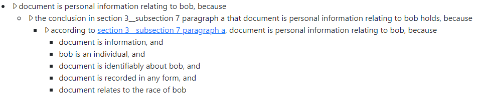

So you can see that Blawx has determined that it is still true that the document
is personal information about bob, merely by virtue of being identifiably about
him and recorded. But with the additional fact Blawx can also reach that
conclusion using paragraph (a) of the definition, which specifically mentions
information relating to a person's race.

This is the behaviour we should expect. The conclusion in (a) is not mutually
exclusive to the conclusion in the root of the definition, so both should be
possible ways of reaching the same conclusion.

If we were to add more facts about the document that would make it personal
information under more paragraphs of the definition, more explanations would
appear for the same conclusion.

#### Test 3

Now let's ask a different question, and find out whether the document is
personal information for the purposes of section 7. Our facts stay the same,
but the new version of the question looks like this:

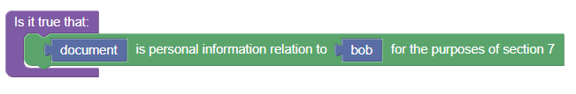

Again, we will get two explanations for the answer, which are based on the root
of the definition and paragraph (a) of the definition respectively, but we will
examine only the first of these to see how it has changed.

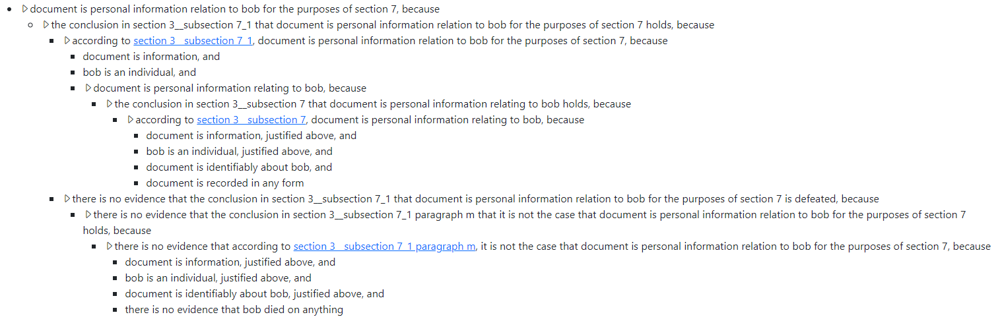

Reading these explanations is already becoming more complicated, but they are
easier to follow if you remember that each line and it's sub-parts should
correspond to a conclusion in a rule, and the conditions of that rule.

Here, our question was whether the document is personal information for the purpose of section 7. That conclusion "holds" because of two things:
according to 3(7.1) it is true, and nothing else defeats that conclusion.
These conclusions are included because the conclusion in 3(7.1) was made
subject to exceptions.

If we look at how Blawx knows that 3(7.1) reached that conclusion, we see
there are only three sub-elements. Those correspond to the
three conditions in the rule we created for 3(7.1):


The third part of that rule is that the info is personal to bob,
which is the question we were asking in our earlier tests, and you
can see from that point down in the tree, the explanation is the same.
In the second explanation, that is the portion of the tree that is
different, and in exactly the same way as before: it uses section 3(7)(a) instead of 3(7).

Further down we have the explanation for how we know that the
conclusion reached in 3(7.1) is not defeated. That is true for only one reason, that there is no evidence that the overriding
conclusion from section 3(7.1)(m) holds. And we know that there
is no evidence that paragraph (m) contradicts because of four things. This is slightly less intuitive, and the reason is how
Blawx generates rules to calculate when things are not true. But
generally speaking, there are a number of factors less than or
equal to the number of conditions in the rule, and one of those
factors doesn't hold.

In this case, we can see that the first three requirements of paragraph (m) are met, and the fourth (that there is a date on
which bob died), is not. Here is the code for paragraph (m):


So you can see that this rule actually has 7 statements in
the conditions of the rule, but only the first four are listed
in the explanation, because Blawx will only provide the first
reason that a rule does not hold in an explanation, even if there
are potentially multiple ways in which the rule would not have
triggered.

#### Test 4

Now let's see what happens if we give Bob a date of death of less than 20 years in the past. Our new version of the facts will look like this:

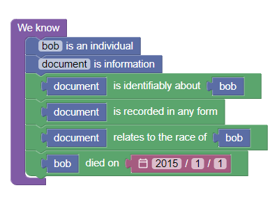

(We are testing this in 2023, so 2015 is less than 20 year ago.)

Now if we run the test again, we would expect the answer to be
the same. The document is personal information. The only difference
should be in how the non-applicability of paragraph (m) is explained. And it is different, but it is not different in 
the way we might have hoped:

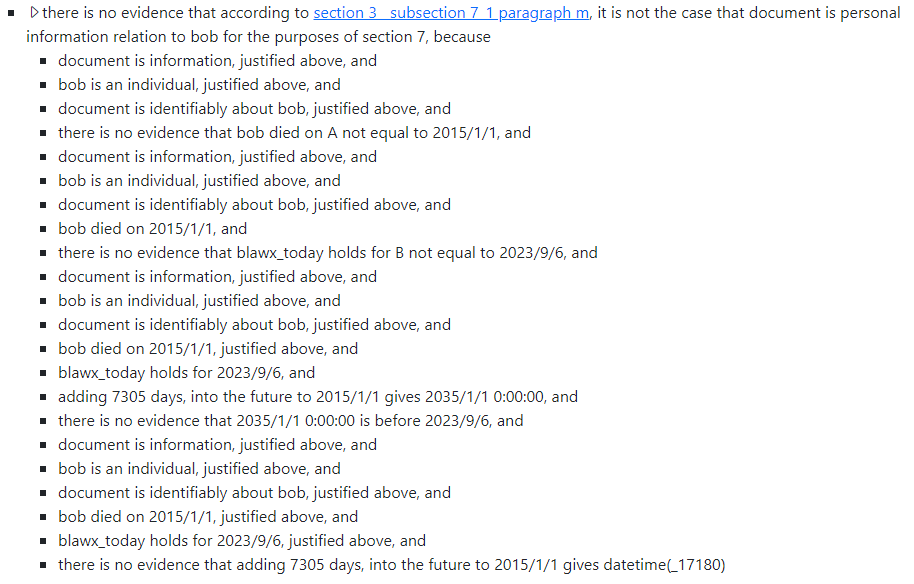


The reasons for this are complex, and have to do with the way that
Blawx deals with doing math about numbers, which is using a constraint math. But if you look closely, you can see a similar
pattern to the one above.  The explanation can be thought of as Blawx trying four different ways of reaching the conclusion, each
of which fails for different reasons. Each sub-attempt can be seen if you look at the lines in the explanation that start with "document is information, justified above", and continue until that line is repeated. Let's take a look at each, one at a time.

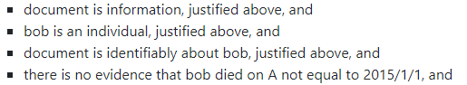

This attempt is very similar to the original explanation,
except that the last line says there is no evidence that bob
died on a day other than the day on which we told Blawx he died.
That would seldom be useful to say to a human being, because
human beings understand that people cannot die twice. But Blawx
has no intuition for that, and the way it does math is based on
numerical constraints, which means it is always trying to find
another way in which the formula might hold. So these four lines
serve to say "bob only has one death date."

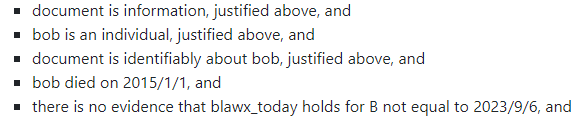

Here it is using the given death date for bob, and then checking
for the date for today, and coming to the same conclusion that
it would not be necessary to say to a person, that "today" has
only one value.

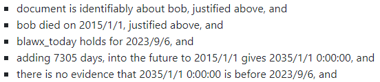

This is the explanation that we would actually expect. Given
the date we know bob died, and today's date, you can add
our estimation of 20 years (in days) to the date he died, and
get a new date (in 2035), and that date is not before today.

This is the only version of the explanation that a human would
need.

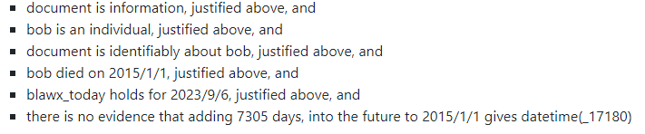

Lastly, Blawx also wants do know if there are other values that
can be received by adding 7305 days to the death date of bob,
which seems like a strange thing to check for when you are
talking about addition, but it is a side effect of the fact that
blawx is doing constraint math in order to calculate these results *in the negative*.

#### Test 5

Now let's see what happens if we make bob's death date more than
20 years in the past. Our new facts look the same, but with an
earlier death date.

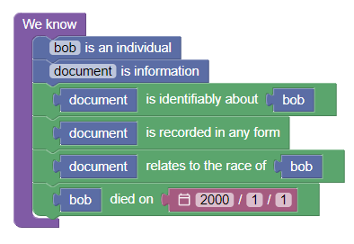

Now when we run the test, we get no answers.

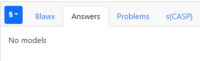

Unfortunately, that doesn't give us a lot of information about why
there were no answers received. But because Blawx has the ability
to explain negations, and we know that the answer to this question
is "no", we can negate the question in order to get a "yes", and
an explanation. So we will add a "there is no evidence that"
block to our question, and ask again.

#### Test 6

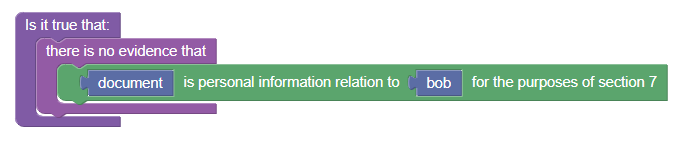

Now when we run the code, we get a single answer, that the document
is not personal information for the purpose of section 7, with
two explanations that differ in the same way. If we zoom in on
only the part of the explanation that shows how it was determined
that paragraph (m) applied, and therefore overruled, we see the following:

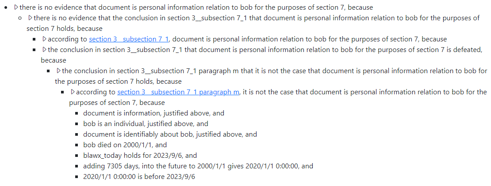

And you can see here that we are getting the explanation that
we would expect, which is that the conclusion in (m) is true
because each line in the conditions of (m) is also true.

Now that we know that answers for whether or not something is
personal information for the purposes of section 7 seem to be
working as we expect, we can start asking questions about section
7 itself, and ask about what uses are permitted for whom, and
why.

#### Test 7

Note that this is a search question, as opposed to a true or false
question. Blawx will allow you to ask both. In this case instead
of asking "is it true that a specific department can use a 
specific information for a specific purpose", we are going to ask
blawx "find all of the scenarios in which a department can use
information for a purpose", without specifying any of the three
elements. We do this by using variables in the question, like this:

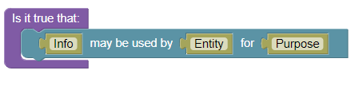

When we ask a search question like this, Blawx will find all the valid answers, all the valid explanations for each answer, and
will also tell you what values were slotted into each of the
variables in a given answer.

But of course, if we run this question with the existing facts,
we will get no answers, because there are no institutions,
there are no purposes, etc.

We can approach this problem in one of two ways. We can do
what we did above and add specific information, or we can tell
Blawx to hypothesize about possible information, and ask it for
those scenarios in which the question can be answered positively.

Let's play with Blawx's hypothetical reasoning features instead.

We know that under our rules, by default, an institution cannot
use information unless certain things are true. We also know that
the rule in section 7 needs to know about institutions, purposes,
control, and consent.  So we will use the "assume" block in our
facts to ask Blawx to hypothesize about the existence of
institutions and purposes, whether those institutions control any
information, and whether any consent exists.  Those blocks are
added to the existing facts. We also need to change bob's death
date to be more recent. The new facts look like this:

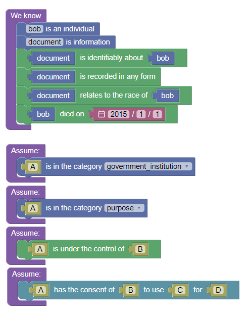

How many answers do you expect? And how many explanations?
And what should the explanation say?

I would expect that there will be one answer, that a hypothetical
institution could use the document for a hypothetical purpose.
And I would expect that would depend on the document being
personal information for the purposes of section 7, which we 
already know has two explanations. But without providing any information about purposes for which it is collected and used,
the only way to conclude that anyone is allowed to use it if there
is consent. So there will be only the two explanations, and the
facts will presume that consent has been granted.

As it happens, we get two answers, each with one explanation. Why do we get two answers if the answers are the same? Because Blawx is not comfortable asserting that a hypothetical object used in one answer to the question is "the same" as another hypothetical object used in a different one.

Let's dig into the explanation for the first answer:

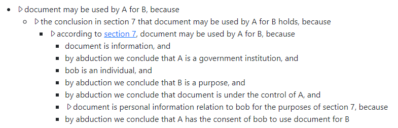

Here we can see that Blawx has used section 7 to conclude that
the document can be used by a hypothetical government institution
it has given the name "A", for a hypothetical purpose it has given
the name "B".

As we would expect, the justification for this looks the same as
the rule in section 7, and has the same 7 requirements.

The drop-down arrow next to the next-to-last condition indicates
that Blawx can provide an explanation for how it reached the
conclusion that the document is personal information for the
purposes of section 7, but we know exactly what that explanation
will contain, so we can leave it collapsed and view only the new
information.

What is different is that four things have been concluded "by
abduction". That means we asked Blawx to hypothesize about statements that could be true in order to find answers for our
search, and the "abducted" statements are the assumptions that it
made.

This is an extremely useful feature of Blawx, because effectively, it gives you the opportunity to ask questions like "under what circumstances can a legal conclusion hold", tell Blawx
to hypothesize about all or a portion of the relevant facts, and
have Blawx effectively describe all of the different abstract fact
scenarios in which that conclusion holds.

In this case, you can read the answer as saying "a government
institution would be entitled to use the document for a purpose if
the institution and the purpose existed, if the institution was in
control of the document, and if bob had consented to its use."

This is very useful for testing the behaviour of your code, because instead of asking "does it give the right answer when I give these inputs", you can ask "what are all the possible combinations of inputs that will generate this answer?"

It is also useful for automated legal systems, because you can keep
track of assumptions that the code is making in order to reach a conclusion, and then display those assumptions to the user, and
advise the user that the conclusion is true only if the assumptions are.

It can also be used in the development of expert systems, to allow
the system to make assumptions about the answers to questions that haven't been asked yet, in order to determine if there is any
way to answer the user's questions, and if so, what additional questions are relevant to ask.


#### Test 8

An important thing to consider when using assumptions is that
they run in both directions. When you ask Blawx to assume something,
it actually considers situations in which that thing is true, and situations in which that thing is logically false. The only thing that is not considered is situations in which we have no information. So if we use the same facts and assumptions but ask instead to search for
situations in which an institution is not permitted to use an
information for a purpose, Blawx may be able to find ways to
answer that question, too.

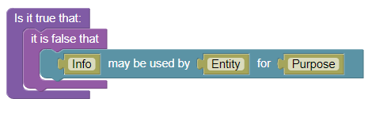

And when we run that code, we get two answers, which differ in
the usual way, in which it is assumed that consent was not granted.

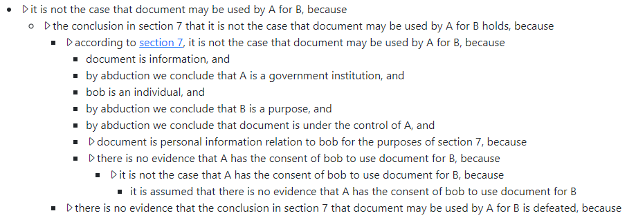

This explanation seems convoluted when explaining how Blawx
concluded that there is no evidence for the consent. Instead of
merely asserting that it abduced that the evidence did not exist,
it says that it does not exist because the false version of the
statement was true, because the non-existence was assumed.

Note that it is using the word "assumed" instead of "abducted",
here. The reason for this is complicated. When you ask Blawx
to make an assumption, you are asking it to assume in every
scenario that either the true or the false statement is true. It does not consider situations in which there is merely no evidence.

The way that Blawx implements this assumption is by creating a pair
of rules. One rule says that if there is no evidence it is false,
it is true. The other rule says that if there is no evidence it is
true, it is false.  These two rules force the reasoner to pick one,
either true or false, and have no evidence for the other.

But our test for whether something can be used or not checks
explicitly for the absence of evidence of consent, which is
different from falsehood of consent. Blawx can reason that there
is no evidence that something is true if it also knows that the
same thing is false. It derives the fact that
it is false from the rule, which it chooses to apply in this case,
that if there is no evidence that it is true, it is false.

But that rule in tern requires Blawx to be confident that there
is no evidence it is true, which is the think Blawx was originally trying to figure out.

When Blawx runs into loops like these, and the absence of 
evidence of something is being used to justify the same absence
of evidence of that thing, Blawx "assumes" that there is no
evidence of it.  So in this case, it is not the "abduced"
conclusion that consent is true, or that consent is false, but
rather the "assumed" conclusion that there is no evidence it is
true, that is being used to reach the hypothetical conclusion.

So far, Blawx has told us that an institution is entitled to use
the document for a purpose if it has consent, and it is not
entitled to use the document for a purpose if it does not.

#### Test 9

Now let's ask Blawx to hypothesize about the other facts used
in section 7(a), having to do with the purpose for which the
information was collected, and consistent purposes. We will
add two more assumptions to our test, and change the question
back to the positive form. In essence, we are now asking
Blawx "what are all the circumstances under which an institution
is entitled to use an information for a purpose?" with the
restrictions that there is only the one individual and document we have described in the facts.

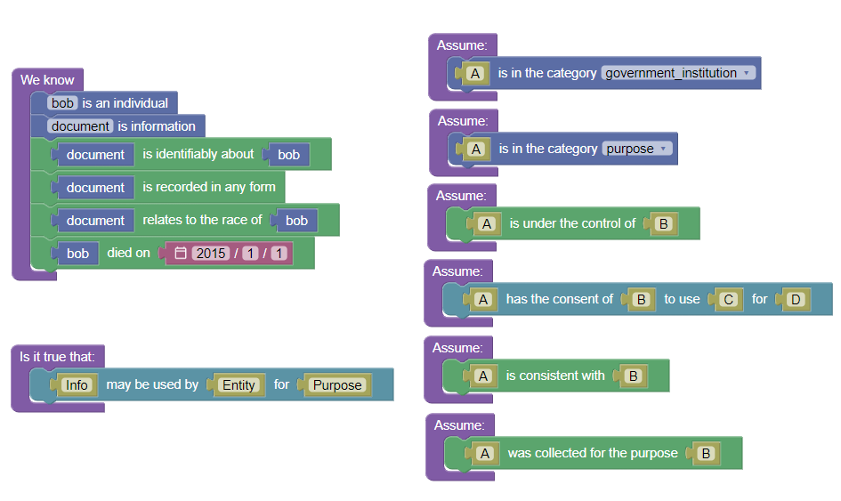

My guess is that there is the circumstance under which there is
consent, the circumstance under which it is for the purpose for
which it was collected, the circumstance under which it is for
a consistent purpose with that purpose, and for each of those
there are two different ways of concluding that the document
constitutes personal information, for a total of 6 explanations.

And indeed, that is what Blawx provides, six answers each with one
explanation.  The first two explanations use section 7 to reach that
conclusion, using section 3(7) and 3(7)(a) respectively to determine that
the document is personal information at all. The next two use section 7(a) to
find that there is permission, using sections 3(7) and 3(7)(a) respectively,
assuming that it is being used for the purpose for which it was collected.
The last two use the same sections, but assume that it is being used for
a consistent purpose.

A portion of the last explanation is shown here:

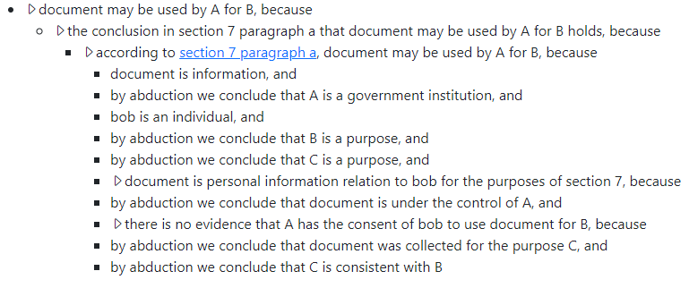

### Validating the Encoding

In this experiment, no actual validation step occurred, but in this section of
the document I will demonstrate the Scenario Editor interface that was built
in order to facilitate validation by non-programmer subject matter experts.

This interface has been used in several experiments conducted by CSPS, and
feedback and insights from those experiments is included below.

To do this, we create a new test which contains only the question of who
is entitled to use what information for what purpose:

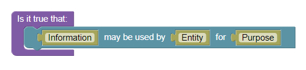

Then we enter the Scenario Editor by choosing that command from the menu in the
top left of the test editor interface:

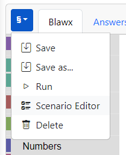

#### Scenario Editor Facts

We are presented with the scenario editor interface on the facts tab.

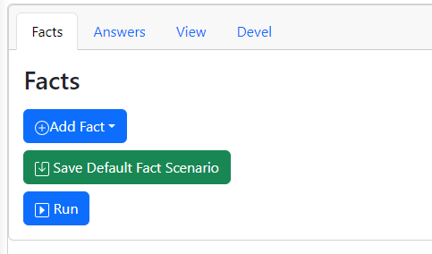

Clicking on the Add Fact button generates a menu of statement types, in natural
langauge, based on all the categories, attributes, and relationships set out in the
encoding.

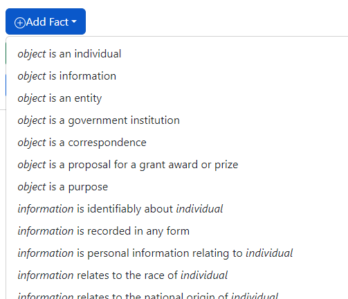

For category statements, the natural language version of the statement replaces
the only parameter with the word "object". For attributes and relationships,
the object and value if any are replaced with words describing their data type or 
category. These names are highlighted in the text to indicate that they will be
replaced with other values when used.

#### Scenario Editor Views

It is clear that for large, complicated encodings, this list of all possible options
will become unwieldy, and so it will be necessary to group it, or allow the user to
filter it, or use an autocomplete search interface to find the statements they want.

As a preliminary way of simplifying the interface, you can use the View tab of
the scenario editor to specify which ontological elements should be excluded. When
a term is excluded in this way it is excluded both from the Add Facts block, and it
is excluded from the list of facts provided by the server, if any.

It is generally a good practice to exclude at least the term that the test is querying,
to avoid the possibility that the user will inadvertently answer the question
themselves.

As an illustration, we will show how a user might use the scenario editor to run
Test 4 described above, so we will use the view tab to limit the interface to the 
statement types that are used in that test. An portion of the View tab then looks
like this:

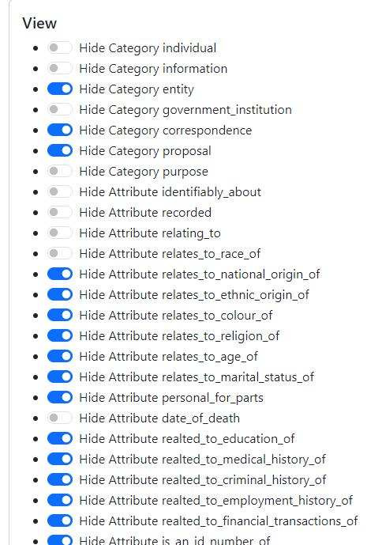

By clicking on the "Save as Default View" button, you can ensure that this is the
view that will be used by default whenever this test is opened in the Scenario
Editor.

Returning to the Fact tab, the Add Fact menu now looks like this:

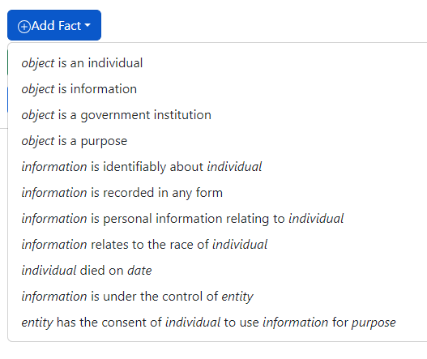

To start, we select "object is an individual" from the list, and we are given
this user interface:

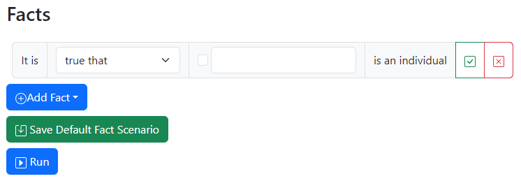

We will specify "bob" as the name of the individual, and click on the checkmark
to generate the fact. The fact is now displayed above the Add Fact button with
the provided details, and with a "X" button that can be used to cause the scenario
editor to "forget" that fact.

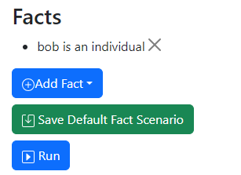

We can use a similar process to create the "document" information, and then we will
add a fact indicating that an information is identifiably about a person to examine
more of the interface features.

#### True, False, Uncertain, Ground and Unground Facts

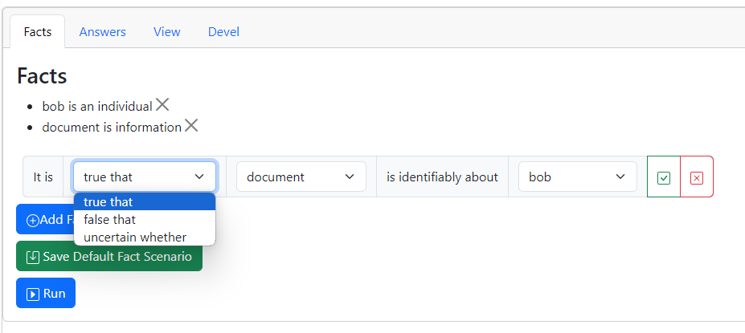

The first thing to note is that the natural language representation of the statement
is preceded by a dropdown menu that allows the user to choose between "it is true that",
"it is false that", and "it is uncertain whether". The first two are logically true
and logically false, respectively, with logically false being equivalent to wrapping
the statement in the
"it is false that" logical negation block inside the code editor. "Uncertainty" is
more complicated, and we will return to that in a moment.

The next thing to notice about the interface is that because the types for this
term are objects in the category information and objects in the category individual,
only the objects that the scenario editor is aware of in those categories are available
to be selected, and if there is only one, it is selected by default.

However, an extra option is added to the end of the list, which indicates the statement
is unground with regard to that parameter. In the case of the information parameter,
the user can choose "any information" instead of the one information that is known.

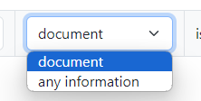

Doing this is equivalent to creating a fact in the code editor that uses a variable
in one of the parameters. This is not usually common in fact statements, because
despite the fact that it says "any information", there is no type-checking in the
actual code. So what it ends up meaning is "anything". So the unground options,
if you are using the "true" or "false" mode, allow you only to say that something
is true about everything in the database, or that is is false about everything in the
database.

Because the category inputs do not allow you to choose from a list, there is
instead a checkbox next to the input used to set the name of the object, and if
this checkbox is selected, the name of the object is treated as unground.

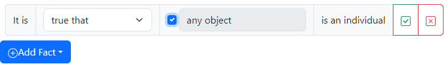

These ungrounded fact options become more useful in the contect of the "uncertain 
whether" mode.

#### Using "Uncertain" Facts To Model Questions Not Yet Posed In An Expert System

The "uncertain whether" mode is similar to the "assumption" block used in the tests
above, except it is intended to be used to indicate situations in which there may
be additional facts of that type that have not been specified. This is used to
accommodate for the situation in which a user of an expert system has, for example, 
indicated
who one individual is, but they have not yet indicated that there are no other
relevant individuals.

In this situation, we want the reasoner to reason with the information provided,
and with an assumption about other possible information of the same type, but
we do not want the reasoner to make assumptions about the facts that have been
clearly set out. Not because it would reach incorrect conclusions, but because it
would have two different ways of concluding those facts, which would needlessly
double the number of explanations provided.

The interview endpoint, when it receives uncertainty statements like this,
generates a custom even loop over negation that applies only to values that the user
has not already specified elsewhere.  For example, if the user defines an
individual, "bob", and then adds the fact that "it is uncertain whether any object
is a person", those two statements will result in the following s(CASP):

```
person(bob).
person(X) :- X \= bob, not -person(X).
-person(X) :- X \= bob, not person(X).
```

In this context, the "any document" option corresponds
semantically to "any document for which this fact is not already stated".

Taken together, the ability to make true, false, and uncertain statements, and
the ability to make both grounded statements about a specific object like "bob",
and ungrounded statements about a category of object like "any individual", provides
the ability to create almost all the fact statements that would be possible to
generate inside the code editor or inside s(CASP) itself.

#### Generating UI from Data Types

We can add the facts that the document is about bob, that the document is about
bob's race, and that the document is recorded in this way. When we add the fact
of bob's death date, the interface looks like this:

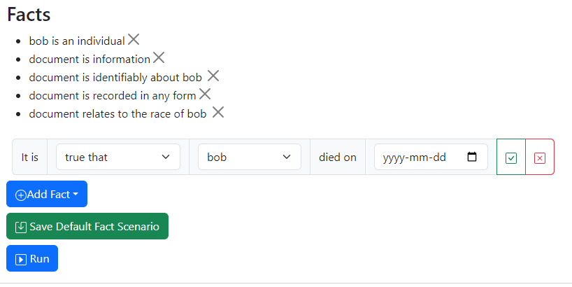

Note that because the user has specified that the attribute "date of death" is
a relationship between an individual and a date, the Scenario Editor has enough
information to be able to provide a date interface for that fact statement.

The four assumptions used in test 7 can be entered by choosing the statement,
choosing the "uncertain whether" mode, and setting all of the parameters to
their "any" options. The resulting list of facts looks like this:

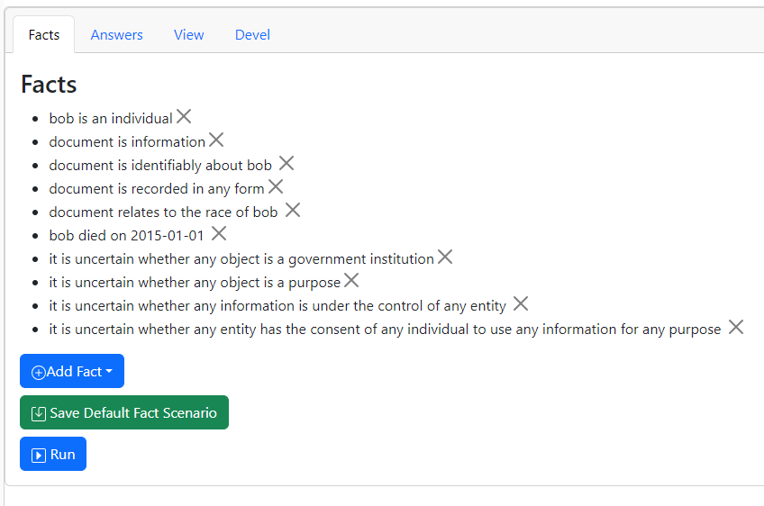

These facts can be saved so that they will be reloaded the next time this
test is raised in the scenario editor by clicking on the "Save Default
Fact Scenario" button.

Now when we click on the "Run" button, the facts are sent to the interview
API endpoint, and the answers are displayed in the Answers tab. Just as with
test 7, we receive two answers, with one explanation each.

#### Improved Answer Display


The display of the answers is similar to that used in the Test Editor, but
with several important improvements. First, where the test editor includes
all constraints returned by the reasoner, the scenario editor reduces this
to the list of constraints on variables that are displayed in the text of
the explanation. It also excludes statements that are used to prove global
constraints, meaning that most constraints will be hidden from the user.

You can see here that only four relevant constraints remain.

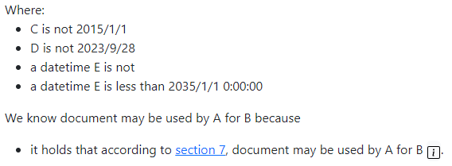

There is a bug in how the third constraint is being displayed.
It should have appeared as "E is not 2035/1/1 0:00:00".

Refer to the discussion of the tests above for information on why these
constrained hypothetical values are created.

Second, instead of a nested tree of statements, where each layer of nesting
represents a set of "because" conditions for the parent statement, the
scenario editor reformats that tree into a series of linked paragraphs, and
displays only the paragraphs where the conclusions were in the question asked.
Each condition, if it has additional reasons, is appended with an "information"
button that allows the user to add the paragraph that justifies that conclusion
to the display.

Clicking on the first two of these information buttons expands the explanation
to read as follows:

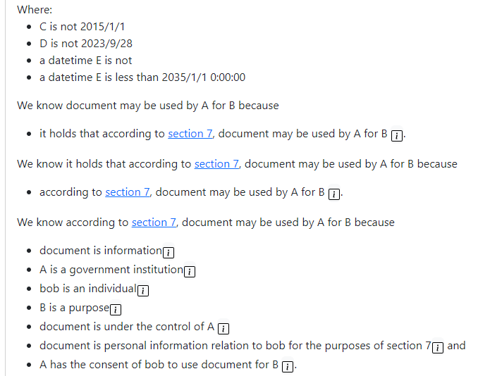

Third, the natural language generation of these explanations is enhanced with
the ability to nest statements inside one another, so more complicated
statements are still generated in a way that is easy for a subject matter expert
to read. This is particularly relevant with regard to statements about statements
such as are used in defaults and exceptions ("it holds according to ... that ...")
and in event reasoning ("... was true as of ..."), which are not currently
handled well in the test editor answer display.

Fourth, justifications are provided for statements that were included in the
facts provided by the user, so the justification for the condition "bob is an
individual" is "We know bob is an individual, which was provided as a fact."

Fifth, sections of legislation that are referred to are correctly formatted
and linked to the corresponding text of the legal document everywhere that they
appear.

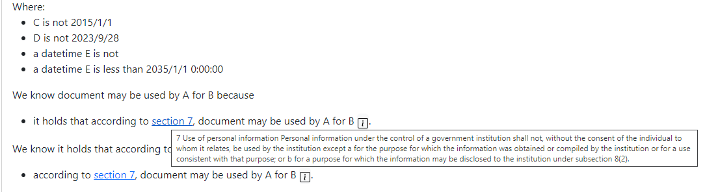

#### LLM Integration for Answer Summarization

Blawx has an optional feature that allows you to provide an OpenAI API
Key when installing the software. If you do, that key will be used use GPT3.5
to generate brief summaries of the explanations inside Scenario Editor, and
allow the user to click on a "details" button in order to see the original
version of that explanation. This can be used to allow a validating user
to quickly determine which of the available explanations is the one that
they wanted to review.

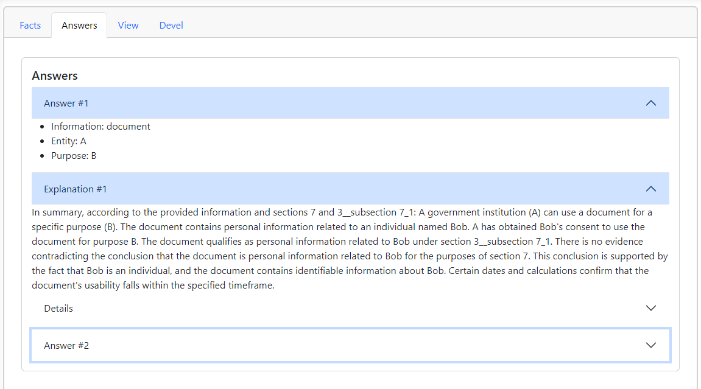

#### Relevance Calculations

Because we provided the interview endpoint with uncertainty information, which
in this context may represent facts that may be relevant but have not yet
been posed to the user of an expert system, Blawx is able to use its hypothetical
reasoning to determine whether those facts are relevant.

A fact is relevant in this sense if it is uncertain, and it appears as an
assumed fact in any of the valid explanations. The interview endpoint does
this calculation and provides the list of relevant facts in its response, which
is then used in the Fact window of the Scenario Editor to indicate what
additional facts would be relevant. 

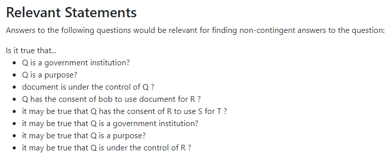

Currently, the relevance display includes some facts that are both redundant
to other facts, and that it is not possible
to specify in the scenario editor, such as "it may be true that Q is a
government institution?"

In this case, all of the uncertain facts were relevant, but had any irrelevant
facts been made uncertain, they would not appear in this list.

It's important to note that this method of calculating relevance of inputs for
use in expert systems is different to, and arguably more powerful than, the
methods that are used in logic programming meta-interpreter approaches, or
even in more modern methods like the undefined variable handling approach
used in Docassemble. In both of those approaches, questions are posed to the
user if and when they are the next unknown fact that the code would sequentially
consider. So the manner in which the code is written determines the order in
which the questions are asked. And it is possible, at any point in the interview,
that the user is being asked for a value because it occurs previous to another
value the system already has which will eventually exclude that branch of the
search.

In meta-programming approaches, therefore, there is no guarantee that the
questions posed to the user are actually necessary to ask in order to find
consistent answers to the posed question. Some irrelevant questions may be
asked depending on the order in which they appear in the code.

The approach used by Blawx does not have that problem, because it simultaneously,
and hypothetically considers all the possible searches that could possibly
generate a valid answer, returns all of them, and the list of relevant factors is
taken from that result, not from the operational semantics of the programming
language. This approach is also more computationally expensive than the 
meta-programming approach.

#### The Development Tab

The Scenario Editor is an example for software developers of how to use the
Blawx API interview and ontology endpoints for generating user-facing tools.
As such, the "Devel" tab provides access to the raw JSON "conversation" happening
between Scenario Editor and the Blawx API, showing the JSON response received
from the Ontology endpoint at the start of the process, the most recent fact
payload sent to the Interview endpoint, and the response received from the
Interview endpoint.

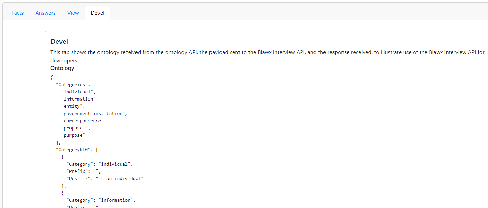

### Integrating Blawx with a Conversational Chatbot

This repository includes the code described below for the integration, and
is designed to be used with Blawx inside a docker compose environment. For
information on how to run this code yourself, see the installation information
in the appendix. Note that it will not work unless you provide an OpenAI API
Key, and have access to the GPT4-0613 model.

#### Design Objective

The objective of this demonstration is to create a conversational chatbot,
powered by generative AI, that is capable of receiving a question about a
specific fact scenario in natural language from a user, using a Blawx
encoding in order to generate an answer to that question, and then summarizing
the information returned from Blawx for the user.

The anticipated use-case for this work is for the education of public servants
tasked with adhering to privacy rules in the management of data products.
There is an increasing push to have data administered less centrally, and shared as a
product, creating a "data mesh" of available resources. The advantages of
the data mesh approach are beyond the scope of this document. For our purposes,
we anticipate that this approach would increase the number of data stewards
who would be obliged to implement controls in order to maintain compliance with
privacy requirements. That, in turn, will increase the need for effective
education of data stewards on, for example, their privacy obligations.

This demonstration is designed to investigate whether it might be possible to
use a combination of symbolic AI (Blawx) and generative AI (GPT4) to generate
tools that allow for a natural language interface, but which are able to generate
accurate, trustworthy, explainable answers to legal questions.

Do to time limitations, it is not possible to generate anything beyond the
minimally viable prototype of such an application. As such, we are focussed
primarily on whether the specific technical hurdles associated with both
symbolic and generative AI can be overcome by using them in combination.

Specifically, symbolic AI representations like those in Blawx are explainable,
but the explanations tend to be verbose, and unfriendly to humans. One of the
objectives of this experiment is to see whether combining Blawx and GPT allows
for a more human-friendly interface to the Blawx encoding.  Similarly,
generative AI has acknowledged risks with regard to hallucination, particularly
when dealing with complicated reasoning tasks. Even if generative AI can be
used to generate accurate answers, and to generate textual explanations for
those answers, the explanations do not represent the reasoning that was used
to generate the answer, and there are risks that neither the answer nor the
explanation are consistent with the rules the generative AI was asked to follow.
Another objective of this experiment is to see whether the answers generated
by a conversational AI can be made more reliable by integrating them with a
symbolic representation of those rules written in Blawx.

Having a generative AI "use" a Blawx encoding requires the generative AI to
do two things successfully, both of which have typically been difficult for
generative AI to do. First, the generative AI needs to faithfully translate
the facts that are provided by the user into the language that is
available in the symbolic encoding. Second, the generative AI needs to send
encode this relatively complicated representation in a format consistent with
the input format expected by the Blawx API, which expects a JSON object.

#### Generating the ChatBot Interface with Gradio

Gradio is a python library for quickly and easily generating web-based user
interfaces for LLM prototypes. The chatbot interface is generated by the `blawxbot.py` file,
which is very straightforward. It imports the required libraries, creates a
function for responding to user queries, and generates a user interface and
ties it to that function. The LLM "agent" is imported, called in that function,
and its output is displayed to the user.

`blawxbot.py` is quoted here in its entirety:

```python
import gradio as gr
from agent.blawxagent import agent

block = gr.Blocks()

def chat_response(input, history):
    history = history or []
    output = agent.run(input)
    bot_message = output['output'] if isinstance(output, dict) and 'output' in output else output
    history.append((input,bot_message))
    return "", history, history

with block:
    chatbot = gr.Chatbot(show_label=False)
    message = gr.Textbox(placeholder="Ask your question here.",show_label=False)
    state = gr.State()
    message.submit(chat_response, inputs=[message,state], outputs=[message, chatbot,state])

block.launch(debug=True)
```

#### Generating the LLM Agent with Langchain

Langchain is a Python library for building larger automations that depend on
smaller portions of those automations being performed by LLMs. In this case,
the demonstration below is done using GPT4-0613. Other models may be sufficient
for the explanation summary tasks, my experience is that the features of GPT4-0613
specifically are important to successful integration with Blawx for encoding
fact scenarios.

The Langchain "agent" for this task is created in the `agent/blawxagent.py` file.

This file imports the tools defined below, configures the LLM to be the GPT-4-0613
model, gets the API Key for it from the environment, gives the agent memory, and
configures it to use the "functions" capabilities provided with GPT4-0613.

The file is quoted here in its entirety.

``` python
from dotenv import load_dotenv
import langchain
from langchain.chat_models import ChatOpenAI
from langchain.agents import initialize_agent, AgentType
from agent.tools.ontology import ontology_tool
from agent.tools.interview import PAInterview
import os
from langchain.prompts import MessagesPlaceholder
from langchain.memory import ConversationBufferMemory

agent_kwargs = {
    "extra_prompt_messages": [MessagesPlaceholder(variable_name="memory")],
}
memory = ConversationBufferMemory(memory_key="memory", return_messages=True)
#langchain.debug = True

load_dotenv()
openai_api_key=os.environ['OPENAI_API_KEY']

# Because we are using functions, we need to use model gpt-4-0613
llm=ChatOpenAI(openai_api_key=openai_api_key,temperature=0, model="gpt-4-0613")

tools = [ontology_tool,PAInterview()]

agent = initialize_agent(tools, llm, agent=AgentType.OPENAI_FUNCTIONS, verbose=True, agent_kwargs=agent_kwargs, memory=memory)
```

The agent is given two "tools", that it knows how to use, the "ontology" tool, and
the "PAInterview" tool.


#### Creating the Ontology Tool

The ontology tool is intended to be used by the agent when it determines that it
needs to know what ontological elements exist in the Blawx encoding, and can be
used to encode facts. It is set out in the `agent/tools/ontology.py` file. It
creates a function called `ontology` that makes a web request to the Blawx server's
endpoint for the ontology associated with the Privacy Act test, and reformats the
answer into text for use in the agent. Then, it configures a langchain "tool" that
calls this function and describes the use of the tool to the agent.

The `ontology.py` file is quoted here in its entirety. You can see that in this
version, the code is making a call against the live development version of Blawx,
and so is dependent on the correct code existing at that location.
In a future version, I hope to run a containerized version of Blawx and refer to
that instead.

```python
import requests
import json
from langchain.agents import Tool

def ontology(input):
  # input is ignored
  response = requests.get('https://dev.blawx.com/jason/privacy-act/test/permitted_use/onto/')
  #print(response)
  package = json.loads(response.text)
  output = "The categories which take only an object as a parameters are " + ", ".join(package['Categories']) + ".\n"
  output = "The attributes that take only an object are " + ", ".join([(a['Attribute'] + " which applies to an object of category " + a['Category']) for a in package['Attributes'] if a['Type'] == "boolean"]) + ".\n"
  output += "The attributes that take an object and a value are " + ', '.join([(a['Attribute'] + " which applies to an object of category " + a['Category'] + " and accepts a value of type " + a['Type']) for a in package['Attributes'] if a['Type'] != "boolean"]) + '.\n'
  output += "The relationships I know about are "
  for r in package['Relationships']:
    output += r['Relationship'] + ", which accepts "
    index = 1
    while "Parameter"+str(index) in r:
      output += "a " + r['Parameter'+str(index)] + ","
      index += 1
    output += ";"
  return output

ontology_tool = Tool.from_function(
        func=ontology,
        name="Ontology",
        description="useful for when you need to know the categories, attributes, and relationships available in the permitted_uses tool. Does not require input."
    )
```

#### Generating the PAInterview Tool

The PAInterview tool needs to be able to correctly format a request to the Blawx
API. GPT4-0613 provides a "functions" capability that allows you to specify a
JSON schema that an answer must adhere to when the LLM chooses to call a given
function. The `interview.py` file uses the Pydantic Python library to generate a
class called "BlawxFacts" which represents this schema, illustrating how information
would need to be encoded to meet the expectations of the Blawx API.

Note that this encoding is not particularly detailed, and doesn't impose any
requirements that the encoding adhere to an ontology, that predicate names are
properly formatted, etc. Several of these requirements are dealt with separately
by providing information to the LLM in the prompts.

It then creates a PAInterview class by giving the tool a name and description, and
setting the schema for the arguments to a call to this tool to the BlawxFacts
schema defined earlier. The tool is configured to call the `privacy_interview`
function when run, which function makes a call to the relevant Blawx API and
reformats the response slightly for use in the agent.

This file is where most of the "prompt engineering" involved in this demo occurs, and it is not elaborate.
In defining the function, the phrase "I should use only the following information
to answer the question: " is prepended before the explanation returned from the Blawx
server, if available, or a message that no proof was available otherwise.

The description of the PAInterview tool contains a small amount of information intended to ensure that the LLM
adheres to elements of the JSON schema that were not possible to express through the
Pydantic model, and to give it some background as to how to use the ontology. Here, some
knowledge of the ontology on the part of the prompt author is being used, but
it is anticipated that it would be possible to allow those details to be set out
in a description of the "test" in the Blawx interface in future, and for a more fullsome schema to be automatically
generated from the ontology itself.

This would reduce the task of generating a tool for an LLM agent to describing in natural language the facts that the test author expects to receive.

The PAInterview and privacy interview definitions are quoted here in their entirety:

```python
class PAInterview(BaseTool):
    name = "permitted_uses"
    description = """
Useful for finding out whether a use of information is permitted under the Privacy Act.

Requires you to know the ontology first.

The "type" of each fact should be the string "true", and the "from_ontology" value should be set to boolean false.

Pieces of information, individuals, government institutions and purposes must be defined in category facts before they are used in attribute and relationship facts.

All text values should be strings that start with lowercase letters and do not contain spaces.

The facts must exclusively use the category, attribute, and relationship predicates set out in the ontology.
Values should not be provided for boolean attributes.

If an entity is described as a government entity, include it in both the "entity" and "government_institution"
categories.

If there is an information, also specify in the facts that it is recorded.

Encode only facts that were obtained from the user. Do not encode facts derived from previous answers.
"""

    def _run(self, facts):
        return privacy_interview({"facts": facts})

    def _arun(self, input):
        raise NotImplementedError("The permitted_uses tool does not support asynchronous requests.")

    args_schema: Optional[Type[BaseModel]] = BlawxFacts

def privacy_interview(input):
  response = requests.post('https://dev.blawx.com/jason/privacy-act/test/permitted_use/run/',json=input)
  #print(response.text)
  package = json.loads(response.text)
  if len(package['Answers']):
    explanation = ''.join(list(deepflatten(package['Answers'][0]['Models'][0]['Tree'])))
    gch = explanation.find('The global constraints hold')
    if gch:
       explanation = explanation[:gch]
    return "I should use only the following information to answer the question: " + package['Answers'][0]['Variables']['Info'] + " can be used by " + package['Answers'][0]['Variables']['Inst'] + " for the purpose of " + package['Answers'][0]['Variables']['Purpose'] + " because "  + explanation
  else:
    return "I should use only the following information to answer the question: There is no evidence based on these facts to conclude that there is any permitted use of information under the AITA."
```

#### Experimental Results

Running the above code, and observing the behaviour of the agent, we can ask questions of the chatbot and
see how it generates the answers for those questions. The following question is posed:

```
if the government tax agency collects bob's income information for calculating his taxes, what information uses are permitted?
```

Observing the agent's debugging log, the first step the agent takes is to retrieve the available ontology.
Once it has done that, it attempts to use the interview endpoint to find an answer to the question, encoding
the facts of the question in the following object:

```
{'facts': [
  {'from_ontology': False, 'type': 'true', 'category': 'individual', 'object': 'bob'},
  {'from_ontology': False, 'type': 'true', 'category': 'information', 'object': 'income_information'},
  {'from_ontology': False, 'type': 'true', 'category': 'government_institution', 'object': 'tax_agency'},
  {'from_ontology': False, 'type': 'true', 'category': 'purpose', 'object': 'calculating_taxes'},
  {'from_ontology': False, 'type': 'true', 'attribute': 'recorded', 'object': 'income_information'},
  {'from_ontology': False, 'type': 'true', 'attribute': 'identifiably_about', 'object': 'income_information', 'value': 'bob'},
  {'from_ontology': False, 'type': 'true', 'attribute': 'under_control_of', 'object': 'income_information', 'value': 'tax_agency'},
  {'from_ontology': False, 'type': 'true', 'attribute': 'collection_purpose', 'object': 'income_information', 'value': 'calculating_taxes'}
]}
```

This object adheres to the JSON schema provided, and follows the instructions provided in the prompt. It also
accurately encodes the facts in the question in the ontology provided, using only the relevant elements of
the ontology, despite the fact there were many more terms available in the ontology. It also does this despite
having been provided no information about what the terms in the ontology mean, except that which can be
implied by their names and the types of their parameters. It seems likely that the performance on such tasks
can be improved in a number of ways, but a very naive approach also succeeds.

The interview tool returns and answer, and reformats the explanation returning that as text to the agent,
which then summarizes it as follows:

```
The government tax agency is permitted to use Bob's income information for the purpose of calculating his taxes. This is because the income information is personal information relating to Bob, it is recorded in any form, and it is under the control of the tax agency. Furthermore, the income information was collected for the purpose of calculating taxes. Please note that this use is permitted under section 7 of the Privacy Act.
```

This is an accurate summary of the text of the explanation received from the Blawx server. With additional work
it would seem to be possible to give the user the ability to ask questions about the explanation itself, and
give the user the option of viewing the raw explanation as provided by the Blawx server as part of the interface.

The test interface for this exchange looks like this:

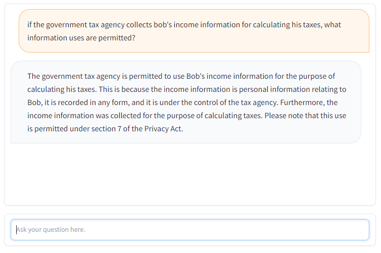

Currently no information is provided to the user about what steps the agent is following, but this
is also clearly feasible to add, as is currently done in agent-based tools like Microsoft's Bing Chat.

Because the agent has conversational memory, we can ask another question that proposed to modify the
facts slightly, without having to restate anything.  For instance, we can now ask:

```
what if bob died on january 1, 2000?
```

Viewing the log, the agent again seeks the ontology, which it ideally would not do repeatedly. It then
generates the following encoding of facts and sends it to the Blawx server:

```
{'facts': [
  {'from_ontology': False, 'type': 'true', 'category': 'individual', 'object': 'bob'}, 
  {'from_ontology': False, 'type': 'true', 'category': 'information', 'object': 'income_information'}, 
  {'from_ontology': False, 'type': 'true', 'category': 'government_institution', 'object': 'tax_agency'}, 
  {'from_ontology': False, 'type': 'true', 'category': 'purpose', 'object': 'calculating_taxes'}, 
  {'from_ontology': False, 'type': 'true', 'attribute': 'date_of_death', 'object': 'bob', 'value': '2000-01-01'}, 
  {'from_ontology': False, 'type': 'true', 'attribute': 'identifiably_about', 'object': 'income_information', 'value': 'bob'}, 
  {'from_ontology': False, 'type': 'true', 'attribute': 'under_control_of', 'object': 'income_information', 'value': 'tax_agency'}, 
  {'from_ontology': False, 'type': 'true', 'attribute': 'collection_purpose', 'object': 'income_information', 'value': 'calculating_taxes'}, 
  {'from_ontology': False, 'type': 'true', 'relationship': 'permitted_user_purpose', 'parameter1': 'income_information', 'parameter2': 'tax_agency', 'parameter3': 'calculating_taxes'}
]}
```

The agent has made a couple of mistakes, this time, and the answer received is therefore incorrect. But
interestingly, the mistakes seem to be of the nature that agent is encoding facts which were previously
derived, and assuming that they remain true in the new scenario. It has correctly encoded bob's date of
death. It has also correctly included all of the facts that were previously provided by the user.
It has also encoded both the idea
that the information is personally identifying with regard to bob, and that the tax agency is permitted
to use it for calculating bob's taxes, both of which are facts that were true in the explanation to the
first question. It has used the ontology correctly, and the encoding is formatted into the JSON object
properly. But it has encoded these facts  despite the prompt instructing it not.

The effect of doing this means that the agent has given the Blawx server the answer to the question it
is asking, and the blawx server essentially replies that the tax agency can use the information because
the user said so.  The text generated in the interface combines this with
the previously known information to generate the following answer:

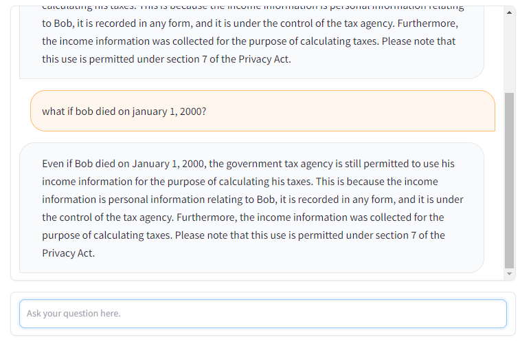

This is not a problem of the agent failing to accurately generate the JSON object, nor it is
a problem of the agent not accurately encoding the facts using the ontology. It is a problem of the agent
knowing which facts to encode, and which not to. That is a less complicated question, and likely tractable
with prompt engineering tactics. So the basic question we are seeking to answer is answered in the
affirmative: GPT4-0613 is capable of using the Blawx API, and it is capable of accurately encoding facts
provided in natural language using a provided ontology, and it is capable of providing readable summaries
of the explanations provided by the Blawx reasoner. The limits of those capabilities are not clear, but
the purpose of this experiment is only begin that exploration.

## Feedback

This section of the document attempts to set out the feedback received from
various groups over the course of the experimentation with Blawx in the last
two years.

The experiments so far have resulted in extremely valuable feedback from
various groups of users, both positive and negative, 
including people who create the encodings, people
who validate the encodings and use them for drafting processes, and people
who integrate the encodings into other applications. What follows is
derived from explicit feedback that was volunteered by users in the course of
experimentation. Other insights derived from observation of users are discussed
below.

### Explanations are Too Verbose

Some of the feedback from legal knowledge engineers and subject matter experts
involved in validation is that the nature of
the natural language explanations provided by Blawx is too verbose, and
difficult to read.

### CLEAN is Too Difficult To Use, Doesn't Work with French

Users reported that CLEAN is relatively difficult
to use. This is because there are no error messages in the Blawx interface to explain
why portions of a CLEAN document did not parse as expected. This leaves the user with
the option of deleting sections of the CLEAN encoding until the entire encoding works,
and then re-adding smaller sections until the most recently added section fails to
compile properly, and then searching for the causes of that problem in the most recently
added sections without any clues. CLEAN also does not deal well with unicode text, which
makes it fundamentally ill-suited to reflecting legislation in French, which is
a major disadvantage in the Canadian context.

### Blawx Needs Features for Multi-Rule Encodings

Experimenters using Blawx frequently found themselves needing to be able to deal with
encodings of multiple different statutory documents at the same time, such as a set of
related laws, or a law and a related regulation. Blawx does not currently support
the ability to keep encodings of different pieces of legislation separate from one
another, while allowing them to be used at the same time. It also doesn't have any
functionality to effectively share vocabulary as between multiple encodings. That
necessitated combining multiple documents into a single, imaginary amalgamation,
and then attempting to represent that amalgamation in CLEAN. The limitations of
CLEAN, were exacerbated by this approach.

### Creating "Section Applies" Predicates is Tiresome

Legal knowledge engineers have also provided feedback that
isomorphism with the structure of a legal text regularly seems to require
symbolic representation of the idea that a sub-section of legal text that
does not generate its own legal implications is nevertheless "triggered" by
a given fact scenario. Consider a situation in which a rules says something like
this:
```
> 1. This section applies if the subject is a
>    a) dog, or
>    b) cat.
```

The knowledge engineer has two options. They can place no code inside section 1,
and instead create two separate rules, mostly similar, in section 1(a) and (b).
Or, they can create two rules in section 1 that are triggered if sections (a) or (b)
are triggered. Doing so enhances the isomorphism of the encoding, but also requires
the creation of a predicate which means "section 1(a) was triggered with regard
to the subject", and a corresponding predicate for section 1(b). These predicates
are concluded in section 1(a) and (b) respectively, and tested for in the two rules
in section 1. That process is so common, and so consistent in form, that it becomes 
tedious for the knowledge engineer, and there is a feeling it should be smart enough
to do that work for the knowledge engineer.

### Testing Requires Easier Access to Details Other Than the Answer

In the task of testing, there is an experience that the current interfaces are
inadequate, because they separate rules, facts, and questions in such a way as
to make it difficult for the knowledge engineer to "navigate" through their
encoding in a natural way. As one simple example, if the answer to a question is
"no models", the next most obvious step is to ask "why not?" But the test
interfaces makes changing the question in that way relatively time-consuming.

### The Use of Applies Blocks is Unclear

Generally, people who use Blawx find it relatively easy to use at first, but
there elements of the semantics of the language that are unintuitive, such as
the fact that the order of conditions can change the result of calculations
over negated goals. The semantic intent of the "applies" block is unclear, and
it tends to be used by knowledge engineers both for its intended purpose (e.g.
"this section does not apply to agents of the crown"), and also for unintended
purposes such as the "triggering" issue described above ("the conclusion in s1
holds because s1(a) "applies"). One is a situation where the law isn't used,
and the other is a situation in which it was used, and was particularly relevant.

### Exceptions vs Presumptions is Confusing

There has also been some confusion from knowledge engineers about the difference
in the semantic meaning of the default and exceptions system, and the ability
to use presumptions. Occasionally, users have combined these two similar features
in ways that are intuitive when the code is read, but do not have the anticipated
effect on the behaviour of the code.

### Encoding Reveals Issues in the Drafting That Could Be Avoided

Participants in experiments prior to the adoption of Blawx are reported to
have said "if we had done this before it was drafted, it would have been drafted
better". That sentiment, that the task of formalizing a law reveals issues with the
drafting of that law that might not otherwise have been noticed, is also expressed
by the people who have been involved in Rules as Code projects using Blawx.

### Need for More Sophisticated Natural Language Generation

Feedback from programmers integrating Blawx encodings with front-end applications
are that they need more information about natural language formulations for
the elements in the Blawx ontology, including how to pose them as questions to
users.

### Relevance is Valuable for Integration, But Want Question Order

Programmers integrating Blawx with front-end applications also note the utility
of the ability to have Blawx isolate relevant from irrelevant facts is valuable
in an attempt to ensure that the questions posed to the front-end user of the
system are never already irrelevant when they are asked. However, what the
developers want to know is not only the set of inputs that might still be
relevant, but also the order in which to pose them.

### Blawx is more Efficient than Earlier Approaches

Staff within CSPS have noted that the process of having a legally-trained
expert use Blawx and write Blawx code to encode the meaning of laws and regulations
has been faster and more productive than the approaches that were attempted prior
to the adoption of Blawx.

## Insights Gained

This sections sets out some of the additional insights that have been gained from 
feedback and
observations over the course of the experiments.

### Laws are Perceived as Being Determinative of Question Order

In general, it seems that there is a presumption among users - other than
legally-trained knowledge engineers - that there is enough information in a law
to make useful decisions about the order in which questions should be
asked when interviewing a user.
This is not actually the case, as the order in which the questions should
be asked depends on, initially, the question being asked. And a law doesn't "know"
what question it is being used to answer. Even in the context of a given question,
question order can't be derived from the law alone, because the optimal order
depends, for example, on whether you are optimizing for asking the fewest questions,
or for having a system that follows typical conversation patterns so as to be
intuitive. Optimizing for the fewest questions also depends on the likelihood
that the answer to a question will be determinative, which information doesn't
exist in the law, either.

So an unexpected insight gained from this experimentation is that there is sometimes
an overestimation of what can be derived from the content of legislation by people
responsible for implementing that legislation. Resolving that may be an educational
task, and might be better achieved if tools for Rules as Code provided explicit
places for things like question order to go, to drive home the intuition that they
cannot be derived from the legislation alone.

### Ontological Terms are Confused with "Questions" or "Inputs"

There has also been a divide between policy experts and programmers on the one
hand, and legal knowledge engineers on the other, on the nature of the
elements of the ontology in Blawx. For legal knowledge engineers, the ontology
sets out a language that can be used for facts, rules, questions, etc. For the
users of the law, it is assumed that there is a one-to-one relationship between
an ontological term, and a "question" that might be posed to a user in a front-
end application. This is not the case, because one predicate can be
used to express multiple different ideas, and each of those ideas might be posed
as a question.

This is a significant issue in the design of Rules as Code tools, because the
idea of abstracting knowledge of how the laws work from people writing software
that complies with those laws depends on the implementers having a solid understanding
of the interface to those rules encodings.
The ontology used in the rules largely defines
that interface. If implementers misunderstand the nature of the elements in the
ontology, that misunderstanding may negatively 
impact their ability to effectively use the encodings.

The solution to this problem might involve tools that more clearly 
distinguish between abstract ontological concepts like "person", and uses of those
ontological concepts in questions like "who is the person", and facts like
"socrates is a person".

### Open World Causes Friction in Validating

Feedback from policy experts has been that the way that Blawx's systems distinguish 
between saying that an input is true, saying
that it is false, and saying nothing (which is semantically different), is
surprising to them, and they are not initially clear on the difference in meaning
between saying that something is false and saying nothing about it. This has
caused some friction when having policy experts validate 
Blawx encodings.

This suggests that there are issues with the user interfaces used for validation
in terms of how intuitively they describe the meaning of the facts that are being
added to scenarios. It may also be an area where greater user training would be
helpful generally. Or, it might be a situation in which interfaces of different complexity
can be justified, with more significant training materials for users who need access to
the more complicated features.

### Legally-Trained Experts Can (and want to) Learn and Use Blawx

It is
indeed possible to have non-programmers create formalizations of laws and
regulations in declarative logic languages. All of the work done in Blawx in
the CSPS experiments over the last year
or so was done by a legally trained non-programmer.
There is also evidence that the Blawx
interface is sufficiently "friendly" to be attractive to legally-trained experts
who are not programmers, as CSPS received unprompted requests from legislative
drafters to be taught how to use Blawx in a tutorial attended by about a half-dozen
lawyers working for the department of Justice.

### Rules as Code Can Facilitate Legal Drafting

With regard to drafting, one experiment in particular has demonstrated that
if Blawx is used by policy experts, prior to engaging with legislative
drafters, it leads to objective evidence about the efficacy of proposed rules,
and insights into the structure and language of those proposed rules that
would have otherwise been difficult to obtain without involving legislative
drafting professionals. From the perspective of the policy experts, it gives
them a better understanding of what they need in a legislative drafting 
project, and why. From the perspective of the legislative drafters, it makes
for better-prepared clients. Details of these experiments are not available
to share at this time, but efforts are underway to detail those experiments
appropriately in the future. 

### Rules as Code Can be Integrated with Front-End Applications

We have seen that it is possible to use Rules as Code
encodings created in Blawx to power front-end service automations, both for 
generating and explaining the answers to legal questions.

### The Question You Need Answered Is Not Always One Question

The combined effect of staying close to the language of the law in doing the encoding,
and the open world reasoning of Blawx, is that
the thing that your user is interested in may not be possible to express in a single
question to the Blawx reasoner.

Take for example a law that sets out a general
prohibition against certain kinds of activities, and then sets out exceptions in the
situation where the user has sought and obtained a permit. If the question that
the user-facing application wants to answer is "do you need a permit to do this work,"
that cannot be answered by a single query. The question of necessity of the permit
is only answered when you discover that you are a) permitted to do the work with a permit,
and that you are b) not permitted to do the work without it. If both of those are true,
the permit is necessary. Otherwise, it is either irrelevant (you can't do the work
in either circumstance), or it is extraneous (you can do the work without the permit,
and getting the permit doesn't change that), or there is some uncertainty (with the
permit is allowed, and without it permission cannot be derived).

Blawx does not currently have a way to combine two questions that rely on different
fact scenarios into a single question. Because in one situation you are presuming the
permit exists, and in the other position you are presuming it doesn't, those two 
questions can't be answered at the same time. You could make the existence of the
permit an assumption, and find out if there are situations in which you can do the
work with the permit and situations in which there is no evidence you can do the work
without it. But the absence of evidence that you can do the work is not evidence that
the work is prohibited.
So you need to query both the positive and negative version of the query
with the assumption in any case.

Addressing that friction
may require a system that allows the user to run multiple queries and
test for conditions in the response, such as whether there are any answers, how many
there are, what facts are included in the explanations, what facts are excluded, etc.
This is similar to the kinds of capabilities that would be valuable for static analysis
and testing of encodings.

### Better Annotations of Legislative Text Would Improve the Process

The process of encoding legislation in Blawx includes time-consuming steps
that could be automated away with sufficiently well-annotated encodings of
the source text, particularly with annotations for how sections and sub-sections
relate to one another logically, and whether lists are conjunctive or
disjunctive. This would give the tool sufficient information to generate some
portions of the "triggering" predicates described above.

### Rules as Code Has Up-Front Costs

The process of encoding legislation in Blawx is longer than the process of
writing code that is capable of answering (e.g.) a single question about the same law.
The value of that additional work is not obvious to project participants at the outset of any project
that ultimately only requires answers to (e.g.) that a single question.

The actual use and benefit of a Rules as Code encoding (to provide an isolated,
executable encoding of only legal knowledge about a specific law) is not clear
to policy experts and programmers who are engaged in a task of automating a particular task
on which that law depends.

That value may come from re-use of the encoding, or greater confidence that the
encoding is legally accurate, or other benefits of Rules as Code, but these
are not problems that project participants are used to spending their time
and effort solving, so they are opportunities for improvement as opposed to
pain relief, and therefore less obvious, and less initially motivating.

### Testing and Validating Require Different Interfaces

The interface used for making the task of encoding rules accessible to legal
knowledge engineers is not adequate to the task of making code validation
accessible to policy experts. The workflow of encoding is also very different
from the workflow of validation, and tools need to be built to support that
specific workflow in the context of the capabilities of the encoding language.

### Software Developers Expect Blawx to Generate an Expert System

For IT professionals, there is a presumption that the primary use of a Rules
as Code encoding is for the generation of an expert system. That is to say,
there is a presumption that it will be capable of conducting an interview,
generating appropriate questions, deciding how to pose those questions,
calculating what further questions are
relevant, and providing answers to the user when they can be derived.

IT professionals see little value in a tool that allows you to express the
knowledge present in a law, and to validate that expression is accurate, if it
does not also have these additional features.

Blawx encodings are capable of supporting expert system development, but the
design work thus far has focussed on simplifying the formalization and validation
tasks, not on using the resulting encodings in the specific use case of expert
systems. Additional expert systems capabilities inside Blawx may be more
persuasive for IT professionals as to the value of Rules as Code encodings.

### Encodings are Time Consuming

Despite the improvements in efficiency reported, the time spent 
generating encodings is still a risk factor in terms of whether
the return on investment for Rules as Code encodings is worth it. People with
the knowledge and skill to learn legal knowledge representation are
highly valuable, and the time spent generating encodings is still high.
Anything that can be done to minimize that cost is likely to enhance the
economic viability of Rules as Code going forward.

### LLMs Can Summarize Verbose Symbolic Explanations 

Modern LLM approaches are capable of effectively summarizing the explanations
generated by symbolic Rules as Code systems like Blawx, offering a possible path
to solving the verbosity problem. It would be useful to continue to explore the
ability of LLMs to answer questions about an explanation.

### LLMs Can Encode Fact Scenarios using NLP

Modern LLM approaches also appear to be capable of encoding fact scenarios
described in natural language in a way that is consistent with the ontology and
data format used in a Blawx encoding, suggesting that there is opportunity to use
conversational generative AI as a user interface for testing and validation
purposes, or ultimately in user-facing applications in the future. It would be
useful to continue to explore the limits of these capabilities.

### Quasi-Typed Encodings Facilitate UI Generation

Using a quasi-typed representation inside Blawx has advantages for 
automatically-generated user interfaces for validation and testing, as they
allow the user to select from among values of the right type, and have the
correct user interface for that data type.

### Issues with Event Reasoning

The Blawx approach seems to be capable of dealing with constraints over time,
and at least minimally with cause and effect over time through event reasoning.
But encodings in the event calculus are considerably less intuitive
to legal knowledge engineers, and require the generation of a great deal of
code to represent implicit causal relationships, which frustrates the goal
of structural isomorphism, because that code is not reflective of anything in
the text of the law.

It would be worth exploring whether there are opportunities to move statements in
code that reflect causal relationships could be moved elsewhere in the application,
perhaps in a separate part of the interface designed for setting out ontological
concepts.

### Issues with Sub-Categories

The ontological system is capable of using sub-categories, but unless the
implications of those ontological rules are available at the front end, it is
difficult to automate interfaces that understand their implications. For example,
if all dogs are pets, and people can have pets, a user interface that does not
have access to the ontological rule "all dogs are pets" cannot conclude that a
dog described by the user should be available for selection as a pet in another
statement. This suggests that effective user interfaces may requires access to
at least the ontological implications of the encoding in real time in order to
be as effective as possible.

It is also worth exploring whether the ontological rules can be expressed in a more
performant semantics that can be adopted by the s(CASP) encodings, but also used
very quickly in the front end.

### Exceptions Improve Isomorphism

The use of exceptions and defaults in Blawx makes it easier to keep encodings
structurally isomorphic to their source text, enhancing the degree to which 
explanations can be generated that automatically refer back to the source
legal text. That effect can be extended by eliminating the need to use the
"subject to exceptions" flag on attributed rules.

### Blawx Covers Many Use Cases

One of the things we wanted to investigate was whether s(CASP) could be made easy
to use, and extended with features that would "cover the field" of the things
most often needed in encoding legislation and regulation. For the most common
features of legislation and regulation, the current version of the Blawx block
language seems to cover a large percentage of them.

Some notable exceptions have
arisen, such as the tendency of legislation to refer to structural scopes of
itself or other rules, and to refer to rules by their relationship to other rules.
For example, a law might say "regulations made under Part 3 of this Act". Blawx
does not currently have language features to accommodate that sort of cross reference
because it has no language for how rules relate to one another ("made under"), or rule 
types ("regulation" and "Act"), and it cannot refer
to Part 3 in a way that will include Part 3 and all its subparts.

Such language features are planned, and seem feasible.

Another example is the relatively common legislative phrase "for the purposes of." This
is often used to set out a context in which a given legislative provision has a
different meaning. Such as "for the purpose of determining eligibility, a minor who
is enrolled in active military duty is deemed to have reached the age of majority".
The challenge here is that Blawx does not have any way of determining at run time
the "purpose" of a goal. The Blawx code can ask whether certain facts are true inside
the model, but it cannot ask whether certain facts are true about the computational
context in which the model is currently being used. That sort of introspection is not
currently feasible in Blawx, though it is likely also not feasible or extremely
complicated in other tools, also.

It seems likely that there will be needs to extend the number of mathematical functions
Blawx is capable of using, and perhaps in some rare circumstances it may be useful to
give it the ability to manipulate string data. Concerns about the effectiveness of
the event reasoning system also raise concerns about the ability to express
procedural knowledge, and knowledge about cause and effect. But on the whole, instances 
in which the Blawx language did not allow for a reasonable modelling of a legislative 
text have been rare.

In particular, the absence of language-level deontic concepts (obligation, permission,
and prohibition) does not seem to have posed any obstacle to generating useful encodings
of legislation and regulations that set out what is permitted, obliged, or prohibited.
If you wanted a Blawx encoding to note that there was an inconsistency between an
obligation and a prohibition, Blawx cannot detect that automatically. The user must
explicitly test for inconsistent combinations of facts. But the
lack of that capability doesn't seem to have had a significant impact on the 
effectiveness of the tool. Deontological contradictions do not seem to form a 
significant
risk factor in real-world legislation and regulation, and language features 
for detecting and avoiding
them may be superfluous, particularly if there are usability or computational
efficiency costs associated with them.

## New and Unanswered Design Questions

This section sets out some design questions that arise from the insights gathered,
or remain unanswered despite the lessons learned.

### Can we create a WYSIWYG UI for AkomaNtoso?

Users have noted that the CLEAN approach to entering legal text and generating
AkomaNtoso encodings is minimally functional, it is difficult to use because of
the lack of error messages when the decoding process fails part way through a
document. We have also discovered that having access to additional annotations
inside the XML representation of the law about the semantic and syntactic structure
of different hierarchical portions of the law would be helpful in being able to
streamline the encoding process going forward.

The question, therefore, is whether it might be possible to generate a WYSIWYG
interface that would allow users to easily and reliably generate standards-compliant
representations of legislative text in XML. No such tools are currently available
in open source. Initial work toward a proof of concept for a WYSIWYG replacement
for CLEAN inside Blawx has revealed that the basic concept is feasible, but there
may be some technical challenges arising from the fact that LegalDocML is not
designed for the purpose of drafting and editing legislative texts, but
more directly for the purposes of storing and transmitting them.

That said, some progress has been made in this direction, and further efforts are
likely warranted. A prototype editor based on the ProseMirror library, called
"LawMirror", is available at https://github.com/Lexpedite/lawmirror, and generates
a user interface that looks like this:

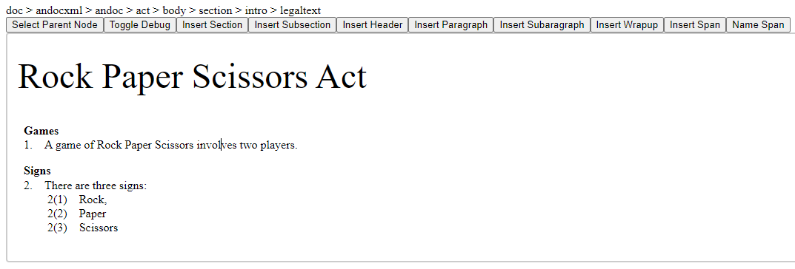

### Computational Efficiency
We still don't know whether or not an encoding in Blawx will be computationally
efficient in the case of, for example, an encoding of an entire statute of
typical complexity, how its efficiency varies with elements like exceptions, constraints, and abduction, and whether there are effective ways to mitigate
and computational efficiency issues that might arise in specific use-cases.

### Return on Investment
Is the time spent doing Rules as Code in this way cost effective in view of
the available alternatives, and taking into account the time required for
training individuals on legal knowledge representation and validation tasks?

### Validation Tools and Workflow

How can we build user interfaces and workflows that are aimed more directly
at code validation by subject matter experts? How more efficient can code
validation processes become?

### Drafting Interfaces and Workflows

How can the user interface be improved to better facilitate both validation
and software testing as an integrated part of the drafting process?

### Enhanced Defeasibility

Could we use a different approach to defaults and exceptions, relying on
greater knowledge of the cross-references between sections of the encoding,
so as to have the encoding process be more structurally isomorphic, without
sacrificing computational efficiency?

### Does Legal Knowledge Encoding Require Legal Expertise
Does the lack of shared understanding as to statutory semantics suggest
that Rules as Code is best done by people with training in statutory interpretation?

### Can we use generative AI to do code generations?

The demonstration above illustrates that large language models are now capable, in
some degree, of taking natural language and converting it into formalizations
that conform to a provided ontology. Right now, this capability is being used only
for facts. Rules are a conclusion fact, and a list of condition facts. It is
not inconceivable that with additional prompt engineering, or with advances in the
capabilities of generative AI, it may be possible in future to get the assistance
of generative AI in creating ontologies and rules from the natural language present
in laws and regulations.

This is an important area to investigate because it has outsized 
potential positive impacts on the
cost of generating and validating Rules as Code encodings.

### Are there other encoding languages that should be used?

The choice to use s(CASP) as the encoding language inside Blawx was made in late 2021
or early 2022. Since then, there are additional open source declarative logic
programming languages with built-in features for natural language explanations.
Specifically, the ErgoAI language was made open source in 2023.

It would be worth exploring whether the advantages provided by s(CASP) over other
declarative languages, such as the ability to deal with constraints over infinite
domains, abductive reasoning, and dual programs, 
come with corresponding costs in terms of computational efficiency that
are ultimately not worth the trade-off.

It is also a possibility that the Blawx application could be redesigned as a tool that
is capable of generating code in multiple different languages for the same piece of
legislation.

### Can we test and/or generate software using Blawx code?

One of the anticipated uses of Rules as Code encodings is improved legal quality
assurance. One way to gain that assurance is by using the Rules as Code encodings
directly, either embedded, or over an API. But another approach is to use the
Rules as Code encoding in order to provide assurances that another piece of software
behaves identically to the Rules as Code encoding for specific purposes.

That could be done in one of two ways. It might be possible to generate code in a
target language, for instance Python, that answers a specific question in a way
consistent with how the Rules as Code encoding would answer that question. This
code-generation capability is used in some Rules as Code technologies like the
Catala language. It may also be possible to use the original Rules as Code
encoding in Blawx and do a form of pre-processing that generates an equivalent
but faster program for answering the same question with the same possible inputs,
also implemented in s(CASP) or another declarative logic programming language.

Perhaps more practically, it may be possible to use Blawx's hypothetical and
abductive reasoning features to generate test cases with relevant inputs and
corresponding outputs that could be used as a test library for use in other software
languages. Or, to use referrals to a Blawx API in the course of automated testing
to ensure that unit and integration test outputs are consistent with the output
provided by a trusted Blawx encoding that has been validated by rule experts.

There is a wide variety of techniques here that could be used to extend the confidence
that a Blawx encoding is correct, to generate confidence that other encodings are
equally correct, and each might be a path to improved legal software quality
assurance. Those techniques are worthy of research.

### Is the Visual Editor Interface More Effective Than Text-Based Languages?

The visual interface of Blawx is designed to make the encoding languages more
accessible to people who perceive of themselves as non-programmers, and our
experiments have shown that non-programmers are comfortable approaching, learning,
and using Blawx. It's not totally clear that we can attribute that effect to
the visual interface, as it may be the result of other factors, such as the availability
of expert assistance.

It would be valuable to do experiments that compare the effectiveness of learning of
similar tools with and without the advantage of the visual interface provided by Blawx.

It's also not clear that the advantages of a visual interface that may be present for
beginners continue to be advantages when the users become more experienced. There is
in the software development community a concern that non-textual languages are
fundamentally slower, and the greatest efficiency is gained by transitioning users
from the "crutch" of visual interfaces to a text-based interface when that becomes
the more efficient method for them.

My intuition is that this is an example of necessity being confused for virtue. If
programming languages are in text, then you must know how to deal with text in order
to deal with programming languages. As a result, the advice of programmers is biased
in favour of whatever tools enhance their efficiency on the basis of learning costs
they are no longer incurring. My suspicion is that there are many people who would
prefer to never transition away from visual interfaces. But it's an open question
that would be susceptible to further investigation.

### Can Blawx be integrated with other Development Technologies?

Software development, because it has been done for a very long time on the basis
of text-based code, has a large number of tools that are used to enhance the
productivity of developers, but which are based on that foundation of text-based code.
Code analysis, version management, and various other capabilities are designed around
the assumption that code is text. In the Blawx interface, the code is effectively
a drawing. It is possible to download and save that drawing to a text file, but
the usual tools for programming cannot be usefully applied to those files.

For example, the `diff` application allows a user to see the difference between two
text files, and tools like that are a big part of how version management is done
in software development. Using `diff` on a blawx file is not useful for a number of
reasons. The contents of the file are effectively unreadable, and `diff` will detect
changes to the file that do not have any semantic meaning for the code.

That's just one example, but it goes to show that there is a universe of programming
support technologies that are not accessible in the visual interface of Blawx.
It would be worth exploring whether there are bi-directionally isomorphic textual
encodings that could be generated from Blawx, and that could be used to generate Blawx
encodings that are semantically identical. That would give the users the option of
working either in the visual interface or in a text-based interface, and give them
access to the various tools available to software developers.

As an alternative, it might be worth exploring whether analogous tools can be developed
that can be used inside the visual Blawx interface. But this is likely to be dependent
on the tools generated for the underlying visual interface library provided by Google.

## Research Priorities

While there are a lot of questions that are not yet fully answered, for many of
them there is good reason to be confident that solutions will be found. In my
estimation there are two areas of uncertainty that the experimentation thus far
has shown are important risk factors, in that the existence of a solution is
uncertain, and the absence of one makes the adoption of Rules as Code in the
approach tested significantly less likely over the long term. They are computational 
efficiency, and cost.

If this research is to be continued in the short term, these would seem like
appropriate areas of exploration.

### Computational Efficiency

The approach taken relies on s(CASP), which is a constraint answer set programming
languages. While s(CASP) is more computationally efficient than other approaches
to answer set programming in several ways, answer set programming, like all logic
programming, is still
an approach which suffers from the risk of combinatorial explosion. That is to say,
as the knowledge encoded in s(CASP) gets twice as complicated, the time to run a 
query using that code, instead of only doubling, might be squared.

We have not undertaken any experiments of sufficient size to understand the degree
to which the computational efficiency of an encoding in s(CASP) decreases with the
increase in the length of the law. If the effect is strong, and it cannot be
mitigated, that may indicate that there are use-cases for which s(CASP) is not
well suited.

It is by no means obvious at this point that anticipated problems with computational efficiency
could not be mitigated with more efficient coding techniques, small changes to
the semantics of the language, or other approaches. But it equally
not guaranteed that these approaches would be sufficient. If they are not, it would
be necessary to evaluate whether s(CASP) encodings can be used in ways to generate
or support the generation of more efficient code for those same tasks, and whether
its use should be limited to use-cases in which computational efficiency is less
important.

It seems unlikely that this is an obstacle to the use of the Blawx approach
generally, but may limit the use-cases where it is appropriately deployed on its own,
which could help guide explorations going forward.

### Cost

Blawx has demonstrated that the knowledge-acquisition bottleneck can be overcome,
to some degree, by putting into the hands of a legal expert a tool that allows them
to generate an encoding, and test that encoding against their own understanding of
the rules. This has shown some improvement over knowledge acquisition processes that
involve multiple people who are generating an artifact with which they cannot all
engage directly.

However, formalization is difficult, and our experiments have suggested that
the task of knowledge representation of laws and regulations might be more
effectively handled by individuals who have been trained specifically on their
interpretation and construction. Our experiments have also demonstrated that the
Rules as Code approach requires more up-front effort in encoding legal knowledge
than is required in the status quo, where the code does not need to encode any 
knowledge other than that being used by by the current application, and does
not need to be reusable for other purposes.

As such, it
seems that even with idealized tools it will still require a significant investment
of expensive human expertise in order to generate and validate Rules as Code
encodings of this type in the future.

That in turn suggests that maximizing the practicality of Rules as Code as an
approach in the public sector in the future may depend on minimizing the cost of 
generating and validating encodings.

Our experiments have demonstrated that very recent advancements in generative AI
have a new and valuable functionality in generating formalizations of fact scenarios
usable in Blawx. And those capabilities were surprisingly effective with very little
information provided to the model about the ontology available. The information
provided was limited to predicate names and typing of their parameters.

It is possible that using more sophisticated prompt engineering techniques, and with
more context, it would
be possible to use modern generative AI approaches to automate
the task of drafting encodings in a tool like Blawx. A tool like Blawx may be well
suited as a target for such approaches, for two reasons.

First, the structurally-
isomorphic approach means that there are small sections of code that correspond
to small section of legal text. That structure is well suited to use human-generated
code in in multi-shot learning approaches.

Second, Blawx is a controlled natural language, and can be written and read
in a way that is very similar to natural language. It is possible that could
make Blawx encodings more useful for generative AI systems that are designed
for natural language processing and generation. This is speculative, but worth
exploring.

Given that the capabilities we have demonstrated in this project were entirely
impossible with the technology available to us at the start of this calendar year,
it seems entirely plausible that the capabilities of generative AI systems will
continue to improve. If so, research efforts into how to maximize the effectiveness
of generative AI for generating formal knowledge representations today, even if the
technology is not currently adequate to the task, may
pay significant dividends as the technology continues to improve.

Given those factors, it seems wise to invest resources now in exploring whether
and to what extent it is possible to use generative AI approaches to make the
generation, testing, and validation of Rules as Code encodings more efficient.

## Conclusions

## Appendices

### Acknowledgements

I would like to thank my colleagues and managers inside ESDC and PHAC, and in particular
Pia Andrews and Chris Allison without whose support this work would not have been
possible, and who have been supportive of it being done in the open.

I would also like to thank the Public Sector Experimentation team at the
Canada School of Public Service, which has for a long time taken a global 
leadership role in Rules as Code experimentation.

In particular, I am indebted to Martin Perron of the Canada School of Public Service,
for his leadership of the Rules as Code experiments, and for acting as the
test user of the Blawx software described above. His contributions have been 
innumerable, and invaluable.

### Installation and Configuration
