# Rules as Code Design Process Demonstration

## Introduction

## Background

### Rules as Code

### Design Questions

This document is intended to record a part of the design process used in
an exploration of Rules as Code as an approach to public administration. In
a design process, there is a status quo, there is an ideal future state, and
there is an area of uncertainty as to how to achieve that future state. The
designer's role is deterimine what is unknown that can be explored, to conceive
experiments that could be run to learn more about those unknowns, and to 
build prototypes, experiment with them with the people whose problem is being
solved, and use the results to reduce that uncertainty.

The experiment described here is a part of a design process for answering the
question of how might we see Rules as Code successfully adopted inside the
Canadian Public Service for the benefit of the people it serves.

One area of uncertainty is illustrated by this question: "Why, if it is such
a good idea, is it not already happening." One hypothesis is that Rules as
Code requires formalization of rules, and formalization of rules requires
knowledge of both rules, and of formalization. In the case of automation,
the formalization tools are programming languages. Most
programmers are not rule experts, and most rule experts are not programmers.
So in practice, Rules as Code requires a multi-disciplinary
approach, with both rule experts and programming experts communicating and
collaborating effectively. The literature with regard to legal expert
systems suggests that this multi-disciplinary approach has been plagued by
ineffective communication, which has led to something called the "knowledge
acquisition bottleneck." Placing, for example, a lawyer and a programmer in
a room together and asking them to encode a law tends to be expensive, slow,
and of questionable quality. Research as of a few years ago confirms that
having law students assist computer science students in encoding legal rules
improves the legal quality of the encodings, but the encodings still do not
actually reflect the understanding of the rules that was shared by the law
student.

This gives us a more useful design question: "How might we reduce the
knowledge acquisition bottleneck?" Our hypothesis is that it is the difficulty
of communication between individuals with different disciplines that causes
the bottleneck, so one possible solution might be to remove the need for
that communication, or to enhance the communication between rule experts and
programmers.

That leads to the design question: "How might we improve the communication
between rule experts and programmers about encodings of rules, or reduce the 
need for it?" Our hypothesis
is that part of the reason for the difficulty of communication is that when
a programmer misunderstands what they are told by a rule expert, the rule
expert cannot detect that fact, because they cannot read the code. If there 
was a shared language, which both rule experts and programmers would be able
to use with equal proficiency, they would be able to express their understanding
of the rules in that language, and each would be able to see where that
expression does not match with their perspective. Possibly the language
would be sufficiently accessible to rule experts that the task of encoding
the rules could belong exclusively to them, eliminating the need for
communication except with regard to how that code can be used by programmers.

There is precedent for this sort of change in the profession of accounting, where
access to computational financial models was dramatically expanded by the
development of the electronic spreadsheets. That is why this
hypothetical tool is sometimes referred to as "spreadsheets for law."

That leads to the next design question: "Is it possible to create tools that are
both sufficiently powerful and sufficiently easy to use that the task of
encoding rules could be given to non-programmers, and the resulting encoding
would be valuable?" Our hypothesis is that it might be possible by using
formalisms that are consistent with the nature of legal rules, so that they
start out as familiar to rule experts as possible, and then generating
friendy user interfaces to those formalisms.

That leads to the two design question of "what formalisms are best suited to
representing rules?", and "how might we make those formalisms accessible to
non-programmers"? Our hypothesis is that declarative logic formalisms, because
they have a structure and semantics similar to that of rules (an unordered 
list of possible implications),
is well-suited to the task of making Rules as Code accessible to rule
experts. Our hypothesis with regard to how they might be made accessible is
by borrowing techniques that are currently used to teach imperative programming
to children.

### Experiments To Date

Blawx, a combination of the declarative programming language s(CASP) and
the user interfaces made available by the Blockly library, is a prototype
designed to test the above hypotheses. It began to see use in August of 2022
by individuals inside the Canada School of Public Service's Public Sector
Experimentation Programme in
collaboration with other departments of the Government of Canada engaged
in Rules as Code experimentation. Those projects have included experiments
both in the regulatory drafting and service automation realms.

### Feedback

The experiments so far have resulted in extremely valuable feedback from
various groups of users, both positive and negative, 
including people who create the encodings, people
who validate the encodings and use them for drafting processes, and people
who integrate the encodings into other applications.

Some of the feedback from legal knowledge engineers is that the nature of
the natural language explanations provided by Blawx is too verbose, and
difficult to read. Legal knowledge engineers have also provided feedback that
isomorphism with the structure of a legal text regularly seems to require
symbolic representation of the idea that a sub-section of legal text that
does not generate its own legal implications is nevertheless "triggered" by
a given fact scenario, and that the task of generating these "section X applies"
type predicates and connecting them to one another according to whether listed
subsections are conjunctive or disjuctive seems like something that could be
done automatically for the user.

In the task of testing, there is an experience that the current interfaces are
inadequate, because they separate rules, facts, and questions in such a way as
to make it difficult for the knowledge engineer to "navigate" through their
encoding in a natural way. As one simple example, if the answer to a question is
"no models", the next most obvious step is to ask "why not?" But the test
interfaces makes changing the question in that way relatively time-consuming.

Generally, people who use Blawx find it relatively easy to use at first, but
there elements of the semantics of the language that are unintuitive, such as
the fact that the order of conditions can change the result of calculations
over negated goals.

Participants in experiments prior to the adoption of Blawx are reported to
have said "if we had done this before it was drafted, it would have been drafted
better". Anecdotally, that sentiment is shared by the people who have been
involved in Rules as Code projects using Blawx.

Feedback from policy experts has been that the way that Blawx's answer set
programming system distinguishes between saying that an input is true, saying
that it is false, and saying nothing (which is semantically different), is
suprising to them, and they are not initially clear on the difference in meaning
between saying that something is false and saying nothing about it. This has
caused some friction when allowing policy experts to define test cases for
Blawx encodings.

Feedback from programmers integrating Blawx encodings with front-end applications
are that they need more information about natural language formulations for
the elements in the Blawx ontology, including how to pose them as questions to
users; that the ability of Blawx to calculate the relevance of certain questions
is valuable; and that their expectation is that Blawx should be able to give
advice as to the order in which questions should be asked.

In general, it seems that there is a presumption among users - other than
legally-trained knowledge engineers - that there is enough information in a law
in order to make useful decisions about the order in which questions should be
asked. This is not actually the case, as the order in which the questions should
be asked depends on, initially, the question being asked. And a law doesn't "know"
what question it is being used to answer. Even in the context of a given goal,
question order can't be derived from the law alone, because the optimal order
depends, for example, on whether you are optimizing for asking the fewest questions,
or for having a system that follows typical conversation patters so as to be
intuitive. Optimizing for the fewest questions also depends on the likelihood
that the answer to a question will be determinative, which information doesn't
exist in the law, either.

There has also been a divide between policy experts and programmers on the one
hand, and legal knowledge engineers on the other, on the nature of the
elements of the ontology in Blawx. For legal knowledge engineers, the ontology
sets out a language that can be used for facts, rules, questions, etc. For the
users of the law, it is assumed that there is a one-to-one relationship between
an ontological term, and a "question" that might be posed to a user in a front-
end application. This is of course not the case, because one predicate can be
used to express multiple different ideas, and each of those ideas might be posed
as a question.

### Blawx

### Privacy Act

## Demo Part 1: Encoding Portions of the Privacy Act in Blawx

### Scope of Privacy Act Covered

Due to time limitations it was not possible to encode the entirety of the
Act, and so a small demonstrative scope was selected. This included the
definition of "personal information", paragraphs (a) through (i), plus the
exclusion to the definition for the purposes of section 7 in paragraph (m), plus the restriction on use
of personal information in section 7, and the exception to that exclusion in
paragraph 7(a).

### CLEAN Representation of Portions of the Privacy Act

CLEAN does not currently support identifying definition clauses in a legal
document by the phrase defined, so to represent the Privacy Act it was
necessary to give artificial section and paragraph numbers to the
definitions and their sub-parts. The relevant portions of the text representation of the Privacy Act
that was used is shown here. The full representation of the Act is included
in the [.blawx project file]().

```
Privacy Act

...

Definitions
3. In this Act,
  ...
  (7) personal information means information about an identifiable individual that is recorded in any form including, without restricting the generality of the foregoing,
    (a) information relating to the race, national or ethnic origin, colour, religion, age or marital status of the individual,
    (b) information relating to the education or the medical, criminal or employment history of the individual or information relating to financial transactions in which the individual has been involved,
    (c) any identifying number, symbol or other particular assigned to the individual,
    (d) the address, fingerprints or blood type of the individual,
    (e) the personal opinions or views of the individual [exception]{except where they are about another individual or about a proposal for a grant, an award or a prize to be made to another individual by a government institution or a part of a government institution specified in the regulations},
    (f) correspondence sent to a government institution by the individual that is implicitly or explicitly of a private or confidential nature, and replies to such correspondence that would reveal the contents of the original correspondence,
    (g) the views or opinions of another individual about the individual,
    (h) the views or opinions of another individual about a proposal for a grant, an award or a prize to be made to the individual by an institution or a part of an institution referred to in paragraph (e), but excluding the name of the other individual where it appears with the views or opinions of the other individual, and
    (i) the name of the individual where it appears with other personal information relating to the individual or where the disclosure of the name itself would reveal information about the individual,
  (7.1) but, for the purposes of sections 7, 8 and 26 and section 19 of the Access to Information Act, does not include
  ...
    (m) information about an individual who has been dead for more than twenty years;

Use of personal information
7. Personal information under the control of a government institution shall not, without the consent of the individual to whom it relates, be used by the institution except
  (a) for the purpose for which the information was obtained or compiled by the institution or for a use consistent with that purpose; or
  ...

```

CLEAN supports "sandwich text", where a section consists of text,
followed by a list of sub-elements, followed by more text. However, it
does not support multiple lists of sub-elements in the same section with text
between them. Because 
the definition of "personal information" uses this unusual structure, it was
necessary to divide the definition into two sub-sections. Paragraphs (a)-(i)
and the text preceding them were placed in section 3(7). The text following
paragraph (i) and the remaining paragraphs were placed in section 3(7.1).

For ease of navigation within the Blawx interface, this document uses the
citations present in the CLEAN document. For example, what would be referred to as
"section 3, definition of personal information, paragraph (m)" in the Act
will in this document be referred to as section 3(7.1)(m).

### Train-of-Thought

The intent of this document is to investigate and share the experience of
formalizing a law using Blawx, in addition to the capabilities of the finished
formalization. That is because part of our hypothesis is that the process
of encoding, as opposed to merely the product of it, has significant benefits
for how people think about interpreting legislation, even if the encoding is
never deployed for a legal automation purpose.

In order to illuminate whether those benefits exist, and what they might be,
this section of the document is presented as a train-of-thought from the
first-person perspective of the author, and was drafted in real time as
the encoding was being created. I have tried to indicate when, where, and why
I was uncertain, and to indicate how I resolved those uncertainties.

I make no claim that the result that I fell upon is necessarily correct. It
is only my best guess, and I intentionally did not use sources outside of
the statute itself in order to resolve interpretation problems, because
such sources would not be available if Rules as Code were used at the
legislative drafting phase.

### Encoding section 3(7)

```
(7) personal information means information about an identifiable individual that is recorded in any form including, without restricting the generality of the foregoing,
```

Noting that the examples following do not restrict the foregoing, this section needs to be encoded on its own.
My initial attempt included the categories individual, personal_information, and information.
Information had the attribute "about" that referred to an individual. Information also had the attribute
"recorded", indicating whether it was recorded in any form. Lastly, information had the attribute
"about_identifiable_individual", which was a boolean to indicate whether that requirement was met.

Note that at this time, reading only this portion of the law, it was not evident that the
person the information was about must be the identifiable individual for the definition of personal information to apply.
My reasoning for that was recognizing that a single piece of information might be "about" multiple people at the same
time, such as a piece of information about a family, or a team. Whether it was about an identifiable individual
would be the question of whether any of the people the information was "about", at least one was identifiable.
And there was no indication that we needed to know which, because "personal" is being applied to "information",
which I took to refer to the data.

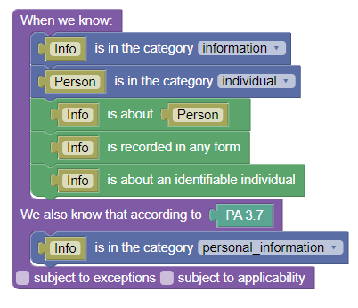

### Encoding Section 3(7)(a)

```
a) information relating to the race, national or ethnic origin, colour, religion, age or marital status of the individual,
```

To encode this section I created attributes on the category "information" for
relating to each of the particular types of information, referring to an individual. Because it says "the individual", I took that to be a reference to the person the information is "about".

Note that a) does not duplicate the requirements of 7, nor is there any implication of how they would be satisfied merely by satisfiying a). The section is not saying that "information relating to race" is necessarily recorded or about an identifiable individual. The reference to "the individual" was interpreted to mean the identifiable individual the information was about, so that those requirements both still needed to be met to trigger a).

As such, I copied the rule from 7, and added the requirement that the information
relates in that way to the person the information is about. One such rule was
created for each of the several possible things to which the information could relate. A similar approach was taken for all of the paragraphs below.

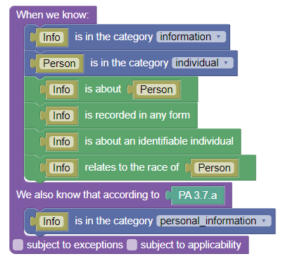

### Encoding Section 3(7)(b)

```
b) information relating to the education or the medical, criminal or employment history of the individual or information relating to financial transactions in which the individual has been involved,
```

Paragraph (7)(b) was encoded in much the same way, setting out an additional 5 "related to" properties for information, and duplicating the rules similarly.

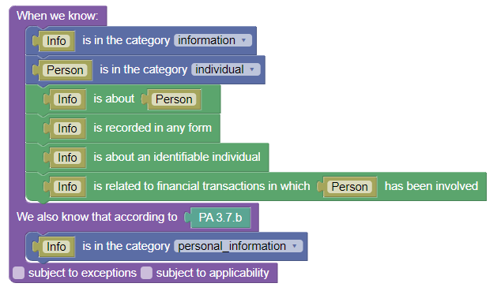

### Encoding Section 3(7)(c)

```
c) any identifying number, symbol or other particular assigned to the individual,
```

The pattern of starting the paragraphs with "information relating to" has been abandoned, but it was presumed that the things listed would be examples of the information mentioned in 7, but because they are specific things as opposed to
categories of things, the "relating to" was not necessary.

To encode this section information was given three attributes referring to individuals, indicating that the information is an id number, id symbol, or id particular for that individual. Note that I chose to model this not as the
information "includes" these identifiers, because that's not what the rule says.

Again, because the reference is to "the individual", the requirement is not that the information identifies anyone, but that it identifies at least one person that
the information is "about". So the rule was drafted as follows, with three copies for the three attributes.

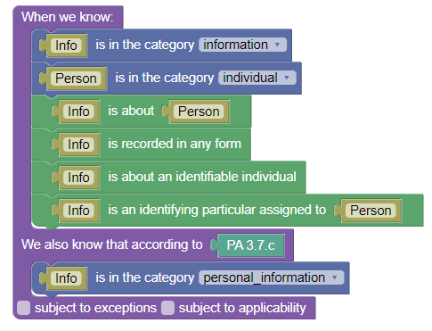

### Encoding Section 3(7)(d)

```
d) the address, fingerprints or blood type of the individual,
```

This section was encoded in much the way section c) was encoded. Three attributes saying that the information "is" the address, fingerprints, or blood type of a given individual, and then adding the requirement in the rule that one
of those hold true for an individual the information is about.

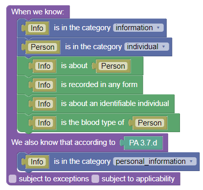

### Encoding Section 3(7)(e)

```
e) the personal opinions or views of the individual except where they are about another individual or about a proposal for a grant, an award or a prize to be made to another individual by a government institution or a part of a government institution specified in the regulations 
```

Recognizing that this section sets out a default, and then an exception to that default, the section was divided into two, and encoded separately.

This immediately causes an interpretation problem. Section 7 says 
"without restricting the generality of the foregoing". Paragraph (e) has been
precluded from limiting what can constitute personal information. So it's not
clear that an exclusion would necessarily have legal effect. But we will come back to that.

#### Encoding Section 3(7)(e), first portion

```
e) the personal opinions or views of the individual
```

The first part was encoded by adding an attribute to information called "is_opinion_of" which refers to an individual. This attribute would say whose opinion it was, and by implication that it is an opinion.

The rule was encoded with the requirement that the information be the personal opinion of the person the information is about, but because of the exception this rule was set to be subject to exceptions.

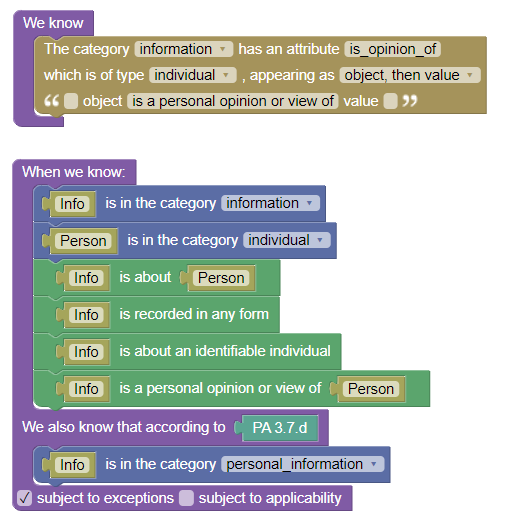

#### Encoding Section 3(7)(e), exception

```
except where they are about another individual or about a proposal for a grant, an award or a prize to be made to another individual by a government institution or a part of a government institution specified in the regulations ,
```

In this section I understood the disjunction at the first "or" to be primary, so the
first thing to encode was the exception that applies "where they are about another individual".


##### Encoding Section 3(7)(e), exception, first part

So it is no longer enough for us to know that the information is an opinion of a person, we need to know whose opinion it is and about whom it is an opinion. That is a ternary relationship between the information, the opiner, and opinee.
As such I created a 3-ary relationship called "personal_opinion_on_person", between an information and two individuals. In order to be sure to relate the
relationship to the previous predicate, I created an unattributed rule to assert that if an information was an opinion of A about anyone, it was an opinion of A's.

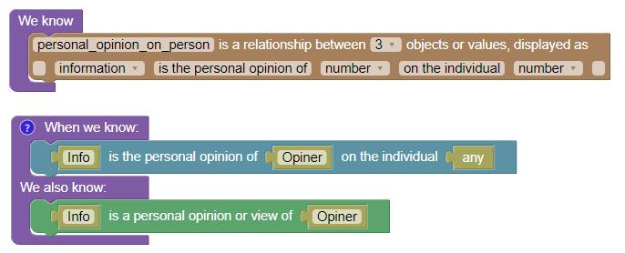

Then it was necessary to contradict the conclusion in the default, and to have the current section's conclusion override the default.
So I created a rule that when an information is the opinion of A on B, and when
A and B are not the same object (to represent the word "another" in "another individual")
then it is false that the information is personal information.

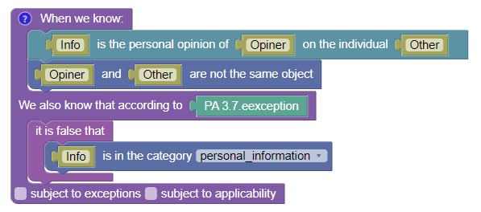

This was problematic, because a piece of information could be personal
information about more than one person, and it would not cease to be personal
information about one such person because any such person expressed an opinion
about someone else in that information. In the given ontology, the "information"
is either "personal" or it is not. If this conclusion served to declare that
something is not personal information, that would be excessive.

As such it seemed like this is more properly understood as an exclusion of applicability. The exception means that section (e) is not used to determine whether something is personal information when it is about another individual.

Blawx has features for applicability, so the root of (e) was changed to make it
subject to applicability, not to exceptions.

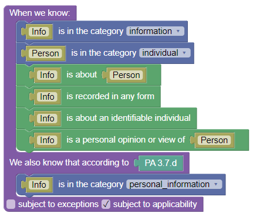

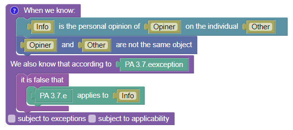

The Blawx applicability method requires that a value be set for applicability
explicitly for all elements, so it was necessary to encode a default rule that would make section e apply unless the exception made that false. That presumption
was implemented in an unattributed rule.

The question of where this implicit information, that section (e) applies unless
something says explicitly that it doesn't, should be found in the encoding, is
stylistic. My preference is where there is only one example of non-applicability,
to place the presumption with the non-applicability rules, because that is the
point at which the need for them becomes obvious. If there is more than one
exception it can be more coherent to place the presumption with the rule.

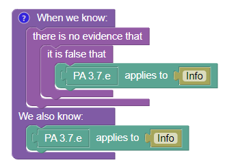

##### Encoding Section 3(7)(e), exception, second part

```
or about a proposal for a grant, an award or a prize to be made to another individual by a government institution or a part of a government institution specified in the regulations
```

This was complicated, so I skipped it in favour of encoding the other sections first.

### Encoding Section 3(7)(f)

```
(f) correspondence sent to a government institution by the individual that is implicitly or explicitly of a private or confidential nature, and replies to such correspondence that would reveal the contents of the original correspondence,
```

Because this section is referring to messages to and from governments and individuals, we need a generic way to refer to them as either the sender or recipient for correspondence. As such, at this point in the encoding I created
the category "entity", and the category "correspondence", and the category "government_institution". I also created two ontological rules, shown below,
indicating that both individuals and government institutions are entities.

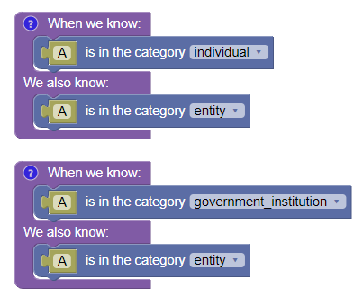

I then created four attributes for correspondence: sender, and recipient refer to entities. The attribute
"is_private" is a boolean that refers to "implicitly or explicitly of a private or
confidential nature". The attribute "reply_that_would_reveal_contents_of" is an
attribute from a correspondence, to a second correspondence, where the second
correspondence is a reply to the first that would reveal the contents of the first.

The first part of the rule, referring to correspondence sent to government institutions, was encoded by adding the requirements that the information is
correspondence, was sent by the person that the information is about, was
sent to a government institution, and is private.

Noting that the rule requires only "sent to" and not "received by", the blocks for
the sender and receiver attributes read "X was sent by Y" and "X was sent to Y",
respectively.

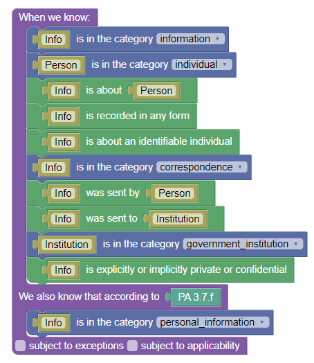

The rule about replies was encoded in much the same way, but adding the requirement
that the original is also a correspondence, the information is a revealing reply
to the original, and the other requirements are true of the original.

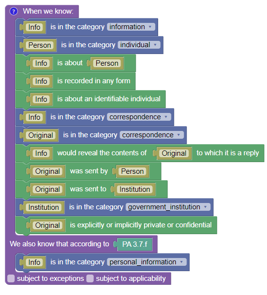

### Encoding Section 3(7)(g)

```
g) the views or opinions of another individual about the individual,
```

At this point, it becomes clear that sections (e), (g), and (h) are designed to work together. Section (e) makes something personal information when it is opinion other than about another individual. Section (g) makes that same information personal information.

So the obvious question is why? Why would the subsections of 7, which are not supposed to set out exceptions to 7 at all, have three different clauses for opinions, when every opinion would fall under at least one of them?

That question led me to examine the rest of the act for how the definition of personal information is actually used, to see if that would offer any clues.

Such a clue was found in section 8(1) which reads:

>Disclosure of personal information
>
>8. (1)  Personal information under the control of a government institution shall not, without the consent of the individual to whom it relates, be disclosed by the institution except in accordance with this section.

This makes it clear that the legislation anticipates that personal information has an "individual to whom it relates" (or more than one) who has legal rights that other individuals do not have with regard to that information.

That phrase is used 6 times in the Act, and is not defined.

So the distinction being made in the definition (7)(e) and (g) is that if an information is an opinion of person A about person B, person B has those rights; and likewise, if it is not an opinion about another person, the author has those rights. So the definition of personal information is also trying to define the "individual to whom (the personal information) relates" at the same time.

So the question then is whether and how this differs from the phrasing in the definition of personal information, which refers the person the information is "about". 

As it happens, the word "about" is only used once outside of the definitions section, in section 5(2), which reads as follows:

>Individual to be informed of purpose  
>(2) A government institution shall inform any individual from whom the institution collects personal information about the individual of the purpose for which the information is being collected.

So here, the legislation anticipates that information is being collected from someone, and that information is "about" the person from whom it is being collected. Why might we use this phrasing instead of saying "individual to whom the personal information relates"?

Perhaps because a personal opinion is "about" both the opiner and the opinee, but the "individual to whom it relates" depends on the context. For instance, if the government collects from me my opinion of Bob, the information is "about" me, in the sense that it is about my opinion. But I am not the "individual to whom it relates," because it is an opinion about another individual.

My suspicion, therefore, is that who information is "about" and the person whose personal information it is, are two different things. An information can be "about" many people, but it is not necessarily true that all of those people are entitled to the legal rights associated with it being "their" personal information.

If I wanted to know whether or not that is actually the case, I would need to look to how authoritative sources have interpreted the rules in the past, like courts and privacy commissioners. But part of the point of this exercise is to explore the benefits for legislative drafting of formalizing legal texts in this way. It is therefore enough to be able to say the following:

**Formalizing the Privacy Act in this way revealed weaknesses in setting out the definition of personal information, in particular with regard to defining who qualifies as an "individual to whom it relates".**

My new interpretation of the definition is that for each section, we need to define not only whether it is personal information, but also the individual to whom it relates.

So then the question arises, what is the difference between saying that a piece of information is personal information, and saying that a piece of information relates to a particular individual as personal information?

It seems intuitive that if a piece of information is personal information related to Bob, then it is also personal information. Is it possible for something to be personal information, but for it not to be the case that it relates to anyone?

It would seem not, because personal information is information about an "identifiable individual" according to the definition, and that individual is referred to in all the examples provided.

As such, it is not necessary for us to identify "personal information" as a separate category, or for use to model "personal" as an attribute of information. It is enough for us to model the existence of an individual for whom the information is personal, and to whom it relates.

So that is how we will try again, eliminating the category of personal information, and merely define the relationship of "identifiable individual to whom the information relates".

### Re-Encoding Section 3(7)

So we are going to change our ontology by getting rid of "personal information" as a category, getting rid of "about_identifiable_individual" as a property of information, and adding "relating_to" as an attribute of information that refers to an individual. We are also going to change the name of the "about" attribute to "identifiably_about". 

To be explicit, we are making another guess, here, that "identifiability" is intended to refer to a relationship between the information and the person the information is about, as opposed to the information alone, or the individual alone.

That is to say, we are interpreting the requirement "information about an identifiable individual" to include the requirement that it would be possible, given that information alone or in combination with other information, to identify which individual the information is about.

We are combining that requirement into the requirement that the information be "about" someone, by changing the name of the attribute to "identifiably_about".

If we return to the main section of the definition, we have the following ontology and rule.

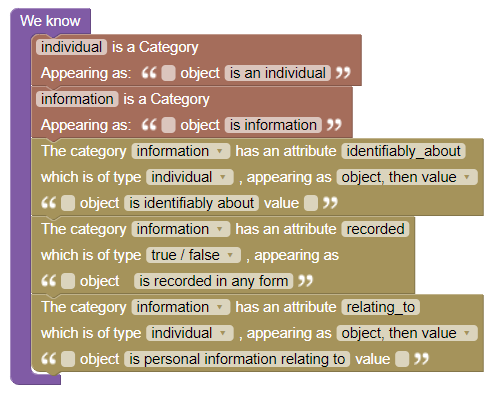

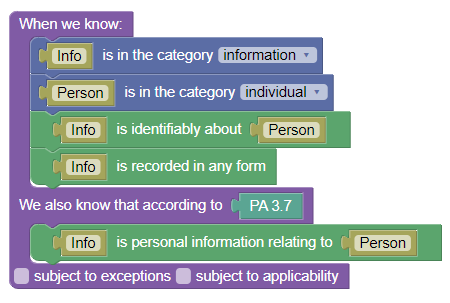

### Re-Encoding Sections 3(7)(a-f)

Now we can re-write the rules in the sub-definitions accordingly.  It is still the case that the sub-definition are including the requirements of recording and identifiability and "about" by using the phrase "the information." So the requirements of the definition will be repeated there, with the additional requirements added, and with the modified conclusion that the information is personal information relating to a person.

Here is an example of the re-written rule for paragraph (a):

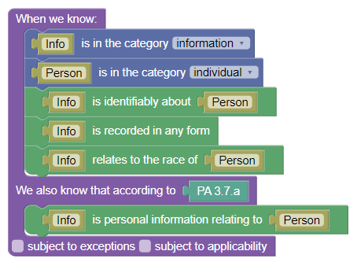

The rest of the code above was modified in a corresponding way.

However, because the conclusion is now a relationship between a person and the information, sections e, g, and h become easier to encode.

### Re-Encoding Section 3(7)(g)

```
g) the views or opinions of another individual about the individual
```

This is easily specified by requiring that there be two individuals, that they are different, and that the "Person" is the subject of the opinion.

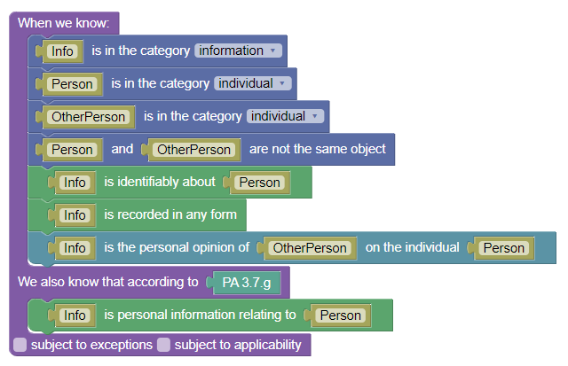

### Re-Encoding Section 3(7)(e), exception, second part

Now we come to section h), which makes explicit mention of the same terms used in the exception portion of section e), so we'll bite the bullet and go back and encode the second half of the exception in section e using our new understanding of the rules.

```
or about a proposal for a grant, an award or a prize to be made to another individual by a government institution or a part of a government institution specified in the regulations
```

We could independently encode the concepts of grants, awards, and prizes, but for our purposes it is unlikely that we would be obtaining input data from a system that makes those distinctions, or from a person who would not be able to decide whether the larger category applies. It is sufficient, therefore, for us
to create a category called "proposal" which encompasses "a proposal for a
grant, an award, or a prize". Now we need it to be possible for information to be about a proposal in addition to being about a person. We could go back and modify the "about" attribute of information so that the target is some category to which both proposals and persons belong. Or, we could create another attribute called "about_proposal", which has proposals as the target specifically.

Or, we could leave the definition as-is, and simply allow the user to state in code that information is "about" a proposal. This is possible, at least inside the coding environment, because the coding environment does not do any type-checking
between different user-defined categories. But it is problematic on the user-
interface side, because interfaces like Scenario Editor (shown later) will use
the target category to decide what options to display. Creating a super-category
has similar problems, in that scenario editor doesn't immediately know what
super-categories apply to an object declared in a sub-category.

Ideally, these considerations wouldn't need to come into play, but Blawx remains
experimental alpha software. To accommodate those sorts of issues, we will
create a second "about_proposal" attribute, with proposals as the target. That will make it easier for the scenario editor and other applications to know what
kind of options to offer when they ask a user what the information is "about".

We need to give proposals a grantor and a grantee attribute.

We have the phrase "government institution or part of a government institution." There are various rules in the Privacy Act about what constitutes part of a government institution, but those are outside the scope of our encoding, so
we will choose to model this only with regard to government institutions, for
which there is already a category.

Another part of this text that requires attention is the phrase "to be made".
This adds a temporal aspect to the definition, in that it seems to refer to
a proposal with regard to a grant that has not yet been decided upon. That raises
the question of whether something ceases to be personal information once the granting decision has been made, which seems on its face to be unlikely. Another possibility is that an opinion issued about a grant that has already been issued at the time the opinion is issued might not qualify under this section. It is also possible that an opinion received by the government after the grant has been issued, regardless of when it was issued, is also not caught by this section.

For our purposes, we will assume that there is no important temporal aspect. A
piece of information is always personal information, or never, for any given reason, and that conclusion doesn't change over time. Because we don't have a
good way of answering the question "to be made as of when" based on the text, we will intentionally model it in that vague way, and create a way of recording the idea that the grant that the proposal is about is "to be made" without defining that further. We can do this by adding the idea "to be made" to the
attributed we have already defined as "about_proposal".

Another part of this text is "specified in the regulations". Currently, the Blawx language does not have mechanisms to refer in the abstract to possible subsidiary or superior legislation. If we added an actual regulation to the encoding, we could ask whether according to any number of sections of that regulation something is a government institution. But we also don't have the features in Blawx right now to refer to scopes of legislation such as "any subsection of this regulation", or "any regulation under this statute".

Because of those weaknesses, and because regulations are outside the scope of our encoding, we are also choosing not to encode that concept here.

In the same way that we need information to be about both individuals or proposals, we now need personal opinions to be about both. So we will create
another relationship for opinions of people, and another ontological rule
stating that information that is an opinion on a proposal is also an opinion.

Those decisions made, the ontology looks like this:

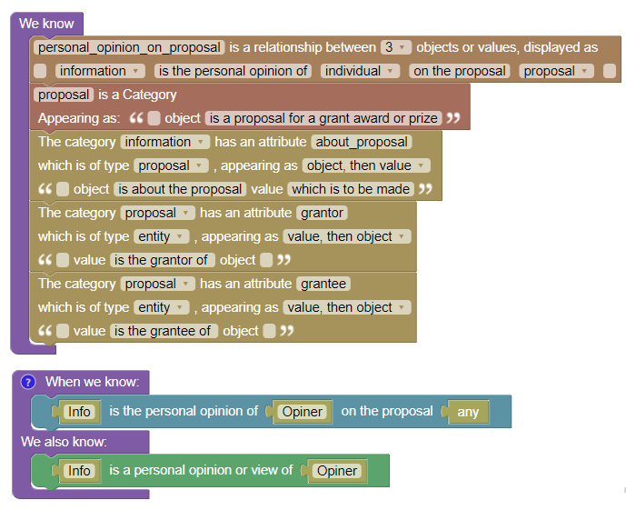

Now we need to encode the idea that section e of the definition does not apply
to information of this type. The requirements are that there is info, the info
is about a proposal to be made, the proposal is from a government institution to an individual,
the info is an opinion of an individual other than the grantee. If all of
those requirements are met then the rule in the main part of e does not apply.

Note that it is not necessary to restate the presumption that we already have
in this section.

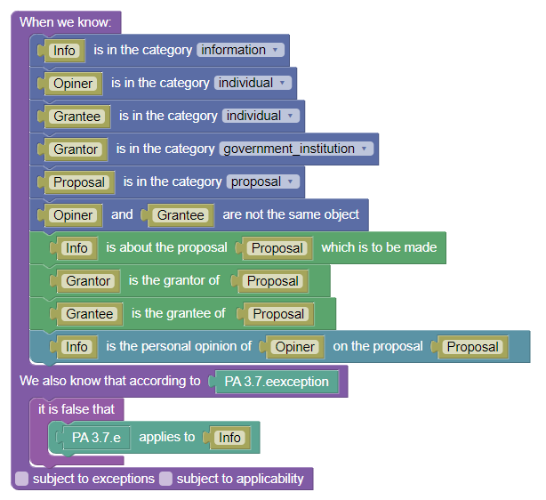

### Encoding Section 3(7)(h)

Now we can return to section h of the definition

```
h) the views or opinions of another individual about a proposal for a grant, an award or a prize to be made to the individual by an institution or a part of an institution referred to in paragraph (e), but excluding the name of the other individual where it appears with the views or opinions of the other individual, and
```

The first thing to note about this section is the cross-reference to paragraph (e) of the current definition. My interpretation of it is that the reference
serves to import into this section the phrase "set out in the regulations" which
occurs in paragraph (e). But it leaves open the possible interpretation that
a government institution or part thereof is not "referred to" by paragraph (e)
unless paragraph (e) applies to a specific proposal from that department. Because (e) and (h) mirror each other, and will both always apply to the same
proposals, that is perhaps harmless. But it confuses the meaning of (h) for no
discernible benefit except avoiding repeating the phrase "set out in the regulations". If that's the objective, the phrase "government institution" should probably just be defined to include parts of government institutions as
set out in the regulations, allowing you to simplify both e and h in the definition of personal information. In fact, government institution is defined earlier in the act, and that reference does not refer to parts as defined in the regulations. That suggests the "parts" distinction is only relevant inside the definition of personal information, in which case it might still have been
clearer to simply repeat the words "as set out in the regulations" in both e and h.

Second, we have to note that there is an exception, here, too. It's worth repeating that because the root of the definition says "without limiting the generality of the foregoing", so an exception is confusing in that context. But we were able to interpret the exception in e, so perhaps the same approach will work, here.

The basic rule I interpret to be "information that is a person B's opinion about a grant to be awarded to a different person A is personal information relating to A."

So in that context, what does the exception mean? It starts saying "excluding the name of the other individual". Immediately we can see that there is a mis-match between the type of entity that the default rule applies to (an information that is an opinion on a proposal), and the thing excluded (a name). So this is not, as in
the exception in e, a rule that excludes the application of the rule to an information altogether. It seems like it might be applying an exclusion to a
specific sub-part of an information, specifically the opiner's name.

It's worth noting that the definition of personal information already considers
the possibility that "information" can be as little as a single piece of 
information, like a personal identifier, and that it can also be something that
includes those pieces of information, like an opinion. So the word "information" is already being used to define things that would include other "informations". But until now, we haven't needed to reflect that possibility in the code.

Here, we are being asked to determine that a super-information is personal information, but a sub-information of it is not.

This is an example of an implied ontology, that needs to be made explicit in code for the software to be able to work with it. The implicaton, as I read it, is as follows:

* informations may contain other informations
* by default, an information is personal information if the information that
  contains it is personal information.

Then, this section can be understood as an exception to that default. To encode this, we need to create the ontological terms and rules to describe that implication. That includes describing the idea of "contains" and "is_a_name". Here, we do not want to ascribe the implication that something inside something else is also personal information to a particular section of the law, because no section of the law says so explicitly. We also don't want
to override it with regard to the conclusion of any given section of the law,
so the exceptions system is not what we need. Instead, we will encode a
presumption which is true unless it is false, using an unattributed rule.

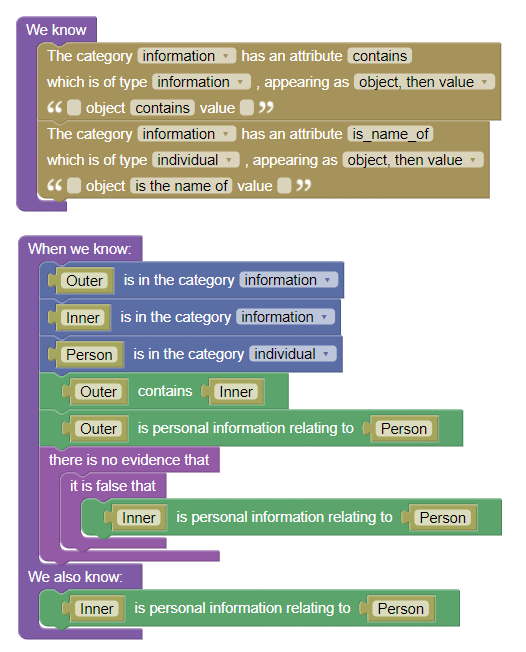

Now we can model "excluding the name of the other individual where it appears with the views or opinions of the other individual" by saying that the presumption does not apply to the name of the opiner when it is contained in an opinion. We are basically guessing as to the meaning of "appears with" being
equivalent to "contained in".

We therefore need two rules, one making the opinion personal information about the potential grantee, and another defeating the presumption that contined information is personal information if it is the name of the opiner.

The first part is almost identical to the exception in e, but with a different conclusion and section. 

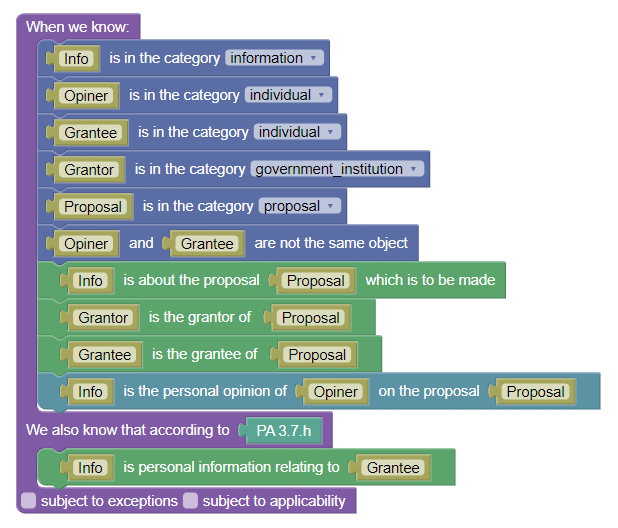

Now the rule is mostly duplicated, with the addition of a second piece of inforamtion, which is contained by the first, is the opiner's name, and the
conclusion is changed to logically falsify that the second information is
personal information regarding the grantee.

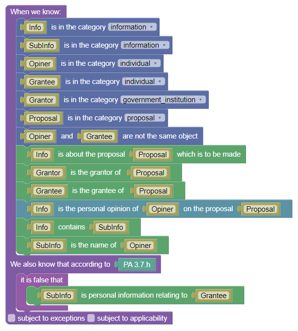

#### Disjunctive "and"

Let's take a second to note the word "and" at the end of (h). This is an example of why it is dangerous to use the raw text of a piece of legislation
to determine its semantic meaning. By default, the word "and" would be considered to be conjunctive, requiring both (or all) of the listed elements.

But frequently, as in this case, the word "and" is used to indicate that all the elements of the list are included in the list, and somewhere else it
is indicated that any element of the list is a disjunctive option. Here, the root of the definition says "including." The list of paragraphs is therefore logically disjunctive. Any on its own is sufficient to find that something is personal information.

So "and", here, means "or".

### Encoding Section 3(7)(f)

```
 (i) the name of the individual where it appears with other personal information relating to the individual or where the disclosure of the name itself would reveal information about the individual,
```

Here, we need to add the concept of a name that in and of itself reveals information. We could model this as an attribute of an individual, that their name reveals information. But we have also stated that an information can be a
name, and the section applies to informations, not people. Plus people can have
more than one name, with some names having that risk and others not. So it is
perhaps better to encode this as a property of informations that are names.

We could create "name" as a category, but for the sake of simplicity we will create another attribute that a piece of information can be revealing alone. The text says that something is personal information where disclosure of the name itself would reveal information about the individual, as opposed to about
other people. So this should be an attribute between a piece of information and a person for whom that piece of information is revealing in and of itself.

It is impossible, in our ontology, for a piece of information to be revealing
with regard to an individual, and for it not to also be "about" that person.
We can therefore include an ontological rule making that implication.

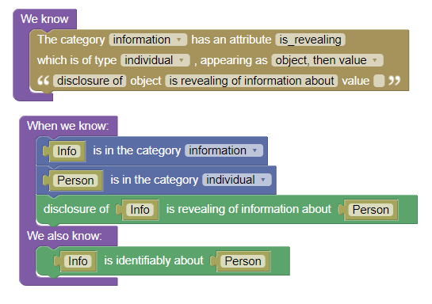

Now we can create the two disjunctive rules that make names personal information. The first is that a name is personal information if it appears
with other personal information. We can model "appears with" in the same
way that we did for (h), asking whether it is contained in information
which is also personal with regard to the same person. Following the pattern
used elsewhere, we get this rule:

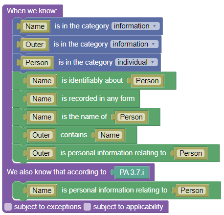

Some of these statements seem redundant, but may not be. For instance it seems
redundant to say that a name is personally identifying about "a person". But
that is not what that line of the rule means, in this context. Because the
variable name "person" is also used elsewhere, what it actually means is
something more like "the information called Name is the name of the person for
whom the containing information is about", which is less obvious.

Note that this rule is recursive. It reaches a conclusion about what is personal
information for who, and in order to reach that conclusion it considers whether
something is personal information for someone. So it is referring to its own
conclusion in its conditions, which creates opportunities for logical loops.
That can be a problem for computational efficiency, and can in some circumstances
create encodings that are unable to terminate because they loop indefinitely.

That's something that we will need to be aware of when testing this code.

### Encoding Section 3(7.1)

```
(7)(1) but, for the purposes of sections 7, 8 and 26 and section 19 of the Access to Information Act, does not include
```

Because it is illustrative of some of the features Blawx has, and some
features it does not, we are also going to encode the exception under
paragraph (m) of the definition.

The first thing to note about this is that structurally, there is no way to
pinpoint the text that initiates paragraph (m), as it appears as a second
section of root text of the definition, and shares the same numbering scheme
as the prior list in the definition, despite the fact it has a different
function. That is why we had to create non-existent 7.1 in order to be able
to create code for this text inside Blawx. (noting that 7 itself is also representative of the 7th definition in the defintitions section.)

Apart from that strangeness, we have, again, the strangeness that despite
the fact the definition says "without limiting the generality of the foregoing",
we again have a set of exceptions that are clearly intended to do exactly that.

Next, we are faced with the text "for the purposes of section 7..." This is a
formulation that occurs more than I would like in statutes, and for which there
is not currently a good representation inside Blawx. One way that this could be
represented is by the computer-science concept of "overloading", where a term
is given one meaning in a larger context, and given another meaning in a smaller,
contained context. It is potentially possible to implement a feature such
as that in Blawx in the future, but it does not currently exist. As such,
we are required to create a second attribute that indicates that information
is personal information for the purposes of those sections, create a
presumption that something that is personal elsewhere is also personal for
the more specific version, declare rules that override that presumption,
and then make sure we are using the newly defined attribute in the relevant
sections.

It is the last part, the requirement to know that a special version of the
attribute has been defined elsewhere before you can know which attribute to
use in the target sections, that is most objectionable, because it is a
violation of structural isomorphism. It makes it impossible to know how to
encode section 7 unless you are also aware of the existence of this special
version of the attribute. That violation of the one-to-one relationship
between encodings and rules make the encodings harder to write properly, and
also make the encodings harder to maintain when the rules change, because you
need to know more to make the required changes to a given section.

So this is an example of a limitation in Blawx's design, and how you can
workaround it, for now.

The exception in (m) for people who have been dead for 20 years is an
example of defeasibility. If it were not for the rule in (m), it would be the
case that the conclusion that something is personal information generally
would lead to the conclusion that it is personal information for section 7 also.
We may want to be able to ask questions like "which section overruled that
conclusion" in the course of testing our rules. So we will use Blawx's exceptions system to represent this.

The difficulty is that Blawx's exception system does not have an easy way of
overriding unattributed rules. So we will need to take the implied conclusion
that personal information generally is also personal information for section 7,
and turn that into an attributed rule. We will attribute that rule to the (7.1)
section, and indicate that the rule is subject to exceptions.

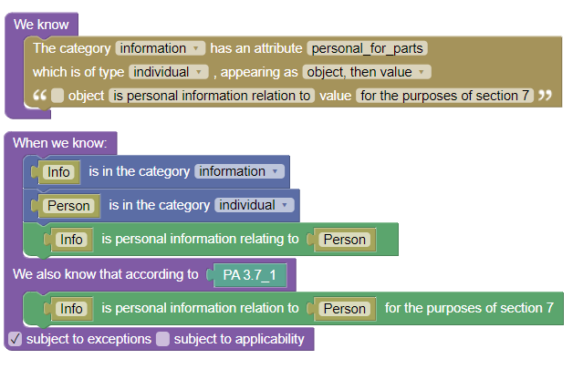

Now we need to describe the exception in (m).

### Encoding Section 3(7.1)(m)

```
m) information about an individual who has been dead for more than twenty years;
```

The one element we need to add to the ontology to describe this rule is that individuals have dates of death.

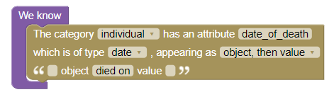

Now we need to make a rule that contradicts the rule in 7.1 for people who have
been dead for more than 20 years.

Dealing with date math in Blawx is unusual compared to a lot of programming
languages, because the statements are not nested, and instead of related to one
another by sharing variable names.  So our calculation for whether a person has
been dead for more than 20 years can be interpreted like this:

> * Today is a date.
> * The person has a date of death.
> * If you add 7305 days to the date of death, you get the date on which they were dead for 20 years.
> * If the date on which they were dead for 20 years is before today, they have
>been dead for more than 20 years.

The reason for using 7305 days as opposed to 20 years is that Blawx's date math
currently does not support date units larger than days. The reason for that is
that Blawx uses constraint math to calculate date math, but constraint math
doesn't cooperate very well with units that are of inconsistent size, such as years and months.
The ability to deal effectively with years and months may be added again in
the future.

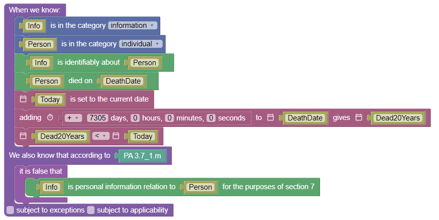

Now we have created a rule that comes to a contradictory conclusion to the rule in 7.1, which we indicated was subject to exceptions. In order for Blawx to know
which of these conclusions should "win", we need to be explicit about the overriding relationship between them.  That is done using the overrules block,
as follows.

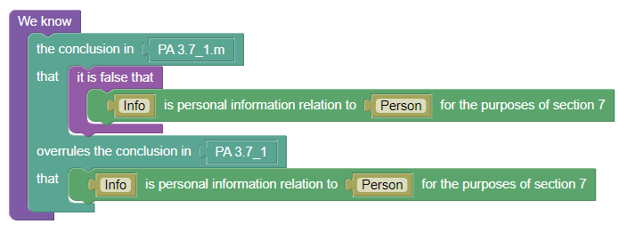

Now Blawx knows everything that it needs to know in order to resolve a conflict between the two conclusions if they would otherwise both hold.

The use of contradicting rules and an override block allows you to state the relationship between the contraicting rules wherever it appears in the law. If
the rule says "subject to", you can put the overrules block with the default rule. If the rule says "despite", you can put the overrules block with the exception. This aids in structural isomorphism, which makes the rules easier to write and maintain.

Note that requiring the user to specify that a rule is subject to exceptions is
also a violation of the principle of structural isomorphism. YOu have to know there is an exception somewhere else before you know to check off that box, so you are expressing knowledge that comes from elsewhere in the rule. In future versions of Blawx it won't be necessary to do that, as exceptions can be enabled for any rules that are targetted by an overrules block.

### Encoding Section 7

```
7. Personal information under the control of a government institution shall not, without the consent of the individual to whom it relates, be used by the institution except ...
```

For this section we need to add the concept of a "purpose", "control", "consent", and "permitted to use".

Note that in Blawx there is no built-in deontic concepts like permission,
prohibition, etc. So if you want to model that something is permitted, you
need to create a predicate for that idea. That may change in future versions.

To model purposes, we will create a new category. To model control, we will
add the attribute "under_control_of" to the category information, and have it
point to an entity. To model "consent" we will create a relationship that
indicates an individual has consented to the use of an information by an entity
for a purpose. And for permission, we will create another relationship
indicating that an entity is permitted to use an information for a purpose.

The ontology looks like this:

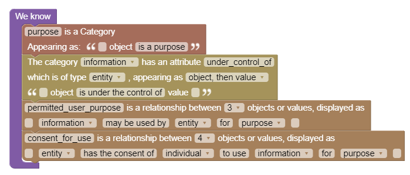

We can see from the word "except" that this section is describing a default
that will be overruled in the following sections, so we will use Blawx's
exceptions features to encode it. The default rule here is that if a 
government institution controls an information about a person who has not
consented to the use of that information by that institution for a purpose,
the institution may not use it for that purpose.

Arguably, implicit in this section is the opposite idea, that if consent has
been granted, then it is permitted. It might seem strange to need to say so,
but remember that in Blawx statements can be true, false, or neither. So if
we ever want to be able to say that something is permitted due to consent,
we need to create a rule that makes that implication possible.

We need to remember to use the "for the purposes of section 7" version of
the personal information attribute.


Note that only this rule is set to be subject to exceptions, because the exceptions
seem to be designed to set out cases only where use is permitted, never to find
cases where it is not despite consent.

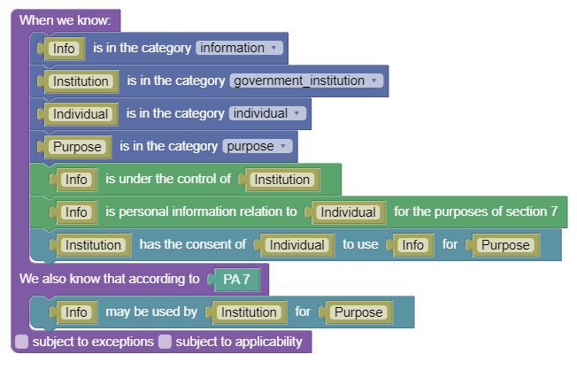

Now we will encode the exception in 7(a).

### Encoding Section 7(a)

```
7(a) for the purpose for which the information was obtained or compiled by the institution or for a use consistent with that purpose; or
```

Here there are two ontological concepts that have been added: the purpose for
which information was obtained, and uses consistent with that purpose. In
deciding how to model this, we need to decide whether to create separate
representations of the concept of a "use" and a "purpose", or to join them
into a single concept in our model. If we separate them, we would need to model
relationships where a use is "for" a purpose, or is "consistent" with a purpose
separately. For the sake of simplicity, we will unify the two ideas as one,
call it purpose, not model uses directly, and instead ask whether purposes
are consistent with one another.

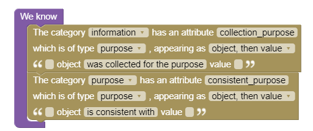

Note that just because we are not modelling the concept of a "use" separately
inside the ontology doesn't mean that it is excluded in our model. But it
exists at the semantic layer, instead of the syntactic layer, and thus cannot
be directly referred to, as distinguished from other uses, inside our rules.

There are two implications in this section. The first is that a government
institution can use information if the use is for the purpose for which the
information was collected. The second is that it can also use that information
for consistent purposes. We will create both of those rules separately.


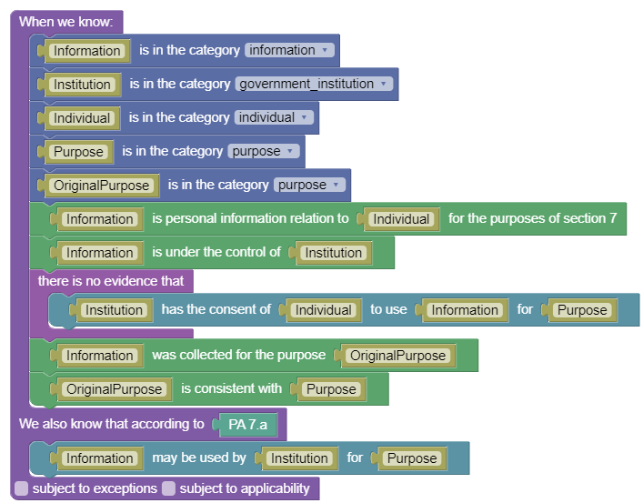

Because these are exceptions to the rule in 7, we need to specify how the
constradictory conclusions are resolved. We do that using the overrules block.

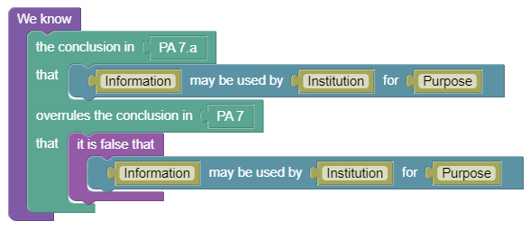

And that completes the second draft of the encoding. We can now proceed to testing and validating the encoding.

## Demo Part 2: Testing the Encoding

For the purpose of illustrating how Blawx can be used to test the behaviour
of rules, we will go through a number of small tests, and show how these
tests give the answers we expect (or not).

This section of the document is intended only to give readers an intuition for
how tests work in Blawx, and how they can be used to learn about the
behaviour of your encoding. **It is not intended to give best practices as
to testing code to be used in production, particularly where the use of that code has risks
of harm.** Best practices for testing of code to be used in production are still being
explored, but would be more extensive and cover a wider
array of possible inputs than shown here.

### Test 1

We will start with a very simple fact scenario in which there is a person, bob,
and there is a document which indicates that bob is caucasian. Let's see if
Blawx can correctly conclude that this document is personal information, and why.

We model this in our block language as 4 facts. Bob is an individual, the
document is information, the document is identifiably about bob, and it is
recorded in any form.

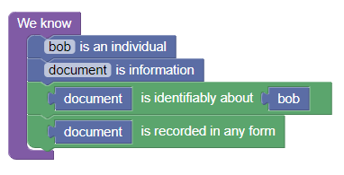

Now we will create a question that asks whether the document is personal
information relating to bob, as follows:

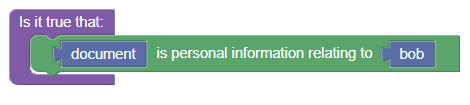

We can "Run" this test in Blawx, and we get only one answer, with only
one explanation, which appears as follows:

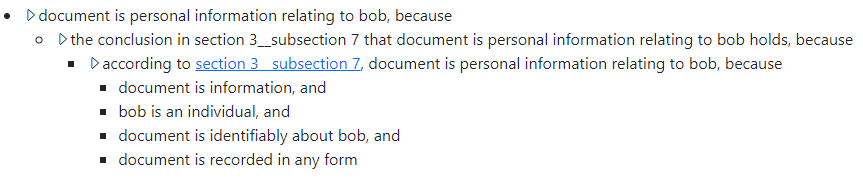

Note that in the Blawx interface a great deal more information appears, to
facilitate debugging. But that information is left out of the images for
the purpose of illustration.

You can see that Blawx has concluded that the document is personal information
by virtue of section 3 subsection 7, which is how we have renumbered the
definition of "personal information".  If the user hovers over the linked
portion of that explanation, the text of the definition appears as a tool tip.

### Test 2

But of course, the document is not merely about bob, it is about bob's race.
We can add that as a fact to the test and run it again, and see what happens.

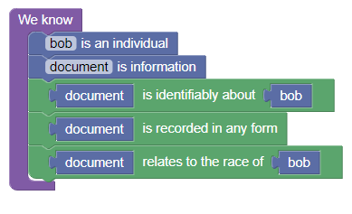

Now when we run the test, we stil get only one answer, but we get two explanations. The first is identical to the answer in the first test. The
new second explanation appears like this:

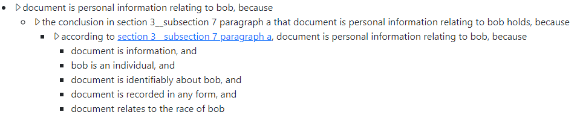

So you can see that Blawx has determined that it is still true that the document
is personal information about bob, merely by virtue of being identifiably about
him and recorded. But with the additional fact Blawx can also reach that
conclusion using paragraph (a) of the definition, which specifically mentions
information relating to a person's race.

This is the behaviour we should expect. The conclusion in (a) is not mutually
exclusive to the conclusion in the root of the definition, so both should be
possible ways of reaching the same conclusion.

If we were to add more facts about the document that would make it personal
information under more paragraphs of the definition, more explanations would
appear for the same conclusion.

### Test 3

Now let's ask a different question, and find out whether the document is
personal information for the purposes of section 7. Our facts stay the same,
but the new version of the question looks like this:

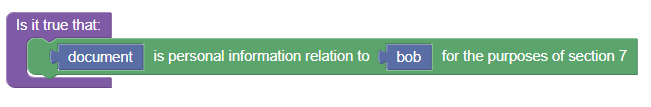

Again, we will get two explanations for the answer, which are based on the root
of the definition and paragraph (a) of the definition respectively, but we will
examine only the first of these to see how it has changed.

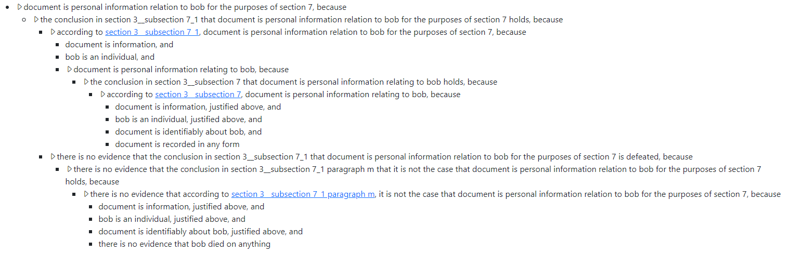

Reading these explanations is already becoming more complicated, but they are
easier to follow if you remember that each line and it's sub-parts should
correspond to a conclusion in a rule, and the conditions of that rule.

Here, our question was whether the document is personal information for the purpose of section 7. That conclusion "holds" because of two things:
according to 3(7.1) it is true, and nothing else defeats that conclusion.
These conclusions are included because the conclusion in 3(7.1) was made
subject to exceptions.

If we look at how Blawx knows that 3(7.1) reached that conclusion, we see
there are only three sub-elements. Those correspond to the
three conditions in the rule we created for 3(7.1):


The third part of that rule is that the info is personal to bob,
which is the question we were asking in our earlier tests, and you
can see from that point down in the tree, the explanation is the same.
In the second explanation, that is the portion of the tree that is
different, and in exactly the same way as before: it uses section 3(7)(a) instead of 3(7).

Further down we have the explanation for how we know that the
conclusion reached in 3(7.1) is not defeated. That is true for only one reason, that there is no evidence that the overriding
conclusion from section 3(7.1)(m) holds. And we know that there
is no evidence that paragraph (m) contradicts because of four things. This is slightly less intuitive, and the reason is how
Blawx generates rules to calculate when things are not true. But
generally speaking, there are a number of factors less than or
equal to the number of conditions in the rule, and one of those
factors doesn't hold.

In this case, we can see that the first three requirements of paragraph (m) are met, and the fourth (that there is a date on
which bob died), is not. Here is the code for paragraph (m):


So you can see that this rule actually has 7 statements in
the conditions of the rule, but only the first four are listed
in the explanation, because Blawx will only provide the first
reason that a rule does not hold in an explanation, even if there
are potentially multiple ways in which the rule would not have
triggered.

### Test 4

Now let's see what happens if we give Bob a date of death of less than 20 years in the past. Our new version of the facts will look like this:

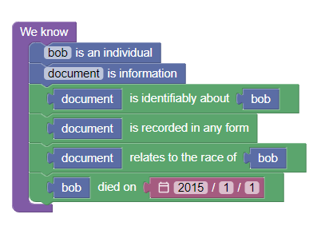

(We are testing this in 2023, so 2015 is less than 20 year ago.)

Now if we run the test again, we would expect the answer to be
the same. The document is personal information. The only difference
should be in how the non-applicability of paragraph (m) is explained. And it is different, but it is not different in 
the way we might have hoped:

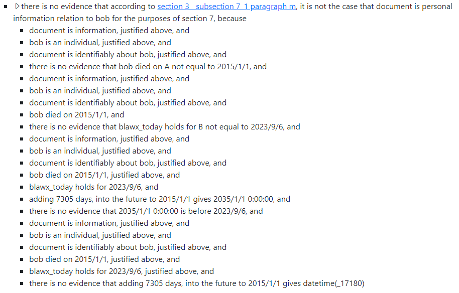


The reasons for this are complex, and have to do with the way that
Blawx deals with doing math about numbers, which is using a constraint math. But if you look closely, you can see a similar
pattern to the one above.  The explanation can be thought of as Blawx trying four different ways of reaching the conclusion, each
of which fails for different reasons. Each sub-attempt can be seen if you look at the lines in the explanation that start with "document is information, justified above", and continue until that line is repeated. Let's take a look at each, one at a time.

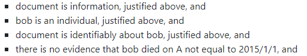

This attempt is very similar to the original explanation,
except that the last line says there is no evidence that bob
died on a day other than the day on which we told Blawx he died.
That would seldom be useful to say to a human being, because
human beings understand that people cannot die twice. But Blawx
has no intuition for that, and the way it does math is based on
numerical constraints, which means it is always trying to find
another way in which the formula might hold. So these four lines
serve to say "bob only has one death date."

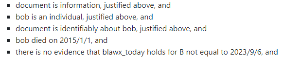

Here it is using the given death date for bob, and then checking
for the date for today, and coming to the same conclusion that
it would not be necessary to say to a person, that "today" has
only one value.

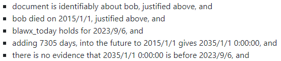

This is the explanation that we would actually expect. Given
the date we know bob died, and today's date, you can add
our estimation of 20 years (in days) to the date he died, and
get a new date (in 2035), and that date is not before today.

This is the only version of the explanation that a human would
need.

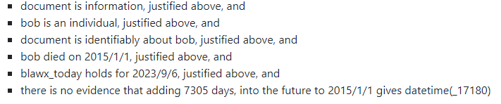

Lastly, Blawx also wants do know if there are other values that
can be received by adding 7305 days to the death date of bob,
which seems like a strange thing to check for when you are
talking about addition, but it is a side effect of the fact that
blawx is doing constraint math in order to calculate these results *in the negative*.

### Test 5

Now let's see what happens if we make bob's death date more than
20 years in the past. Our new facts look the same, but with an
earlier death date.

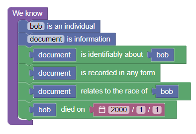

Now when we run the test, we get no answers.

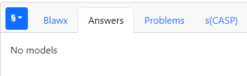

Unforunately, that doesn't give us a lot of information about why
there were no answers received. But because Blawx has the ability
to explain negations, and we know that the answer to this question
is "no", we can negate the question in order to get a "yes", and
an explanation. So we will add a "there is no evidence that"
block to our question, and ask again.

### Test 6

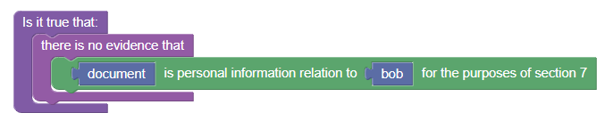

Now when we run the code, we get a single answer, that the document
is not personal information for the purpose of section 7, with
two explanations that differ in the same way. If we zoom in on
only the part of the explanation that shows how it was determined
that paragraph (m) applied, and therefore overruled, we see the following:


And you can see here that we are getting the explanation that
we would expect, which is that the conclusion in (m) is true
because each line in the conditions of (m) is also true.

Now that we know that answers for whether or not something is
personal information for the purposes of section 7 seem to be
working as we expect, we can start asking questions about section
7 itself, and ask about what uses are permitted for whom, and
why.

### Test 7

Note that this is a search question, as opposed to a true or false
question. Blawx will allow you to ask both. In this case instead
of asking "is it true that a specific department can use a 
specific information for a specific purpose", we are going to ask
blawx "find all of the scenarios in which a department can use
information for a purpose", without specifying any of the three
elements. We do this by using variables in the question, like this:


When we ask a search question like this, Blawx will find all the valid answers, all the valid explanations for each answer, and
will also tell you what values were slotted into each of the
variables in a given answer.

But of course, if we run this question with the existing facts,
we will get no answers, because there are no institutions,
there are no purposes, etc.

We can approach this problem in one of two ways. We can do
what we did above and add specific information, or we can tell
Blawx to hypothesize about possible information, and ask it for
those scenarios in which the question can be answered positively.

Let's play with Blawx's hypothetical reasoning features instead.

We know that under our rules, by default, an institution cannot
use information unless certain things are true. We also know that
the rule in section 7 needs to know about institutions, purposes,
control, and consent.  So we will use the "assume" block in our
facts to ask Blawx to hypothesize about the existence of
institutions and purposes, whether those institutions control any
information, and whether any consent exists.  Those blocks are
added to the existing facts. We also need to change bob's death
date to be more recent. The new facts look like this:


How many answers do you expect? And how many explanations?
And what should the explanation say?

I would expect that there will be one answer, that a hypothetical
institution could use the document for a hypothetical purpose.
And I would expect that would depend on the document being
personal information for the purposes of section 7, which we 
already know has two explanations. But without providing any information about purposes for which it is collected and used,
the only way to conclude that anyone is allowed to use it if there
is consent. So there will be only the two explanations, and the
facts will presume that consent has been granted.

As it happens, we get two answers, each with one explanation. Why do we get two answers if the answers are the same? Because Blawx is not comfortable asserting that a hypothetical object used in one answer to the question is "the same" as another hypothetical object used in a different one.

Let's dig into the explanation for the first answer:


Here we can see that Blawx has used section 7 to conclude that
the document can be used by a hypothetical government institution
it has given the name "A", for a hypothetical purpose it has given
the name "B".

As we would expect, the justification for this looks the same as
the rule in section 7, and has the same 7 requirements.

The drop-down arrow next to the next-to-last condition indicates
that Blawx can provide an explanation for how it reached the
conclusion that the document is personal information for the
purposes of section 7, but we know exactly what that explanation
will contain, so we can leave it collapsed and view only the new
information.

What is different is that four things have been concluded "by
abduction". That means we asked Blawx to hypothesize about statements that could be true in order to find answers for our
search, and the "abducted" statements are the assumptions that it
made.

This is an extremely useful feature of Blawx, because effectively, it gives you the opportunity to ask questions like "under what circumstances can a legal conclusion hold", tell Blawx
to hypothesize about all or a portion of the relevant facts, and
have Blawx effectively describe all of the different abstract fact
scenarios in which that conclusion holds.

In this case, you can read the answer as saying "a government
institution would be entitled to use the document for a purpose if
the institution and the purpose exsited, if the institution was in
control of the document, and if bob had consented to its use."

This is very useful for testing the behaviour of your code, because instead of asking "does it give the right answer when I give these inputs", you can ask "what are all the possible combinations of inputs that will generate this answer?"

It is also useful for automted legal systems, because you can keep
track of assumptions that the code is making in order to reach a conclusion, and then display those assumptions to the user, and
advise the user that the conclusion is true only if the assumptions are.

It can also be used in the development of expert systems, to allow
the system to make assumptions about the answers to questions that haven't been asked yet, in order to determine if there is any
way to answer the user's questions, and if so, what additional questions are relevant to ask.


### Test 8

An important thing to consider when using assumptions is that
they run in both directions. When you ask Blawx to assume something,
it actually considers situations in which that thing is true, and situations in which that thing is logically false. The only thing that is not considered is situations in which we have no information. So if we use the same facts and assumptions but ask instead to search for
situations in which an institution is not permitted to use an
information for a purpose, Blawx may be able to find ways to
answer that question, too.


And when we run that code, we get two answers, which differ in
the usual way, in which it is assumed that consent was not granted.


This explanation seems convoluted when explaining how Blawx
concluded that there is no evidence for the consent. Instead of
merely asserting that it abduced that the evidence did not exist,
it says that it does not exist because the false version of the
statement was true, because the non-existence was assumed.

Note that it is using the word "assumed" instead of "abducted",
here. The reason for this is complicated. When you ask Blawx
to make an assumption, you are asking it to assume in every
scenario that either the true or the false statement is true. It does not consider situations in which there is merely no evidence.

The way that Blawx implements this assumption is by creating a pair
of rules. One rule says that if there is no evidence it is false,
it is true. The other rule says that if there is no evidence it is
true, it is false.  These two rules force the reasoner to pick one,
either true or false, and have no evidence for the other.

But our test for whether something can be used or not checks
explicitly for the absence of evidence of consent, which is
different from falsehood of consent. Blawx can reason that there
is no evidence that something is true if it also knows that the
same thing is false. It derives the fact that
it is false from the rule, which it chooses to apply in this case,
that if there is no evidence that it is true, it is false.

But that rule in tern requires Blawx to be confident that there
is no evidence it is true, which is the think Blawx was originally trying to figure out.

When Blawx runs into loops like these, and the absence of 
evidence of something is being used to justify the same absence
of evidence of that thing, Blawx "assumes" that there is no
evidence of it.  So in this case, it is not the "abduced"
conclusion that consent is true, or that consent is false, but
rather the "assumed" conclusion that there is no evidence it is
true, that is being used to reach the hypothetical conclusion.

So far, Blawx has told us that an institution is entitled to use
the document for a purpose if it has consent, and it is not
entitled to use the document for a purpose if it does not.

### Test 9

Now let's ask Blawx to hypothesize about the other facts used
in section 7(a), having to do with the purpose for which the
information was collected, and consistent purposes. We will
add two more assumptions to our test, and change the question
back to the positive form. In essence, we are now asking
Blawx "what are all the circumstances under which an institution
is entitled to use an information for a purpose?" with the
restrictions that there is only the one individual and document we have described in the facts.


My guess is that there is the circumstance under which there is
consent, the circumstance under which it is for the purpose for
which it was collected, the circumstance under which it is for
a consistent purpose with that purpose, and for each of those
there are two different ways of concluding that the document
constitutes personal information, for a total of 6 explanations.

And indeed, that is what Blawx provides, six answers each with one
explanation.  The first two explanations use section 7 to reach that
conclusion, using section 3(7) and 3(7)(a) respectively to determine that
the document is personal information at all. The next two use section 7(a) to
find that there is permission, using sections 3(7) and 3(7)(a) respectively,
assuming that it is being used for the purpose for which it was collected.
The last two use the same sections, but assume that it is being used for
a consistent purpose.

A portion of the last explanation is shown here:


## Demo Part 3: Integrating Blawx with a Conversational Chatbot

This repository includes the code described below for the integration, and
is designed to be used with Blawx inside a docker compose environment. For
information on how to run this code yourself, see the installation information
in the appendix. Note that it will not work unless you provide an OpenAI API
Key, and have access to the GPT4-0613 model.


### Design Objective

The objective of this demonstration is to create a conversational chatbot,
powered by generative AI, that is capable of receiving a question about a
specific fact scenario in natural language from a user, using a Blawx
encoding in order to generate an answer to that question, and then summarizing
the information returned from Blawx for the user.

The anticipated use-case for this work is for the education of public servants
tasked with adhereing to privacy rules in the mangement of data products.
There is an increasing push to have data administered less centrally, and shared as a
product, creating a "data mesh" of available resources. The advantages of
the data mesh approach are beyond the scope of this document. For our purposes,
we anticipate that this approach would increase the number of data stewards
who would be obliged to implement controls in order to maintain compliance with
privacy requirements. That, in turn, will increase the need for effective
education of data stewards on, for example, their privacy obligations.

This demonstration is designed to investigate whether it might be possible to
use a combination of symbolic AI (Blawx) and generative AI (GPT4) to generate
tools that allow for a natural language interface, but which are able to generate
accurate, trustworthy, explainable answers to legal questions.

Do to time limitations, it is not possible to generate anything beyond the
minimally viable prototype of such an application. As such, we are focussed
primarily on whether the specific technical hurdles associated with both
symbolic and generative AI can be overcome by using them in combination.

Specifically, symbolic AI representations like those in Blawx are explainable,
but the explanations tend to be verbose, and unfriendly to humans. One of the
objectives of this experiment is to see whether combining Blawx and GPT allows
for a more human-friendly interface to the Blawx encoding.  Similarly,
generative AI has acknowledged risks with regard to hallucination, particularly
when dealing with complicated reasoning tasks. Even if generative AI can be
used to generate accurate answers, and to generate textual explanations for
those answers, the explanations do not represent the reasoning that was used
to generate the answer, and there are risks that neither the answer nor the
explanation are consistent with the rules the generative AI was asked to follow.
Another objective of this experiment is to see whether the answers generated
by a conversational AI can be made more reliable by integrating them with a
symbolic representation of those rules written in Blawx.

Having a generative AI "use" a Blawx encoding requires the generative AI to
do two things successfully, both of which have typically been difficult for
generative AI to do. First, the generative AI needs to faithfully translate
the facts that are provided by the user into the language that is
available in the symbolic encoding. Second, the generative AI needs to send
encode this relatively complicated representation in a format consistent with
the input format expected by the Blawx API, which expects a JSON object.

### Generating the ChatBot Interface with Gradio

Gradio is a python library for quickly and easily generating web-based user
interfaces for LLM prototypes. The chatbot interface is generated by the `blawxbot.py` file,
which is very straightforward. It imports the required libraries, creates a
function for responding to user queries, and generates a user interface and
ties it to that function. The LLM "agent" is imported, called in that function,
and its output is displayed to the user.

`blawxbot.py` is quoted here in its entirety:

```python
import gradio as gr
from agent.blawxagent import agent

block = gr.Blocks()

def chat_response(input, history):
    history = history or []
    output = agent.run(input)
    bot_message = output['output'] if isinstance(output, dict) and 'output' in output else output
    history.append((input,bot_message))
    return "", history, history

with block:
    chatbot = gr.Chatbot(show_label=False)
    message = gr.Textbox(placeholder="Ask your question here.",show_label=False)
    state = gr.State()
    message.submit(chat_response, inputs=[message,state], outputs=[message, chatbot,state])

block.launch(debug=True)
```

### Generating the LLM Agent with Langchain

Langchain is a Python library for building larger automations that depend on
smaller portions of those automations being performed by LLMs. In this case,
the demonstration below is done using GPT4-0613. Other models may be sufficient
for the explanation summary tasks, my experience is that the features of GPT4-0613
specifically are important to successful integration with Blawx for encoding
fact scenarios.

The Langchain "agent" for this task is created in the `agent/blawxagent.py` file.

This file imports the tools defined below, configures the LLM to be the GPT-4-0613
model, gets the API Key for it from the environment, gives the agent memory, and
configures it to use the "functions" capabilities provided with GPT4-0613.

The file is quoted here in its entirety.

``` python
from dotenv import load_dotenv
import langchain
from langchain.chat_models import ChatOpenAI
from langchain.agents import initialize_agent, AgentType
from agent.tools.ontology import ontology_tool
from agent.tools.interview import PAInterview
import os
from langchain.prompts import MessagesPlaceholder
from langchain.memory import ConversationBufferMemory

agent_kwargs = {
    "extra_prompt_messages": [MessagesPlaceholder(variable_name="memory")],
}
memory = ConversationBufferMemory(memory_key="memory", return_messages=True)
#langchain.debug = True

load_dotenv()
openai_api_key=os.environ['OPENAI_API_KEY']

# Because we are using functions, we need to use model gpt-4-0613
llm=ChatOpenAI(openai_api_key=openai_api_key,temperature=0, model="gpt-4-0613")

tools = [ontology_tool,PAInterview()]

agent = initialize_agent(tools, llm, agent=AgentType.OPENAI_FUNCTIONS, verbose=True, agent_kwargs=agent_kwargs, memory=memory)
```

The agent is given two "tools", that it knows how to use, the "ontology" tool, and
the "PAInterview" tool.


### Creating the Ontology Tool

The ontology tool is intended to be used by the agent when it determines that it
needs to know what ontological elements exist in the Blawx encoding, and can be
used to encode facts. It is set out in the `agent/tools/ontology.py` file. It
creates a function called `ontology` that makes a web request to the Blawx server's
endpoint for the ontology associated with the Privacy Act test, and reformats the
answer into text for use in the agent. Then, it configures a langchain "tool" that
calls this function and describes the use of the tool to the agent.

The `ontology.py` file is quoted here in its entirety. You can see that in this
version, the code is making a call against the live development version of Blawx,
and so is dependent on the correct code existing at that location.
In a future version, I hope to run a containerized version of Blawx and refer to
that instead.

```python
import requests
import json
from langchain.agents import Tool

def ontology(input):
  # input is ignored
  response = requests.get('https://dev.blawx.com/jason/privacy-act/test/pi_for_purposes/onto/')
  package = json.loads(response.text)
  output = "The categories which take only an object as a paramtere are " + ", ".join(package['Categories']) + ".\n"
  output = "The attributes that take only an object are " + ", ".join([(a['Attribute'] + " which applies to an object of category " + a['Category']) for a in package['Attributes'] if a['Type'] == "boolean"]) + ".\n"
  output += "The attributes that take an object and a value are " + ', '.join([(a['Attribute'] + " which applies to an object of category " + a['Category'] + " and accepts a value of type " + a['Type']) for a in package['Attributes'] if a['Type'] != "boolean"]) + '.\n'
  output += "The relationships I know about are "
  for r in package['Relationships']:
    output += r['Relationship'] + ", which accepts "
    index = 1
    while "Parameter"+str(index) in r:
      output += "a " + r['Parameter'+str(index)] + ","
      index += 1
    output += ";"
  return output

ontology_tool = Tool.from_function(
        func=ontology,
        name="Ontology",
        description="useful for when you need to know the categories, attributes, and relationships available in the pi_for_purposes tool. Does not require input."
    )
```

### Generating the PAInterview Tool

The PAInterview tool needs to be able to correctly format a request to the Blawx
API. GPT4-0613 provides a "functions" capability that allows you to specify a
JSON schema that an answer must adhere to when the LLM chooses to call a given
function. The `interview.py` file uses the Pydantic Python library to generate a
class called "BlawxFacts" which represents this schema, illustrating how information
would need to be encoded to meet the expectations of the Blawx API.

Note that this encoding is not particularly detailed, and doesn't impose any
requirements that the encoding adhere to an ontology, that predicate names are
properly formatted, etc. Several of these requirements are dealt with separately
by providing information to the LLM in the prompts.

It then creates a PAInterview class by giving the tool a name and description, and
setting the schema for the arguments to a call to this tool to the BlawxFacts
schema defined earlier. The tool is configured to call the `privacy_interview`
function when run, which function makes a call to the relevant Blawx API and
reformats the response slightly for use in the agent.

This file is where most of the "prompt engineering" involved in this demo occurs, and it is not elaborate.
In defining the function, the phrase "I should use only the following information
to answer the question: " is prepended before the explanation returned from the Blawx
server, if available, or a message that no proof was available otherwise.

The description of the PAInterview tool contains a small amount of information intended to ensure that the LLM
adheres to elements of the JSON schema that were not possible to express through the
Pydantic model, and to give it some background as to how to use the ontology. Here, some
knowledge of the ontology on the part of the prompt author is being used, but
it is anticipated that it would be possible to allow those details to be set out
in a description of the "test" in the Blawx interface in future, and for a more fullsome schema to be automatically
generated from the ontology itself.

This would reduce the task of generating a tool for an LLM agent to describing in natural langauge the facts that the test author expects to receive.

The PAInterview and privacy interview definitions are quoted here in their entirety:

```python
class PAInterview(BaseTool):
    name = "get_pi_for_purposes"
    description = """
Useful for finding out whether information is personal information for the purposes of section 19 of the
Access to Information Act.

Requires you to know the ontology first.

The "type" of each fact should be the string "true", and the "from_ontology" value should be set to boolean false.

Pieces of information and individuals must be defined in category facts before they are used in attribute and relationship facts.

All values should be strings that start with lowercase letters and do not contain spaces.

The facts must use exclusively the category predicates "individual" and "information", and the attribute predicates
"about", "recorded", "about_identifiable_individual", "relates_to_race_of", and "date_of_death".

"about_identifiable_individual" is a unary predicate for which a value should not be provided.

"""

    def _run(self, facts):
        return privacy_interview({"facts": facts})

    def _arun(self, input):
        raise NotImplementedError("The get_pi_for_purposes tool does not support asynchronous requests.")

    args_schema: Optional[Type[BaseModel]] = BlawxFacts

def privacy_interview(input):
  response = requests.post('https://dev.blawx.com/jason/privacy-act/test/pi_for_purposes/run/',json=input)
  package = json.loads(response.text)
  if len(package['Answers']):
    return "I should use only the following information to answer the question: " + package['Answers'][0]['Variables']['A'] + " is personally identifying information for the purposes of section 19 of the AITA because " + ''.join(list(deepflatten(package['Answers'][0]['Models'][0]['Tree'])))
  else:
    return "I should use only the following information to answer the question: There is no evidence based on these facts to conclude that anything is personally identifying information for the purposes of section 19 of the AITA."
```

### Experimental Results


## Insights Gained

The anecdotal evidence from the use of Blawx in the Canada School of
Public Service and with their clients over the last year is that it is
indeed possible to have non-programmers create formalizations of laws and
regulations in declarative logic languages, and that doing so in Blawx
results in experiments that accomplish more in less time and with less expense
than was typical in projects that delegated the final coding task to programmers.

With regard to drafting, one experiment in particular has demonstrated that
if Blawx is used by policy experts, prior to engaging with legislative
drafters, it leads to objective evidence about the efficacy of proposed rules,
and insights into the structure and language of those proposed rules that
would have otherwise been difficult to obtain without involving legislative
drafting professionals. From the perspective of the policy experts, it gives
them a better understanding of what they need in a legislative drafting 
project, and why. From the perspective of the legislative drafters, it makes
for better-prepared clients. So in the scope of rule design and drafting, the
encoding process has demonstrated value.

In the automation realm, we have seen that it is possible to use Rules as Code
encodings created in Blawx to power front-end service automations, both for 
generating and explaining the answers to legal questions. 

* Blawx has effectively answered the question of whether it is possible for
  non-programmers to do knowledge representation in sophisticated declarative logic languages. It is clearly possible, and
  has benefits.
* The use of exceptions and defaults in Blawx makes it easier to keep encodings
  structurally isomorphic to their source text, enhancing explainability, and
  potentially maintainability.
* The process of encoding legislation in Blawx includes time-consuming steps
  that could be automated away with sufficiently well-annotated encodings of
  the source text, particularly with annotations for how sections and sub-sections
  relate to one another logically, and whether lists are conjunctive or
  disjunctive.
* The process of encoding legislation in Blawx is longer than the process of
  writing code that is capable of answering (e.g.) a single question about the same law.
  The value of that additional work is not obvious to project participants at the outset of any project
  that ultimately only requires answers to (e.g.) that a single question. That value may come from re-use of the encoding, or greater confidence that the
  encoding is legally accurate, or other benefits of Rules as Code, but these
  are not problems that project participants are used to spending their time
  and effort solving, so they are opportunities for improvement as opposed to
  pain relief, and therefore less obvious, and less initially motivating.
* The interface used for making the task of encoding rules accessible to legal
  knowledge engineers is not adequate to the task of making code validation
  accessible to policy experts.
* The actual use and benefit of a Rules as Code encoding (to provide an isolated,
  executable encoding of only legal knowledge about a specific law) is not clear
  to policy experts and programmers who are engaged in a task of automating a particular task
  on which that law depends.
* There is a mismatch in expectations between legal knowledge engineers and
  policy experts and programmers as to what a Rules as Code encoding should be
  able to do. Effectively, policy experts and programmers expect a rules as code
  encoding to be capable of generating an expert system. This may be in part due
  to a lack of a shared understanding between legally trained individuals and
  others about the semantics of legislation and regulation.
* The time spend generating encodings is still a risk factor in terms of whether
  the return on investment for Rules as Code encodings is worth it. People with
  the knowledge and skill to learn legal knowledge representation are still
  highly valuable, and the time spent generating encodings is still high.
  Anything that can be done to minimize that cost is likely to enhance the
  economic viability of Rules as Code going forward.
* Modern LLM approaches are capable of effectively summarizing the explanations
generated by symbolic Rules as Code systems like Blawx, offering a possible path
to solving the verbosity problem.
* Modern LLM approaches also appear to be capable of encoding fact scenarios
described in natural language in a way that is consistent with the ontology and
data format used in a Blawx encoding, suggesting that there is opportunity to use
conversational generative AI as a user interface for testing and validation
purposes, or ultimately in user-facing applications in the future.
* The Blawx approach seems to be capable of dealing with constraints over time,
and at least minimally with cause and effect over time through the event calculus. But encodings in the event calculus are considerably less intuitive
to legal knowledge engineers, and require the generation of a great deal of
code to represent implicit causal relationships, which frustrates the goal
of structural isomorphism.
* Using a quasi-typed representation inside Blawx has advantages for automatically-generated user interfaces for validation and testing, as they
allow the user to select from among values of the right type, and have the
correct user interface for that data type.
* The ontological system is capable of using sub-categories, but unless the
implications of those ontological rules are available at the front end, it is
difficult to automate interfaces that understand their implications. For example,
if all dogs are pets, and people can have pets, a user interface that does not
have access to the ontological rule "all dogs are pets" cannot conclude that a
dog described by the user should be available for selection as a pet in another
statement. This suggests that effective user interfaces may requires access to
at least a sub-set of the reasoning of the larger encoding in real time.


## Unanswered/New Design Questions

* We still don't know whether or not an encoding in Blawx will be computationally
efficient in the case of, for example, an encoding of an entire statute of
typical complexity, how its efficiency varies with elements like exceptions, constraints, and abduction, and whether there are effective ways to mitigate
and computational efficiency issues that might arise in specific use-cases.
* Is the time spent doing Rules as Code in this way cost effective in view of
the available alternatives, and taking into account the time required for
training individuals on legal knowledge representation and validation tasks?
* How can we build user interfaces and workflows that are aimed more directly
at code validation by subject matter experts? How more efficient can code
validation processes become?
* How can the user interface be improved to better facilitate both validation
and software testing as an integrated part of the drafting process?
* Could we use a different approach to defaults and exceptions, relying on
greater knowledge of the cross-references between sections of the encoding,
so as to have the encoding process be more structurally isomorphic, without
sacrificing computational efficiency?
* Does the lack of shared understanding as to statutory semantics suggest
that Rules as Code is best done by people with training in statutory interpretation?

## Conclusions

## Appendices

### Acknowledgements

### Installation and Configuration